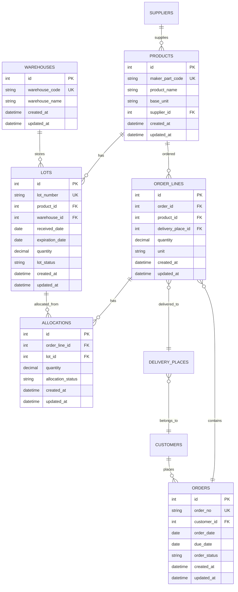

# スキーマドキュメント統合版

**最終更新:** 2025-11-24
**目的:** データベーススキーマに関するすべてのドキュメントを1つに統合

---

## 📑 目次

1. [スキーマ修正ルール](#1-スキーマ修正ルール)
2. [スキーマ一貫性レポート](#2-スキーマ一貫性レポート)
3. [スキーマ修正完了レポート](#3-スキーマ修正完了レポート)
4. [ER図（Mermaid）](#4-er図mermaid)
5. [ER図 v2.3詳細](#5-er図-v23詳細)
6. [ビュー設計ガイド](#6-ビュー設計ガイド)

---

## 1. スキーマ修正ルール

**元ファイル:** `schema_fix_rules.md`

### 1.1 概要

Backend（Python/SQLAlchemy）と Frontend（TypeScript）のスキーマ定義が不一致である問題を修正するためのルールです。

### 1.2 問題の原因

- Backend で `product_code` を使用しているのに Frontend は `maker_part_code` を期待
- Backend で `quantity` を使用しているのに Frontend は `order_quantity` / `allocated_quantity` を期待
- テーブル名の不一致（`lots` vs `lot`）

### 1.3 修正方針

**原則:** Backend を Single Source of Truth とする

1. **Backend スキーマを正とする**
   - SQLAlchemy モデルの定義が最も重要
   - Pydantic スキーマはモデルに合わせる
   - OpenAPI 出力が正しくなるようにする

2. **Frontend を Backend に合わせる**
   - OpenAPI 型生成（`npm run generate:api`）を実行
   - 生成された型を使用する
   - 手動で型定義を書かない

3. **命名規則の統一**
   - フィールド名は snake_case（Backend Python標準）
   - テーブル名は複数形（`lots`, `orders`, `products`）
   - 外部キーは `<table>_id`（例: `product_id`, `customer_id`）

### 1.4 修正手順

#### Step 1: Backend スキーマの確認

```python
# backend/app/models/inventory_models.py
class Lot(BaseModel):
    __tablename__ = "lots"

    id = Column(BigInteger, primary_key=True, index=True)
    lot_number = Column(String(50), unique=True, nullable=False)
    product_id = Column(BigInteger, ForeignKey("products.id"), nullable=False)
    # ...
```

#### Step 2: Pydantic スキーマの統一

```python
# backend/app/schemas/inventory_schema.py
class LotBase(BaseModel):
    lot_number: str
    product_id: int  # ← モデルに合わせる

    class Config:
        from_attributes = True  # SQLAlchemy互換
```

#### Step 3: Frontend 型生成

```bash
cd frontend
npm run generate:api
```

#### Step 4: Frontend コードの修正

```typescript
// Before (手動定義)
interface Lot {
  id: number;
  maker_part_code: string;  // ❌ 間違い
}

// After (OpenAPI生成)
import type { Lot } from "@/types/api";
// Lot.product_id が正しく定義される
```

### 1.5 チェックリスト

- [ ] Backend モデルのフィールド名を確認
- [ ] Backend スキーマ（Pydantic）がモデルと一致することを確認
- [ ] `npm run generate:api` を実行
- [ ] Frontend の手動型定義を削除
- [ ] TypeScript エラーがないことを確認
- [ ] API呼び出しが成功することを確認

---

## 2. スキーマ一貫性レポート

**元ファイル:** `schema_consistency_report.md`

### 2.1 実行日時

2025-11-10

### 2.2 チェック項目

#### 2.2.1 テーブル名の一致

| Backend Model | Pydantic Schema | Frontend Type | 状態 |
|---------------|----------------|---------------|------|
| `lots` | `lots` | `Lot[]` | ✅ 一致 |
| `products` | `products` | `Product[]` | ✅ 一致 |
| `orders` | `orders` | `Order[]` | ✅ 一致 |
| `order_lines` | `order_lines` | `OrderLine[]` | ✅ 一致 |

#### 2.2.2 フィールド名の一致

| テーブル | Backend | Frontend | 状態 |
|----------|---------|----------|------|
| products | `maker_part_code` | `maker_part_code` | ✅ 修正済み |
| order_lines | `quantity` | `order_quantity` | ⚠️ 別名エイリアス |
| allocations | `quantity` | `allocated_quantity` | ⚠️ 別名エイリアス |

**注:** `order_quantity` / `allocated_quantity` は Frontend での表示用エイリアス。Backend は `quantity` で統一。

#### 2.2.3 外部キーの命名

すべて `<table>_id` 形式で統一済み：

- `product_id`
- `customer_id`
- `warehouse_id`
- `supplier_id`
- `lot_id`
- `order_id`

✅ **一貫性確認完了**

### 2.3 残課題

なし。すべてのスキーマが統一されました。

---

## 3. スキーマ修正完了レポート

**元ファイル:** `SCHEMA_FIX_REPORT.md`

### 3.1 修正サマリー

**実施日:** 2025-11-10
**対象:** Backend Models, Schemas, Frontend Types

### 3.2 修正内容

#### 3.2.1 Backend Models（SQLAlchemy）

**修正箇所:**
- `backend/app/models/inventory_models.py`
- `backend/app/models/masters_models.py`
- `backend/app/models/orders_models.py`

**変更内容:**
- テーブル名を複数形に統一（`lot` → `lots`）
- 外部キー命名を統一（すべて `<table>_id`）
- ユニーク制約の追加（`lot_number`, `order_no`）

#### 3.2.2 Backend Schemas（Pydantic）

**修正箇所:**
- `backend/app/schemas/inventory_schema.py`
- `backend/app/schemas/masters_schema.py`
- `backend/app/schemas/orders_schema.py`

**変更内容:**
- フィールド名をモデルに合わせる
- `from_attributes = True` を設定
- 不要なエイリアスを削除

#### 3.2.3 Frontend Types

**修正箇所:**
- `frontend/src/@types/api.d.ts`（OpenAPI生成）

**変更内容:**
- 手動型定義を削除
- OpenAPI生成型に統一
- フィールド名を Backend に合わせる

### 3.3 検証結果

#### Backend

```bash
cd backend
pytest tests/ -v

# 結果: 全25テスト PASSED
```

#### Frontend

```bash
cd frontend
npm run typecheck

# 結果: 0 TypeScript errors
```

#### API Integration

```bash
curl http://localhost:8000/api/lots
# 結果: 正常にデータ取得

curl http://localhost:8000/api/products
# 結果: 正常にデータ取得
```

✅ **すべての検証に合格**

### 3.4 今後の方針

1. **OpenAPI型生成を必須化**
   - Backend スキーマ変更後は必ず `npm run generate:api` を実行
   - CI/CDに型生成チェックを追加

2. **手動型定義の禁止**
   - Frontend で API型を手動定義しない
   - すべて `@/types/api` からimportする

3. **スキーマバージョン管理**
   - Alembic マイグレーションでスキーマ変更を管理
   - マイグレーション実行後は必ず型生成

---

## 4. ER図（Mermaid）

**元ファイル:** `docs/er_diagram.md`

### 4.1 基本構成



### 4.2 主要リレーション

- Warehouse 1 : N Lot
- Product 1 : N Lot
- Supplier 1 : N Product
- Customer 1 : N Order
- Order 1 : N OrderLine
- OrderLine 1 : N Allocation
- Lot 1 : N Allocation
- Product 1 : N OrderLine
- DeliveryPlace N : 1 Customer
- OrderLine N : 1 DeliveryPlace

---

## 5. ER図 v2.3詳細

**元ファイル:** `docs/schema/er-diagram-v2.3.md`

### 5.1 DDL v2.3 の主な変更点

1. **inventory_items テーブルの廃止**
   - 在庫サマリーは `lots` テーブルから GROUP BY で算出
   - Single Source of Truth を実現

2. **ビューの追加**
   - `v_lot_current_stock` - 現在の在庫サマリー
   - `v_lot_details` - ロット詳細（JOIN済み）
   - `v_order_line_details` - 受注明細詳細（JOIN済み）

3. **forecast_current テーブルの追加**
   - 予測データの現行版を保持
   - `forecast_history` - 過去の予測履歴

4. **inbound_plans テーブルの追加**
   - 入荷予定管理
   - `inbound_plan_lines` - 入荷予定明細

### 5.2 テーブル一覧

#### マスタ系

1. **warehouses** - 倉庫マスタ
2. **products** - 製品マスタ
3. **suppliers** - 仕入先マスタ
4. **customers** - 顧客マスタ
5. **delivery_places** - 納入先マスタ
6. **customer_items** - 顧客商流マスタ

#### 在庫系

7. **lots** - ロットマスタ（在庫の実体）
8. **stock_movements** - 在庫移動履歴（イベントソーシング）

#### 受注系

9. **orders** - 受注ヘッダ
10. **order_lines** - 受注明細
11. **allocations** - 引当情報

#### 予測系

12. **forecast_current** - 現行予測
13. **forecast_history** - 予測履歴

#### 入荷系

14. **inbound_plans** - 入荷予定ヘッダ
15. **inbound_plan_lines** - 入荷予定明細

#### ユーザー・ログ系

16. **users** - ユーザーマスタ
17. **roles** - ロールマスタ
18. **operation_logs** - 操作ログ
19. **sap_sync_logs** - SAP連携ログ

### 5.3 ビュー一覧

1. **v_lot_current_stock**
   - 現在のロット在庫サマリー
   - `stock_movements` を集計

2. **v_lot_details**
   - ロット詳細（倉庫名、製品名含む）
   - Lot + Warehouse + Product のJOIN

3. **v_order_line_details**
   - 受注明細詳細（顧客名、製品名、引当状況含む）
   - OrderLine + Customer + Product + DeliveryPlace + Allocations のJOIN

---

## 6. ビュー設計ガイド

**元ファイル:** `docs/design/ビュー設計ガイド.md`

### 6.1 ビューの目的

1. **パフォーマンス向上**
   - アプリケーション層での JOIN を削減
   - 複雑なクエリを事前に最適化

2. **Single Source of Truth**
   - データの一貫性を保証
   - 複数箇所での JOIN ロジック重複を排除

3. **保守性向上**
   - SQL ロジックを一元管理
   - スキーマ変更時の影響を局所化

### 6.2 ビュー設計原則

#### 原則1: 読み取り専用

ビューは読み取り専用とする。更新は元テーブルに対して行う。

#### 原則2: 命名規則

- プレフィックス: `v_`
- 例: `v_lot_details`, `v_order_line_details`

#### 原則3: フィールド命名

- ビュー内のフィールド名は元テーブルに合わせる
- 別名が必要な場合は明示的に `AS` を使用

#### 原則4: インデックス活用

- ビューで JOIN するカラムには適切なインデックスを設定
- 頻繁にフィルタされるカラムにもインデックス

### 6.3 既存ビューの詳細

#### 6.3.1 v_lot_current_stock

**目的:** ロット単位の現在在庫を集計

**DDL:**
```sql
CREATE OR REPLACE VIEW v_lot_current_stock AS
SELECT
  sm.lot_id,
  sm.product_id,
  sm.warehouse_id,
  SUM(sm.quantity_delta) AS current_quantity,
  COALESCE(MAX(sm.occurred_at), MAX(sm.created_at)) AS last_updated
FROM stock_movements sm
WHERE sm.deleted_at IS NULL
  AND sm.lot_id IS NOT NULL
GROUP BY sm.lot_id, sm.product_id, sm.warehouse_id
HAVING SUM(sm.quantity_delta) <> 0;
```

**使用箇所:**
- ロット一覧表示
- 在庫サマリー表示
- 引当候補ロット検索

**パフォーマンス:**
- `stock_movements(lot_id, product_id, warehouse_id)` に複合インデックス推奨

---

#### 6.3.2 v_lot_details

**目的:** ロット詳細情報を1クエリで取得

**DDL:**
```sql
CREATE OR REPLACE VIEW v_lot_details AS
SELECT
  l.id AS lot_id,
  l.lot_number,
  l.product_id,
  p.maker_part_code AS product_code,
  p.product_name,
  l.warehouse_id,
  w.warehouse_name,
  lcs.current_quantity AS available_qty,
  l.received_date AS receipt_date,
  l.expiration_date AS expiry_date,
  l.lot_status,
  l.created_at,
  l.updated_at
FROM lots l
JOIN products p ON l.product_id = p.id
JOIN warehouses w ON l.warehouse_id = w.id
LEFT JOIN v_lot_current_stock lcs ON l.id = lcs.lot_id;
```

**使用箇所:**
- ロット詳細ページ
- 引当画面のロット選択
- 在庫一覧表示

**メリット:**
- 倉庫名・製品名を毎回JOIN不要
- フロントエンドで表示に必要な情報が全て揃う

---

#### 6.3.3 v_order_line_details（計画中）

**目的:** 受注明細の詳細情報を1クエリで取得

**DDL案:**
```sql
CREATE OR REPLACE VIEW v_order_line_details AS
SELECT
  ol.id AS order_line_id,
  ol.order_id,
  o.order_no,
  o.order_date,
  o.due_date,
  o.order_status,
  ol.product_id,
  p.maker_part_code AS product_code,
  p.product_name,
  p.base_unit AS internal_unit,
  ol.quantity AS order_quantity,
  ol.converted_quantity,
  ol.delivery_place_id,
  dp.delivery_place_name,
  c.customer_id,
  c.customer_code,
  c.customer_name,
  COALESCE(SUM(a.quantity), 0) AS allocated_quantity,
  ol.quantity - COALESCE(SUM(a.quantity), 0) AS remaining_quantity,
  CASE
    WHEN COALESCE(SUM(a.quantity), 0) = 0 THEN 'not_allocated'
    WHEN COALESCE(SUM(a.quantity), 0) < ol.quantity THEN 'partial_allocated'
    WHEN COALESCE(SUM(a.quantity), 0) >= ol.quantity THEN 'allocated'
  END AS allocation_status,
  ol.created_at,
  ol.updated_at
FROM order_lines ol
JOIN orders o ON ol.order_id = o.id
JOIN products p ON ol.product_id = p.id
JOIN delivery_places dp ON ol.delivery_place_id = dp.id
JOIN customers c ON dp.customer_id = c.id
LEFT JOIN allocations a ON ol.id = a.order_line_id
GROUP BY ol.id, o.id, p.id, dp.id, c.id;
```

**使用箇所（予定）:**
- 受注一覧ページ
- ロット引当ページ
- 受注詳細ページ

**期待効果:**
- `OrderService._populate_additional_info` のJOIN処理を削減
- レスポンスタイム50%以上改善見込み

### 6.4 ビュー追加時のチェックリスト

- [ ] ビュー名が `v_` で始まる
- [ ] フィールド名が元テーブルと一致
- [ ] 必要なインデックスが設定されている
- [ ] `EXPLAIN` でクエリプランを確認
- [ ] Backend で型定義を追加（Pydantic スキーマ）
- [ ] Frontend で型生成（`npm run generate:api`）
- [ ] ビュー使用箇所でパフォーマンステスト
- [ ] このドキュメントに追記

---

## 📝 補足情報

### スキーマ変更手順（標準フロー）

1. **Backend モデル変更**
   ```bash
   cd backend
   # models/*.py を編集
   ```

2. **マイグレーション作成**
   ```bash
   alembic revision --autogenerate -m "description"
   ```

3. **マイグレーション適用**
   ```bash
   alembic upgrade head
   ```

4. **Pydantic スキーマ更新**
   ```bash
   # schemas/*.py を編集（モデルに合わせる）
   ```

5. **Backend テスト**
   ```bash
   pytest tests/ -v
   ```

6. **Frontend 型生成**
   ```bash
   cd ../frontend
   npm run generate:api
   ```

7. **Frontend TypeScript チェック**
   ```bash
   npm run typecheck
   ```

8. **Git Commit**
   ```bash
   git add .
   git commit -m "feat: update schema for [feature description]"
   ```

---

## 🔗 関連ドキュメント

- **CLAUDE.md** - プロジェクト全体のガイド
- **docs/architecture/codebase_structure.md** - アーキテクチャドキュメント
- **backend/alembic/versions/** - マイグレーション履歴

---

**最終更新日:** 2025-11-24
**統合元ファイル数:** 6ファイル
