# ER Diagram v2.3

## Overview

This document contains the Entity-Relationship diagram for the Lot Management System database schema v2.3.

## Full ER Diagram

```mermaid
erDiagram
    %% ==========================================
    %% Master Data
    %% ==========================================

    warehouses {
        bigint id PK
        varchar warehouse_code UK
        varchar warehouse_name
        varchar warehouse_type "internal/external/supplier"
        timestamp created_at
        timestamp updated_at
    }

    suppliers {
        bigint id PK
        varchar supplier_code UK
        varchar supplier_name
        timestamp created_at
        timestamp updated_at
    }

    customers {
        bigint id PK
        varchar customer_code UK
        varchar customer_name
        timestamp created_at
        timestamp updated_at
    }

    delivery_places {
        bigint id PK
        varchar jiku_code
        varchar delivery_place_code UK
        varchar delivery_place_name
        bigint customer_id FK
        timestamp created_at
        timestamp updated_at
    }

    products {
        bigint id PK
        varchar maker_part_code UK
        varchar product_name
        varchar base_unit
        integer consumption_limit_days
        timestamp created_at
        timestamp updated_at
    }

    customer_items {
        bigint customer_id PK,FK
        varchar external_product_code PK
        bigint product_id FK
        bigint supplier_id FK
        varchar base_unit
        varchar pack_unit
        integer pack_quantity
        text special_instructions
        timestamp created_at
        timestamp updated_at
    }

    %% ==========================================
    %% Users & Authentication
    %% ==========================================

    users {
        bigint id PK
        varchar username UK
        varchar email UK
        varchar password_hash
        varchar display_name
        boolean is_active
        timestamp last_login_at
        timestamp created_at
        timestamp updated_at
    }

    roles {
        bigint id PK
        varchar role_code UK
        varchar role_name
        text description
        timestamp created_at
        timestamp updated_at
    }

    user_roles {
        bigint user_id PK,FK
        bigint role_id PK,FK
        timestamp assigned_at
    }

    %% ==========================================
    %% Inventory Management
    %% ==========================================

    lots {
        bigint id PK
        varchar lot_number
        bigint product_id FK
        bigint warehouse_id FK
        bigint supplier_id FK
        bigint expected_lot_id FK
        date received_date
        date expiry_date
        numeric current_quantity
        numeric allocated_quantity
        varchar unit
        varchar status "active/depleted/expired/quarantine"
        timestamp created_at
        timestamp updated_at
    }

    stock_history {
        bigint id PK
        bigint lot_id FK
        varchar transaction_type "inbound/allocation/shipment/adjustment/return"
        numeric quantity_change
        numeric quantity_after
        varchar reference_type
        bigint reference_id
        timestamp transaction_date
    }

    adjustments {
        bigint id PK
        bigint lot_id FK
        varchar adjustment_type "physical_count/damage/loss/found/other"
        numeric adjusted_quantity
        text reason
        bigint adjusted_by FK
        timestamp adjusted_at
    }

    %% ==========================================
    %% Orders & Allocations
    %% ==========================================

    orders {
        bigint id PK
        varchar order_number UK
        bigint customer_id FK
        date order_date
        timestamp created_at
        timestamp updated_at
    }

    order_lines {
        bigint id PK
        bigint order_id FK
        bigint product_id FK
        bigint delivery_place_id FK
        date delivery_date
        numeric order_quantity
        varchar unit
        varchar status "pending/allocated/shipped/completed/cancelled"
        timestamp created_at
        timestamp updated_at
    }

    allocations {
        bigint id PK
        bigint order_line_id FK
        bigint lot_id FK
        numeric allocated_quantity
        varchar status "allocated/shipped/cancelled"
        timestamp created_at
        timestamp updated_at
    }

    %% ==========================================
    %% Forecasts
    %% ==========================================

    forecast_headers {
        bigint id PK
        bigint customer_id FK
        bigint delivery_place_id FK
        varchar forecast_number UK
        date forecast_start_date
        date forecast_end_date
        varchar status "active/completed/cancelled"
        timestamp created_at
        timestamp updated_at
    }

    forecast_lines {
        bigint id PK
        bigint forecast_id FK
        bigint product_id FK
        date delivery_date
        numeric forecast_quantity
        varchar unit
        timestamp created_at
        timestamp updated_at
    }

    allocation_suggestions {
        bigint id PK
        bigint forecast_line_id FK
        bigint lot_id FK
        numeric suggested_quantity
        varchar allocation_logic
        timestamp created_at
        timestamp updated_at
    }

    %% ==========================================
    %% Inbound Plans
    %% ==========================================

    inbound_plans {
        bigint id PK
        varchar plan_number UK
        bigint supplier_id FK
        date planned_arrival_date
        varchar status "planned/partially_received/received/cancelled"
        text notes
        timestamp created_at
        timestamp updated_at
    }

    inbound_plan_lines {
        bigint id PK
        bigint inbound_plan_id FK
        bigint product_id FK
        numeric planned_quantity
        varchar unit
        timestamp created_at
        timestamp updated_at
    }

    expected_lots {
        bigint id PK
        bigint inbound_plan_line_id FK
        varchar expected_lot_number
        numeric expected_quantity
        date expected_expiry_date
        timestamp created_at
        timestamp updated_at
    }

    %% ==========================================
    %% System Configuration & Logs
    %% ==========================================

    system_configs {
        bigint id PK
        varchar config_key UK
        text config_value
        text description
        timestamp created_at
        timestamp updated_at
    }

    business_rules {
        bigint id PK
        varchar rule_code UK
        varchar rule_name
        varchar rule_type "allocation/expiry_warning/kanban/other"
        jsonb rule_parameters
        boolean is_active
        timestamp created_at
        timestamp updated_at
    }

    batch_jobs {
        bigint id PK
        varchar job_name
        varchar job_type
        varchar status "pending/running/completed/failed"
        jsonb parameters
        text result_message
        timestamp started_at
        timestamp completed_at
        timestamp created_at
    }

    operation_logs {
        bigint id PK
        bigint user_id FK
        varchar operation_type "create/update/delete/login/logout/export"
        varchar target_table
        bigint target_id
        jsonb changes
        varchar ip_address
        timestamp created_at
    }

    master_change_logs {
        bigint id PK
        varchar table_name
        bigint record_id
        varchar change_type "insert/update/delete"
        jsonb old_values
        jsonb new_values
        bigint changed_by FK
        timestamp changed_at
    }

    %% ==========================================
    %% Relationships
    %% ==========================================

    %% Master Data Relations
    customers ||--o{ delivery_places : "has"
    customers ||--o{ customer_items : "has"
    products ||--o{ customer_items : "mapped_to"
    suppliers ||--o{ customer_items : "supplied_by"

    %% User Relations
    users ||--o{ user_roles : "has"
    roles ||--o{ user_roles : "assigned_to"
    users ||--o{ adjustments : "adjusted_by"
    users ||--o{ operation_logs : "performed"
    users ||--o{ master_change_logs : "changed_by"

    %% Inventory Relations
    products ||--o{ lots : "has"
    warehouses ||--o{ lots : "stores"
    suppliers ||--o{ lots : "supplied"
    expected_lots ||--o| lots : "received_as"
    lots ||--o{ stock_history : "tracks"
    lots ||--o{ adjustments : "adjusted"
    lots ||--o{ allocations : "allocated_from"
    lots ||--o{ allocation_suggestions : "suggested_for"

    %% Order Relations
    customers ||--o{ orders : "places"
    orders ||--o{ order_lines : "contains"
    products ||--o{ order_lines : "ordered"
    delivery_places ||--o{ order_lines : "delivered_to"
    order_lines ||--o{ allocations : "allocated"

    %% Forecast Relations
    customers ||--o{ forecast_headers : "forecasts"
    delivery_places ||--o{ forecast_headers : "forecast_for"
    forecast_headers ||--o{ forecast_lines : "contains"
    products ||--o{ forecast_lines : "forecasted"
    forecast_lines ||--o{ allocation_suggestions : "suggested"

    %% Inbound Plan Relations
    suppliers ||--o{ inbound_plans : "supplies"
    inbound_plans ||--o{ inbound_plan_lines : "contains"
    products ||--o{ inbound_plan_lines : "planned"
    inbound_plan_lines ||--o{ expected_lots : "expects"
```



## Table Groups

### 1. Master Data (6 tables)

| Table | Description |
|-------|-------------|
| `warehouses` | 倉庫マスタ (internal/external/supplier) |
| `suppliers` | 仕入先マスタ |
| `customers` | 得意先マスタ |
| `delivery_places` | 納品先マスタ |
| `products` | 製品マスタ |
| `customer_items` | 得意先品目マッピング (外部品番→内部品番) |

### 2. Users & Authentication (3 tables)

| Table | Description |
|-------|-------------|
| `users` | ユーザーマスタ |
| `roles` | ロールマスタ |
| `user_roles` | ユーザー・ロール関連 |

### 3. Inventory Management (3 tables)

| Table | Description |
|-------|-------------|
| `lots` | ロットマスタ (在庫の単位) |
| `stock_history` | 在庫履歴 (イミュータブル) |
| `adjustments` | 在庫調整履歴 |

### 4. Orders & Allocations (3 tables)

| Table | Description |
|-------|-------------|
| `orders` | 受注ヘッダー |
| `order_lines` | 受注明細 |
| `allocations` | 引当 (ロット→受注明細) |

### 5. Forecasts (3 tables)

| Table | Description |
|-------|-------------|
| `forecast_headers` | 内示ヘッダー |
| `forecast_lines` | 内示明細 |
| `allocation_suggestions` | 引当提案 (ロット→内示明細) |

### 6. Inbound Plans (3 tables)

| Table | Description |
|-------|-------------|
| `inbound_plans` | 入荷予定ヘッダー |
| `inbound_plan_lines` | 入荷予定明細 |
| `expected_lots` | 予定ロット |

### 7. System Configuration & Logs (5 tables)

| Table | Description |
|-------|-------------|
| `system_configs` | システム設定 |
| `business_rules` | ビジネスルール設定 |
| `batch_jobs` | バッチジョブ |
| `operation_logs` | 操作ログ |
| `master_change_logs` | マスタ変更ログ |

## Key Relationships

### Core Business Flow

```
Inbound → Lots → Allocations → Orders → Shipment

1. Inbound Plans (入荷予定) → Expected Lots (予定ロット)
2. Expected Lots → Lots (実ロット作成)
3. Lots → Allocations (引当)
4. Allocations → Order Lines (受注明細へ紐付け)
5. Order Lines → Shipment (出荷)
```

### Inventory Tracking

```
Lots (ロット)
├── stock_history (在庫履歴 - immutable event log)
├── adjustments (調整履歴)
└── allocations (引当)

在庫数量は lots.current_quantity が単一の真実源
stock_history は全てのトランザクションを記録
```

### Customer-Product Mapping

```
Customers → Customer Items → Products
                         ↓
                    Suppliers

顧客の外部品番を内部品番にマッピング
仕入先情報も関連付け可能
```

## Constraints Summary

### Status Enums

| Table | Column | Values |
|-------|--------|--------|
| `warehouses` | warehouse_type | internal, external, supplier |
| `lots` | status | active, depleted, expired, quarantine |
| `allocations` | status | allocated, shipped, cancelled |
| `order_lines` | status | pending, allocated, shipped, completed, cancelled |
| `forecast_headers` | status | active, completed, cancelled |
| `inbound_plans` | status | planned, partially_received, received, cancelled |
| `adjustments` | adjustment_type | physical_count, damage, loss, found, other |
| `stock_history` | transaction_type | inbound, allocation, shipment, adjustment, return |
| `batch_jobs` | status | pending, running, completed, failed |
| `batch_jobs` | job_type | allocation_suggestion, allocation_finalize, inventory_sync, data_import, report_generation |
| `business_rules` | rule_type | allocation, expiry_warning, kanban, other |
| `operation_logs` | operation_type | create, update, delete, login, logout, export |
| `master_change_logs` | change_type | insert, update, delete |

### Important Constraints

- `lots.allocated_quantity <= lots.current_quantity` (引当数は現在数量以下)
- `lots.current_quantity >= 0` (現在数量は0以上)
- `lots.allocated_quantity >= 0` (引当数量は0以上)
- `lots` has unique constraint on `(lot_number, product_id, warehouse_id)`

## Schema Version

- **Version**: 2.3
- **Last Updated**: 2025-11
- **Total Tables**: 26
