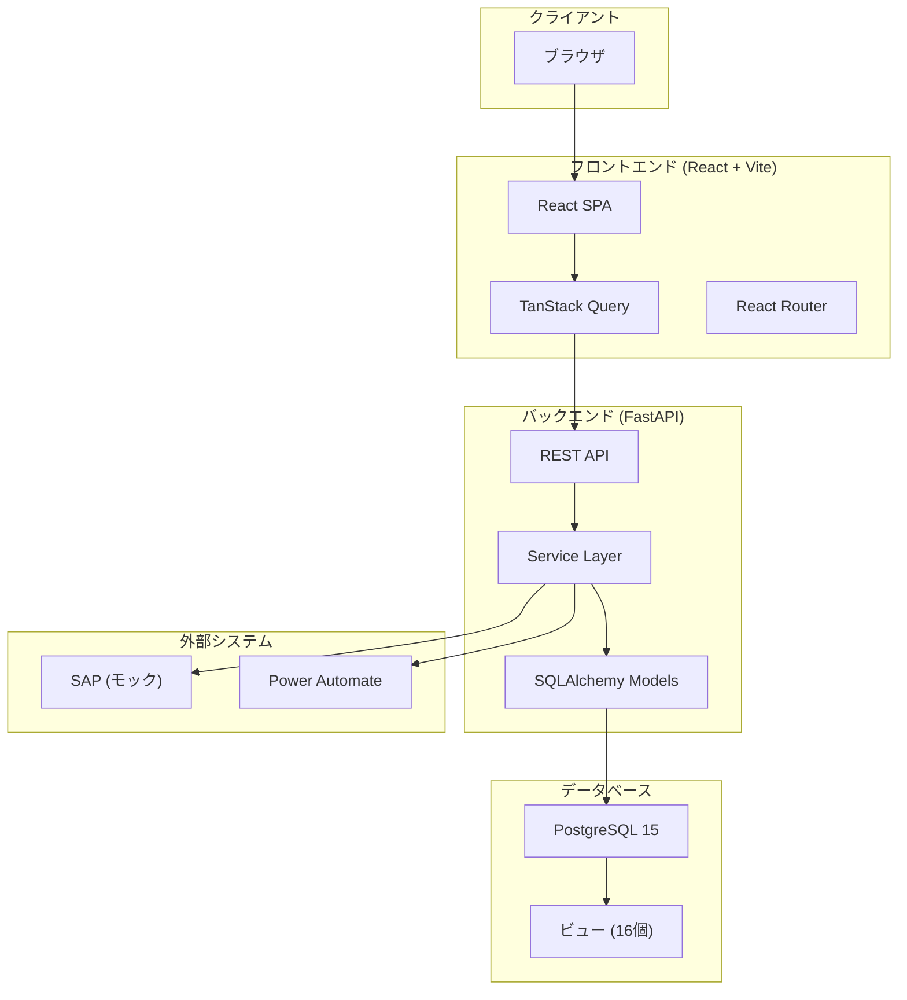
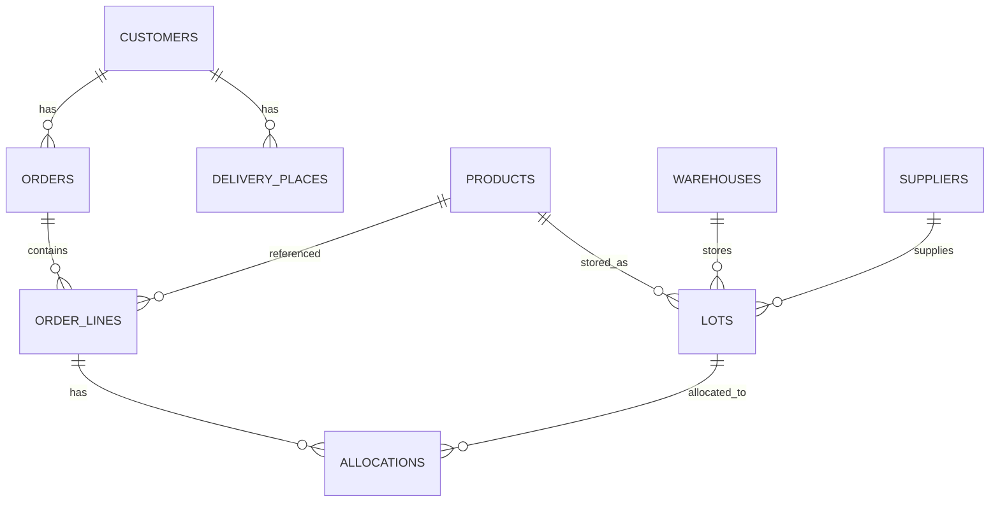

# システム概要設計書

> **最終更新:** 2025-12-04  
> **ステータス:** 📝 ドラフト  
> **バージョン:** v2.2

---

## 1. システム概要

### 1.1 システム名

**ロット在庫管理システム（Lot Management System）**

### 1.2 目的

食品・消費財の在庫をロット単位で管理し、FEFO（First-Expired, First-Out）に基づく引当・出荷を実現する。

### 1.3 主要機能

| カテゴリ | 機能 |
|---------|------|
| **在庫管理** | ロット登録、在庫照会、ロックアウト |
| **受注管理** | 受注登録、受注明細、配送先管理 |
| **引当管理** | FEFO自動引当、手動引当、引当プレビュー |
| **フォーキャスト** | 内示取込、引当提案生成 |
| **入荷管理** | 入荷予定、入庫確定 |
| **マスタ管理** | 得意先、製品、仕入先、倉庫、ユーザー |
| **外部連携** | SAP在庫同期（モック）、RPA連携 |

---

## 2. アーキテクチャ

### 2.1 システム構成図



### 2.2 技術スタック

| レイヤー | 技術 | バージョン |
|---------|------|-----------|
| **フロントエンド** | React | 18.x |
| | TypeScript | 5.x |
| | Vite | 5.x |
| | TanStack Query | 5.x |
| | React Router | 6.x |
| | Tailwind CSS | 3.x |
| | shadcn/ui | - |
| **バックエンド** | Python | 3.11+ |
| | FastAPI | 0.100+ |
| | SQLAlchemy | 2.x |
| | Alembic | 1.x |
| | Pydantic | 2.x |
| **データベース** | PostgreSQL | 15 |
| **インフラ** | Docker Compose | - |
| **CI/CD** | GitHub Actions | - |

---

## 3. ディレクトリ構造

### 3.1 バックエンド

```
backend/
├── app/
│   ├── api/
│   │   ├── deps.py              # 依存性注入
│   │   └── routes/              # APIルーター
│   │       ├── allocations/     # 引当API
│   │       ├── customers/       # 得意先API
│   │       ├── forecasts/       # フォーキャストAPI
│   │       ├── inventory/       # 在庫API
│   │       ├── orders/          # 受注API
│   │       └── ...
│   ├── models/                  # SQLAlchemyモデル
│   ├── schemas/                 # Pydanticスキーマ
│   ├── services/                # ビジネスロジック
│   │   ├── allocations/         # 引当サービス
│   │   ├── batch/               # バッチ処理
│   │   └── ...
│   └── external/                # 外部連携
├── alembic/                     # マイグレーション
├── sql/
│   └── views/                   # ビュー定義
└── tests/                       # テスト
```

### 3.2 フロントエンド

```
frontend/src/
├── components/
│   └── ui/                      # shadcn/ui コンポーネント
├── features/                    # 機能別モジュール
│   ├── allocations/             # 引当機能
│   │   ├── api.ts               # API定義
│   │   ├── hooks/               # カスタムフック
│   │   ├── components/          # コンポーネント
│   │   └── pages/               # ページ
│   ├── customers/               # 得意先
│   ├── forecasts/               # フォーキャスト
│   ├── inventory/               # 在庫
│   ├── orders/                  # 受注
│   └── ...
├── lib/                         # ユーティリティ
├── types/                       # 型定義
└── constants/                   # 定数
```

---

## 4. 主要データモデル

### 4.1 ER図（概要）



### 4.2 主要テーブル

| テーブル | 説明 |
|---------|------|
| `customers` | 得意先マスタ |
| `products` | 製品マスタ |
| `suppliers` | 仕入先マスタ |
| `warehouses` | 倉庫マスタ |
| `lots` | ロット在庫 |
| `orders` | 受注ヘッダ |
| `order_lines` | 受注明細 |
| `allocations` | 引当情報 |
| `forecast_current` | フォーキャスト |
| `inbound_plans` | 入荷予定 |

詳細は `docs/data_model_guide.md` を参照。

---

## 5. API設計

### 5.1 エンドポイント構成

| プレフィックス | 対象 |
|---------------|------|
| `/api/customers` | 得意先 |
| `/api/products` | 製品 |
| `/api/suppliers` | 仕入先 |
| `/api/warehouses` | 倉庫 |
| `/api/lots` | ロット |
| `/api/orders` | 受注 |
| `/api/allocations` | 引当 |
| `/api/forecasts` | フォーキャスト |
| `/api/inbound-plans` | 入荷予定 |
| `/api/inventory` | 在庫照会 |

### 5.2 認証

現在は認証なし（開発環境）。本番運用時に実装予定。

詳細は `docs/api_reference.adoc` を参照。

---

## 6. 画面一覧

| カテゴリ | 画面 | パス |
|---------|------|------|
| **ダッシュボード** | ホーム | `/` |
| **受注** | 受注一覧 | `/orders` |
| | 受注詳細 | `/orders/:id` |
| **引当** | 引当一覧 | `/allocations` |
| **在庫** | 在庫一覧 | `/inventory` |
| | ロット一覧 | `/lots` |
| **フォーキャスト** | フォーキャスト一覧 | `/forecasts` |
| **入荷** | 入荷予定一覧 | `/inbound-plans` |
| **マスタ** | 得意先一覧 | `/customers` |
| | 製品一覧 | `/products` |
| | 仕入先一覧 | `/suppliers` |
| | 倉庫一覧 | `/warehouses` |
| **設定** | ユーザー管理 | `/settings/users` |
| | ロール管理 | `/settings/roles` |

---

## 7. 関連ドキュメント

- [データモデルガイド](./data_model_guide.md)
- [業務フロー図](./business_flow_diagrams.md)
- [APIリファレンス](./api_reference.adoc)
- [DBスキーマ](./schema.adoc)
- [Hard Allocation設計](./designs/hard_allocation_design.md)
- [残課題一覧](./remaining_issues.adoc)
