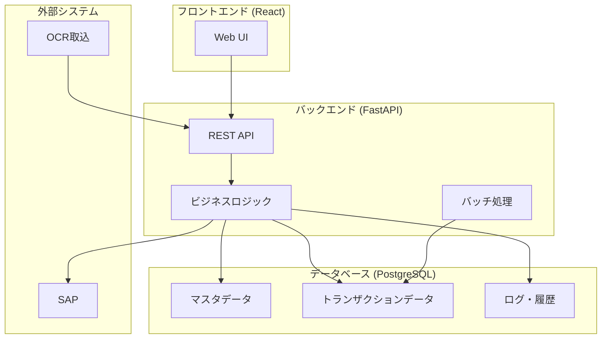
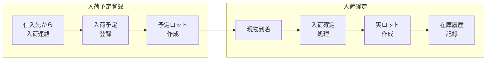
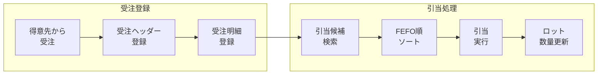
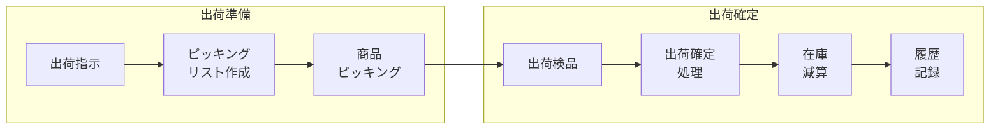
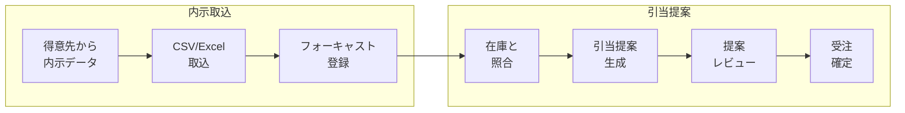
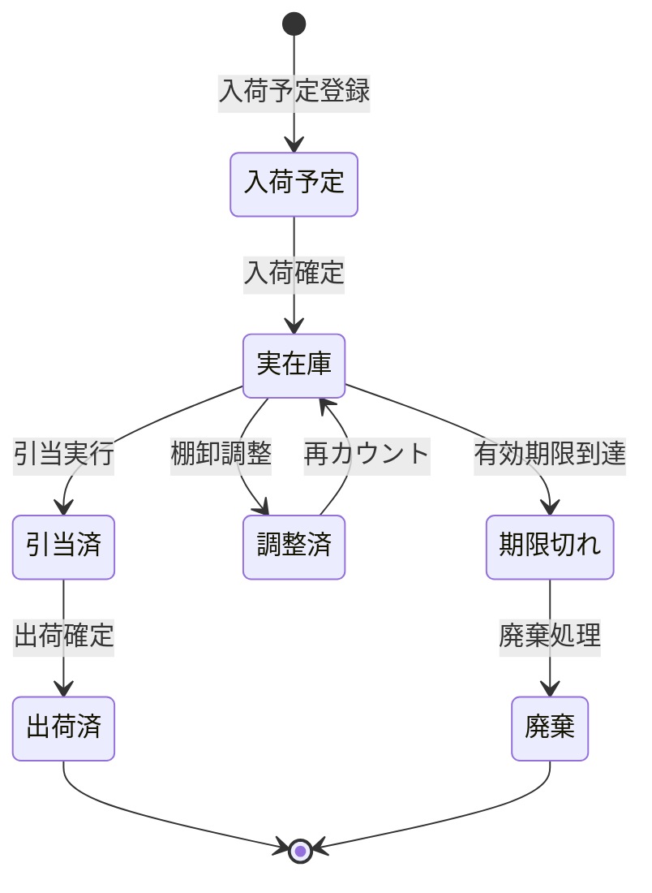
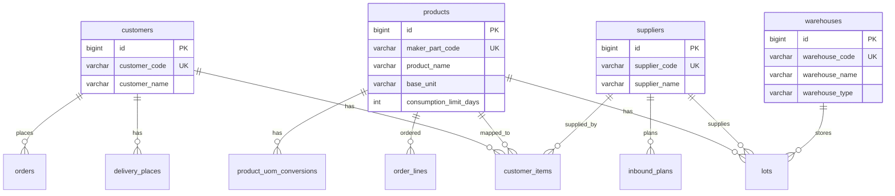
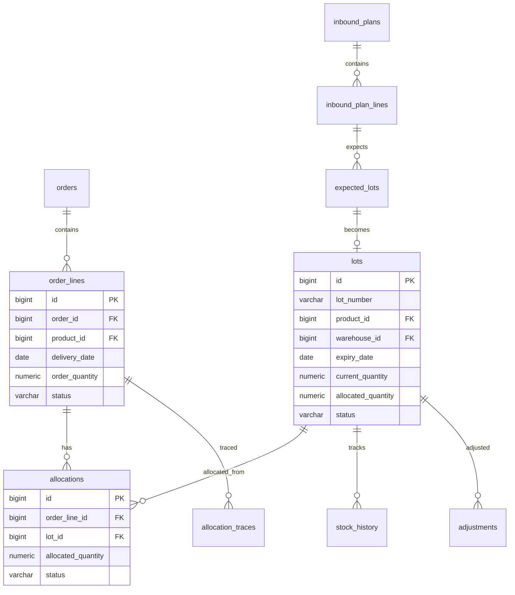
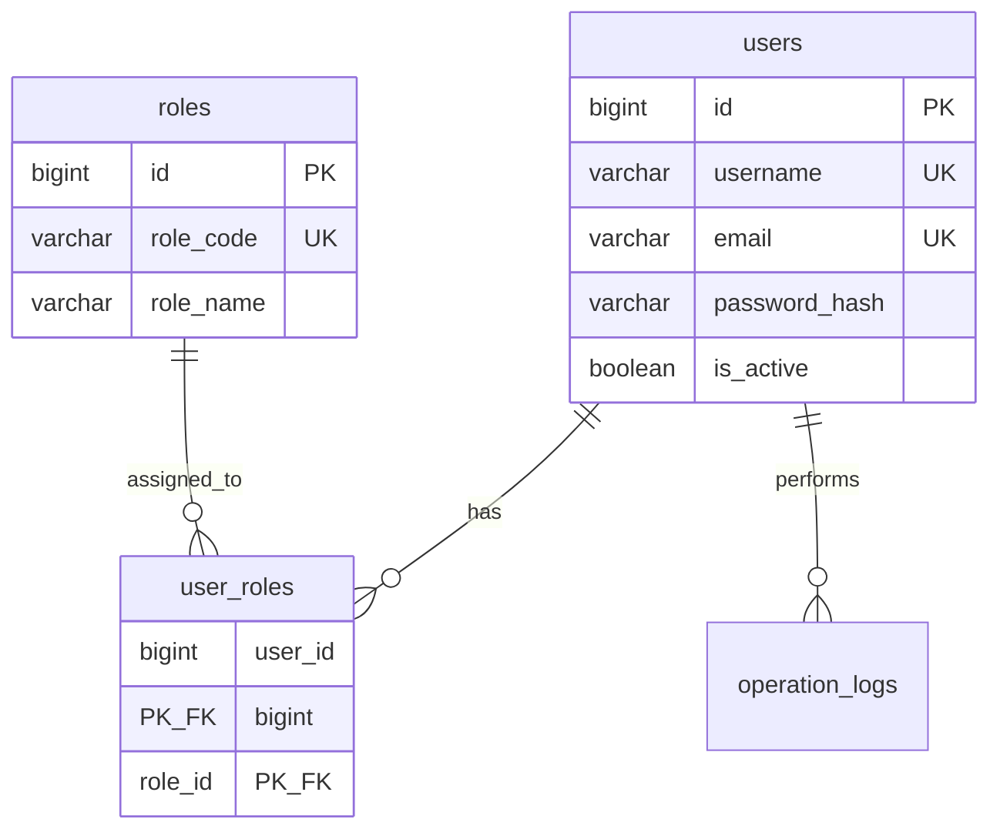
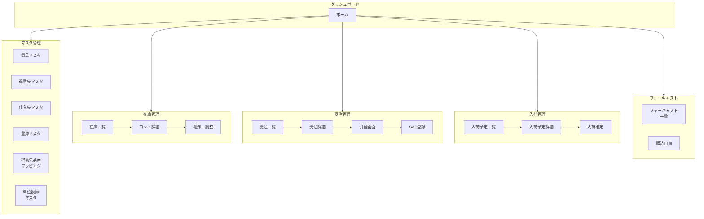

# 業務フロー図・システム構成図

> **最終更新:** 2025-12-04  
> **目的:** システム全体の業務フローとデータの流れを視覚的に理解する

---

## 📊 システム全体図

---

## 🔄 主要業務フロー

### 1. 入荷フロー（仕入→在庫）

**関連テーブル:**
| ステップ | テーブル | 操作 |
|---------|---------|------|
| 入荷予定登録 | `inbound_plans` | INSERT |
| 予定ロット作成 | `inbound_plan_lines`, `expected_lots` | INSERT |
| 入荷確定 | `inbound_plans` | UPDATE (status) |
| 実ロット作成 | `lots` | INSERT |
| 在庫履歴記録 | `stock_history` | INSERT (type=inbound) |

---

### 2. 受注フロー（受注→引当）

**関連テーブル:**
| ステップ | テーブル | 操作 |
|---------|---------|------|
| 受注ヘッダー登録 | `orders` | INSERT |
| 受注明細登録 | `order_lines` | INSERT |
| 引当候補検索 | `lots` | SELECT (status=active) |
| 引当実行 | `allocations` | INSERT |
| ロット数量更新 | `lots` | UPDATE (allocated_quantity) |
| 引当トレース | `allocation_traces` | INSERT |

---

### 3. 出荷フロー（引当→出荷）

**関連テーブル:**
| ステップ | テーブル | 操作 |
|---------|---------|------|
| 出荷確定 | `allocations` | UPDATE (status=shipped) |
| 受注明細更新 | `order_lines` | UPDATE (status=shipped) |
| 在庫減算 | `lots` | UPDATE (current_quantity) |
| 履歴記録 | `stock_history` | INSERT (type=shipment) |

---

### 4. フォーキャスト（内示）フロー

**関連テーブル:**
| ステップ | テーブル | 操作 |
|---------|---------|------|
| フォーキャスト登録 | `forecast_current` | INSERT/UPDATE |
| 履歴保存 | `forecast_history` | INSERT |
| 引当提案生成 | `allocation_suggestions` | INSERT |
| 受注確定 | `orders`, `order_lines` | INSERT |

---

## 📈 在庫数量の状態遷移

---

## 🗃️ ER図（簡易版）

### マスタデータ関連

### 在庫・引当関連

---

## 🔐 ユーザー認証・権限

---

## 📱 画面遷移図

---

## 📋 ステータス一覧

### ロット (lots.status)

| ステータス | 日本語 | 説明 |
|-----------|--------|------|
| `active` | 有効 | 引当可能な在庫 |
| `depleted` | 在庫なし | 現在数量がゼロ |
| `expired` | 期限切れ | 有効期限超過 |
| `quarantine` | 検疫中 | 品質確認中（引当不可） |
| `locked` | ロック中 | 管理者によりロック（引当不可） |

### 受注明細 (order_lines.status)

| ステータス | 日本語 | 説明 |
|-----------|--------|------|
| `pending` | 未引当 | 引当待ち |
| `allocated` | 引当完了 | ロット引当済み |
| `shipped` | 出荷済 | 出荷確定済み |
| `completed` | 完了 | 全工程完了 |
| `cancelled` | キャンセル | 受注取消 |

### 入荷予定 (inbound_plans.status)

| ステータス | 日本語 | 説明 |
|-----------|--------|------|
| `planned` | 予定 | 入荷待ち |
| `partially_received` | 一部入荷 | 一部のみ入荷 |
| `received` | 入荷完了 | 全数入荷 |
| `cancelled` | キャンセル | 入荷取消 |

---

## 🔗 関連ドキュメント

- [データモデルガイド](./data_model_guide.md) - テーブル詳細説明
- [スキーマドキュメント](./schema.adoc) - ER図、テーブル定義
- [アーキテクチャ](./architecture.adoc) - システム構成、API構造
- [API リファレンス](./api_reference.adoc) - APIエンドポイント一覧
