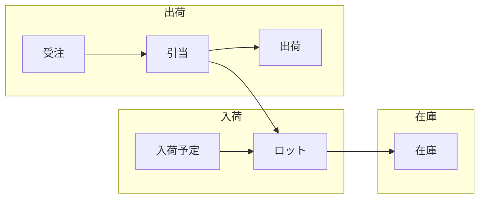
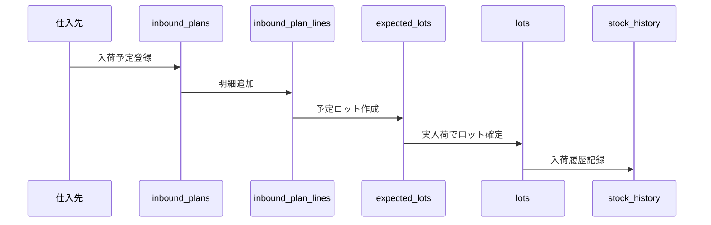
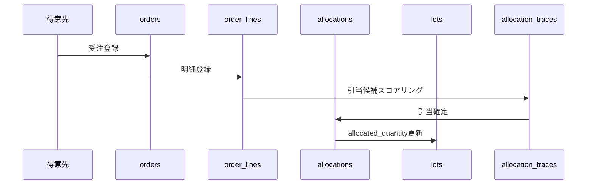

# データモデルガイド

> **最終更新:** 2025-12-04  
> **目的:** このシステムのデータ構造を業務フローに沿って理解できるようにする

---

## 📖 概要

このシステムは**ロット管理**を中心に、入荷予定・在庫管理・受注引当・出荷を一元管理します。



---

## 📦 テーブル概要

### 1. マスタデータ（7テーブル）

基本的なマスター情報。変更頻度は低い。

| テーブル名 | 日本語名 | 説明 | 主要項目 |
|-----------|---------|------|---------|
| `warehouses` | 倉庫マスタ | 製品を保管する倉庫 | 倉庫コード、倉庫名、タイプ（internal/external/supplier） |
| `suppliers` | 仕入先マスタ | 製品を仕入れる取引先 | 仕入先コード、仕入先名 |
| `customers` | 得意先マスタ | 製品を販売する取引先 | 得意先コード、得意先名 |
| `delivery_places` | 納品先マスタ | 得意先の配送先住所 | 納品先コード、納品先名、紐付く得意先ID |
| `products` | 製品マスタ | 取り扱う製品 | メーカー品番、製品名、基本単位、消費期限日数 |
| `customer_items` | 得意先品番マッピング | 得意先が使う品番と内部品番の対応 | 得意先ID、外部品番、製品ID、仕入先ID |
| `product_uom_conversions` | 単位換算マスタ | 製品ごとの単位変換レート | 製品ID、外部単位、換算係数 |

**関係性:**
- 得意先(customers) → 納品先(delivery_places): 1対多
- 得意先(customers) → 得意先品番マッピング(customer_items): 1対多
- 製品(products) → 得意先品番マッピング(customer_items): 1対多

---

### 2. 認証・権限（3テーブル）

ユーザー管理とアクセス制御。

| テーブル名 | 日本語名 | 説明 |
|-----------|---------|------|
| `users` | ユーザー | システムにログインするユーザー（ユーザー名、メール、パスワード） |
| `roles` | ロール | 権限グループ（admin, operator, viewer等） |
| `user_roles` | ユーザーロール関連 | ユーザーとロールの多対多関係 |

---

### 3. 在庫管理（3テーブル）

**ロットが在庫管理の核心。**

| テーブル名 | 日本語名 | 説明 | 重要項目 |
|-----------|---------|------|---------|
| `lots` | ロット | 在庫の最小管理単位 | ロット番号、製品ID、倉庫ID、有効期限、現在数量(`current_quantity`)、引当済数量(`allocated_quantity`)、ステータス |
| `stock_history` | 在庫履歴 | 在庫変動の全記録（イミュータブル） | ロットID、取引タイプ、数量変化、変化後数量 |
| `adjustments` | 在庫調整 | 棚卸差異や破損等の調整記録 | ロットID、調整タイプ、調整数量、理由 |

**ロット(lots)のステータス:**
- `active` - 利用可能
- `depleted` - 在庫なし
- `expired` - 期限切れ
- `quarantine` - 検疫中（利用不可）
- `locked` - ロック中（利用不可）

**在庫数量の仕組み:**
```
利用可能数量 = current_quantity - allocated_quantity
```

---

### 4. 受注・引当（4テーブル）

**受注から引当までの流れを管理。**

| テーブル名 | 日本語名 | 説明 | 重要項目 |
|-----------|---------|------|---------|
| `orders` | 受注ヘッダー | 受注の基本情報 | 受注番号、得意先ID、受注日 |
| `order_lines` | 受注明細 | 受注の各明細行 | 製品ID、納品先ID、納期、数量、単位、ステータス |
| `allocations` | 引当 | ロットと受注明細の紐付け | 受注明細ID、ロットID、引当数量、ステータス |
| `allocation_traces` | 引当トレース | 引当アルゴリズムの判断ログ | 受注明細ID、ロットID、スコア、決定（採用/却下/部分） |

**受注明細(order_lines)のステータス:**
- `pending` - 未引当
- `allocated` - 引当完了
- `shipped` - 出荷済
- `completed` - 完了
- `cancelled` - キャンセル

**引当(allocations)のステータス:**
- `allocated` - 引当済（まだ出荷されていない）
- `shipped` - 出荷済
- `cancelled` - キャンセル

---

### 5. フォーキャスト（3テーブル）

**将来の需要予測（内示）を管理。**

| テーブル名 | 日本語名 | 説明 |
|-----------|---------|------|
| `forecast_current` | 最新フォーキャスト | 現在有効な需要予測 |
| `forecast_history` | フォーキャスト履歴 | 過去のスナップショット |
| `allocation_suggestions` | 引当提案 | 予測に基づく引当候補 |

---

### 6. 入荷予定（3テーブル）

**仕入先からの入荷を事前登録。**

| テーブル名 | 日本語名 | 説明 | 重要項目 |
|-----------|---------|------|---------|
| `inbound_plans` | 入荷予定ヘッダー | 入荷予定の基本情報 | 入荷予定番号、仕入先ID、予定到着日、ステータス |
| `inbound_plan_lines` | 入荷予定明細 | 入荷予定の各明細行 | 製品ID、予定数量、単位 |
| `expected_lots` | 予定ロット | 入荷予定に紐付くロット情報 | 予定ロット番号、予定数量、予定有効期限 |

**入荷予定(inbound_plans)のステータス:**
- `planned` - 予定
- `partially_received` - 一部入荷
- `received` - 入荷完了
- `cancelled` - キャンセル

**入荷フロー:**
```
inbound_plans → inbound_plan_lines → expected_lots → lots(実ロット)
```

---

### 7. システム設定・ログ（5テーブル）

| テーブル名 | 日本語名 | 説明 |
|-----------|---------|------|
| `system_configs` | システム設定 | キー・バリュー形式の設定値 |
| `business_rules` | ビジネスルール | 引当ルール、期限警告ルール等 |
| `batch_jobs` | バッチジョブ | 定期実行タスクの履歴 |
| `operation_logs` | 操作ログ | ユーザー操作の監査ログ |
| `master_change_logs` | マスタ変更ログ | マスタデータの変更履歴 |

---

## 🔄 業務フローとテーブルの対応

### 入荷フロー



### 受注・引当フロー



---

## 🖥️ 画面とテーブルの対応

| 画面 | 主要テーブル | 備考 |
|------|------------|------|
| **受注一覧/詳細** | `orders`, `order_lines`, `allocations` | 引当状況も表示 |
| **在庫一覧** | `lots` | 現在数量、有効期限、引当数量を表示 |
| **引当画面** | `order_lines`, `lots`, `allocations`, `allocation_traces` | ロット選択・引当実行 |
| **入荷予定** | `inbound_plans`, `inbound_plan_lines`, `expected_lots` | 入荷確定でlots生成 |
| **フォーキャスト** | `forecast_current`, `allocation_suggestions` | 内示ベースの引当提案 |
| **得意先品番マッピング** | `customer_items`, `customers`, `products` | 外部品番→内部品番変換 |
| **マスタ管理** | `warehouses`, `suppliers`, `customers`, `products`, `delivery_places` | 各種マスタCRUD |
| **棚卸/調整** | `adjustments`, `stock_history`, `lots` | 差異を調整履歴に記録 |

---

## 📊 ER図

詳細なER図は `docs/schema.adoc` を参照してください。

---

## 💡 よくある質問

### Q: 在庫数量はどこを見ればいい？
**A:** `lots.current_quantity` が現在の総数量です。引当済み分を引いた利用可能数量は `current_quantity - allocated_quantity` で計算します。

### Q: ロットと受注の関係は？
**A:** `allocations` テーブルが `lots` と `order_lines` を紐付けます。1つの受注明細に複数ロットを引当てることもできます。

### Q: 入荷予定と実在庫の関係は？
**A:** `expected_lots` は「将来届く予定のロット」で、実際に入荷が確定するとそこから `lots` レコードが作られます。

### Q: 得意先品番マッピングとは？
**A:** 得意先が使う独自品番（外部品番）と、システム内部の製品ID（内部品番）を紐付けるマスタです。OCR取込や受注登録で外部品番から製品を特定するのに使います。
