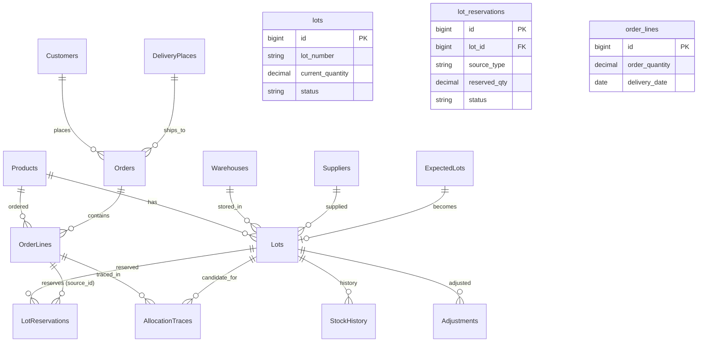

# ER図 (Entity Relationship Diagram)

主要なエンティティ間のリレーションを示す。

```mermaid
erDiagram
    %% Master Data
    Products ||--o{ Lots : "has"
    Products ||--o{ OrderLines : "ordered"
    Warehouses ||--o{ Lots : "stored_in"
    Suppliers ||--o{ Lots : "supplied"
    Customers ||--o{ Orders : "places"
    DeliveryPlaces ||--o{ Orders : "ships_to"

    %% Inventory
    Lots ||--o{ StockHistory : "history"
    Lots ||--o{ Adjustments : "adjusted"
    Lots ||--o{ LotReservations : "reserved"

    %% Orders
    Orders ||--o{ OrderLines : "contains"
    
    %% Reservation / Allocation
    OrderLines ||--o{ LotReservations : "reserves (source_id)"
    OrderLines ||--o{ AllocationTraces : "traced_in"
    Lots ||--o{ AllocationTraces : "candidate_for"
    
    %% Inbound
    ExpectedLots ||--o| Lots : "becomes"

    lots {
        bigint id PK
        string lot_number
        decimal current_quantity
        string status
    }
    
    lot_reservations {
        bigint id PK
        bigint lot_id FK
        string source_type
        decimal reserved_qty
        string status
    }
    
    order_lines {
        bigint id PK
        decimal order_quantity
        date delivery_date
    }
```
