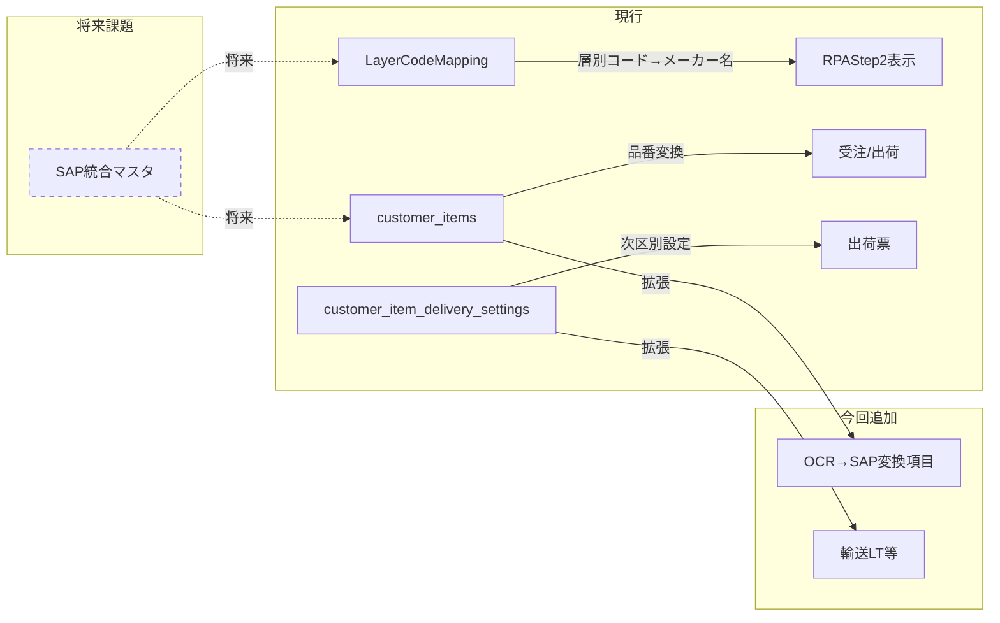
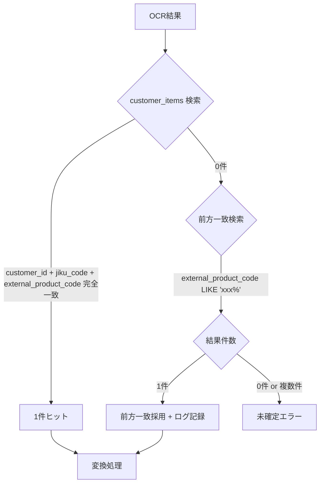
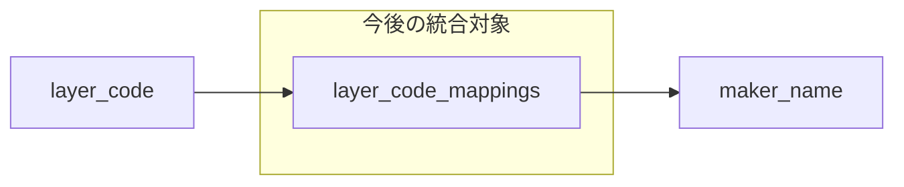

# OCR→SAP変換用ローカル補完マスタ設計（再設計版）

**方針変更**: 新規テーブル作成ではなく、既存テーブル拡張によるアプローチ

---

## 1. 項目分類結果（確定）

### ローカルマスタ正本

| 項目 | テーブル | カラム | 変更 |
|:---|:---|:---|:---|
| **得意先コード** | `customer_items` → `customers` | `customer_id` (FK) | 変更なし |
| **次区** | `customer_item_delivery_settings` | `jiku_code` | 変更なし |
| **先方品番** | `customer_items` | `external_product_code` | 変更なし |
| **メーカーコード** | `layer_code_mappings` | `layer_code` | 変更なし（別テーブル参照） |
| **メーカー名** | `layer_code_mappings` | `maker_name` | 変更なし（別テーブル参照） |
| **メーカー品番** | `customer_items` | `maker_part_no` | **追加** |
| **発注区分** | `customer_items` | `order_category` | **追加** |
| **発注の有無** | `customer_items` | `is_procurement_required` | **追加** |
| **納入先コード** | `customer_item_delivery_settings` → `delivery_places` | `delivery_place_id` (FK) | 変更なし |
| **納入先名** | `delivery_places` | `delivery_place_name` | 変更なし（テーブルJOIN） |
| **出荷票テキスト** | `customer_items` | `shipping_slip_text` | **追加** |
| **輸送LT（営業日）** | `customer_item_delivery_settings` | `lead_time_days` | 変更なし |
| **備考** | `customer_items` | `ocr_conversion_notes` | **追加** |

> [!NOTE]
> 「変更なし」の項目は既存テーブル・カラムをそのまま使用。OCR変換時はJOINで取得。

### SAP正（キャッシュ項目）- 二重管理を許容

| 項目 | 拡張先 | カラム名 | 備考 |
|:---|:---|:---|:---|
| **仕入れ先コード** | `customer_items` | 既存: `supplier_id` + **追加**: `sap_supplier_code` | 緩チェック二重管理 |
| **倉庫コード** | `customer_items` | **追加**: `sap_warehouse_code` | キャッシュ |
| **出荷倉庫** | `customer_items` | **追加**: `sap_shipping_warehouse` | キャッシュ |
| **単位（UoM）** | `customer_items` | 既存: `base_unit` + **追加**: `sap_uom` | 緩チェック二重管理 |

### 他テーブル参照

| 項目 | 参照先 |
|:---|:---|
| **担当者名** | `users` + `user_supplier_assignments` |

---

## 2. 既存テーブルとの関係整理

### 機能重複・今後の課題



> [!WARNING]
> **今後の課題**
> - `LayerCodeMapping`（層別コード→メーカー名）とRPAテーブルの統合
> - SAP正項目の二重管理解消（SAP API連携による一元化）

---

## 3. 拡張カラム設計

### 3.1 `customer_items` への追加カラム

| カラム名 | 型 | Null許容 | 説明 |
|:---|:---|:---|:---|
| `maker_part_no` | VARCHAR(100) | ○ | メーカー品番 |
| `order_category` | VARCHAR(50) | ○ | 発注区分（指示/かんばん等） |
| `is_procurement_required` | BOOLEAN | ✕ | 発注の有無（デフォルト: TRUE） |
| `shipping_slip_text` | TEXT | ○ | 出荷票テキスト |
| `ocr_conversion_notes` | TEXT | ○ | OCR変換用備考 |
| `sap_supplier_code` | VARCHAR(50) | ○ | SAP仕入先コード（キャッシュ） |
| `sap_warehouse_code` | VARCHAR(50) | ○ | SAP倉庫コード（キャッシュ） |
| `sap_shipping_warehouse` | VARCHAR(50) | ○ | SAP出荷倉庫（キャッシュ） |
| `sap_uom` | VARCHAR(20) | ○ | SAP単位（キャッシュ） |

### 3.2 `customer_item_delivery_settings` 既存カラム活用

- `shipment_text`: 出荷票テキスト（既存）
- `lead_time_days`: 輸送LT（既存）
- `jiku_code`: 次区（既存）

---

## 4. DDL（マイグレーション）

### 4.1 customer_items 拡張

```sql
-- OCR→SAP変換用カラム追加
ALTER TABLE customer_items
    ADD COLUMN IF NOT EXISTS maker_part_no VARCHAR(100),
    ADD COLUMN IF NOT EXISTS order_category VARCHAR(50),
    ADD COLUMN IF NOT EXISTS is_procurement_required BOOLEAN NOT NULL DEFAULT TRUE,
    ADD COLUMN IF NOT EXISTS shipping_slip_text TEXT,
    ADD COLUMN IF NOT EXISTS ocr_conversion_notes TEXT;

-- SAP正（キャッシュ）カラム追加
ALTER TABLE customer_items
    ADD COLUMN IF NOT EXISTS sap_supplier_code VARCHAR(50),
    ADD COLUMN IF NOT EXISTS sap_warehouse_code VARCHAR(50),
    ADD COLUMN IF NOT EXISTS sap_shipping_warehouse VARCHAR(50),
    ADD COLUMN IF NOT EXISTS sap_uom VARCHAR(20);

-- コメント
COMMENT ON COLUMN customer_items.maker_part_no IS 'メーカー品番';
COMMENT ON COLUMN customer_items.order_category IS '発注区分（指示/かんばん等）';
COMMENT ON COLUMN customer_items.is_procurement_required IS '発注の有無';
COMMENT ON COLUMN customer_items.shipping_slip_text IS '出荷票テキスト';
COMMENT ON COLUMN customer_items.ocr_conversion_notes IS 'OCR変換用備考';
COMMENT ON COLUMN customer_items.sap_supplier_code IS 'SAP仕入先コード（キャッシュ）';
COMMENT ON COLUMN customer_items.sap_warehouse_code IS 'SAP倉庫コード（キャッシュ）';
COMMENT ON COLUMN customer_items.sap_shipping_warehouse IS 'SAP出荷倉庫（キャッシュ）';
COMMENT ON COLUMN customer_items.sap_uom IS 'SAP単位（キャッシュ）';

-- 発注区分検索用インデックス
CREATE INDEX IF NOT EXISTS idx_customer_items_order_category 
    ON customer_items (order_category);
```

### 4.2 トランザクション連携（rpa_run_items拡張）

```sql
-- マスタ参照ログ追加
ALTER TABLE rpa_run_items
    ADD COLUMN IF NOT EXISTS complement_customer_id BIGINT,
    ADD COLUMN IF NOT EXISTS complement_external_product_code VARCHAR(100),
    ADD COLUMN IF NOT EXISTS complement_match_type VARCHAR(10) 
        CHECK (complement_match_type IN ('exact', 'prefix'));

-- コメント
COMMENT ON COLUMN rpa_run_items.complement_customer_id IS '参照したマスタのcustomer_id';
COMMENT ON COLUMN rpa_run_items.complement_external_product_code IS '参照したマスタのexternal_product_code';
COMMENT ON COLUMN rpa_run_items.complement_match_type IS '検索種別（exact: 完全一致, prefix: 前方一致）';

-- インデックス
CREATE INDEX IF NOT EXISTS idx_rri_complement_master 
    ON rpa_run_items (complement_customer_id, complement_external_product_code);
```

---

## 5. 検索ロジック（処理設計）

### 5.1 OCR→SAP変換時のマスタ検索



### 5.2 メーカー名の解決



---

## 6. 運用メモ

### 6.1 SCD2 vs 単純更新

- **今回の設計**: 既存の`valid_to`カラムを活用したソフトデリート
- **履歴管理**: 必要に応じて`customer_items`に`version`カラム追加を検討

### 6.2 前方一致監視

| 運用項目 | 方法 |
|:---|:---|
| **発生件数の可視化** | `rpa_run_items.complement_match_type = 'prefix'` を集計 |
| **アラート閾値** | 前方一致比率 5% 超で通知 |
| **是正アクション** | 前方一致品番をマスタに正式登録 |

### 6.3 SAP正項目の二重管理（暫定対応）

| 項目 | ローカル | SAP | 備考 |
|:---|:---|:---|:---|
| 仕入先コード | `supplier_id` | `sap_supplier_code` | 緩チェック（不一致許容） |
| 単位 | `base_unit` | `sap_uom` | 緩チェック（不一致許容） |

> [!NOTE]
> 将来的にはSAP統合API連携により、ローカルキャッシュを廃止し一元化を目指す。

### 6.4 LayerCodeMappingとの連携

- **現状**: 別テーブルとして維持、RPA処理時に参照
- **今後**: `customer_items.maker_code`との統合を検討

---

## 今後の課題（実装外）

1. **RPAテーブルとの統合**: `LayerCodeMapping` をどう統合するか
2. **SAP統合**: SAP API連携によるマスタ一元化
3. **履歴管理強化**: `customer_items`のSCD2対応（version管理）

---

## User Review Required

> [!IMPORTANT]
> **確認事項**
> 1. 既存`customer_items`への拡張カラム追加で問題ないか
> 2. SAP正項目の二重管理（緩チェック）で当面は進めてよいか
> 3. `LayerCodeMapping`との統合は今後の課題として保留でよいか
