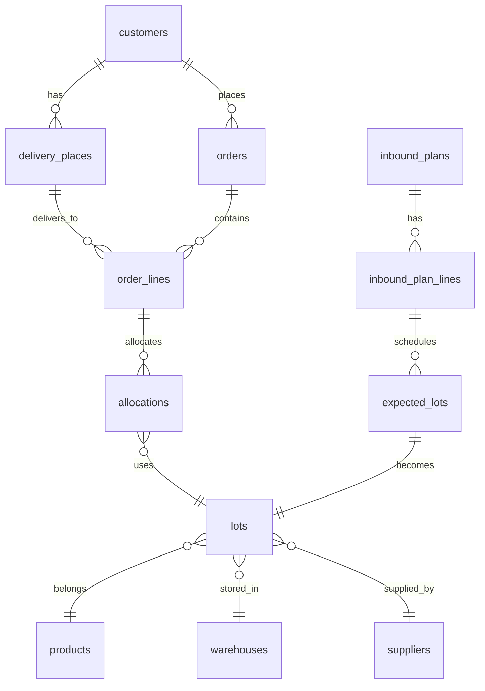
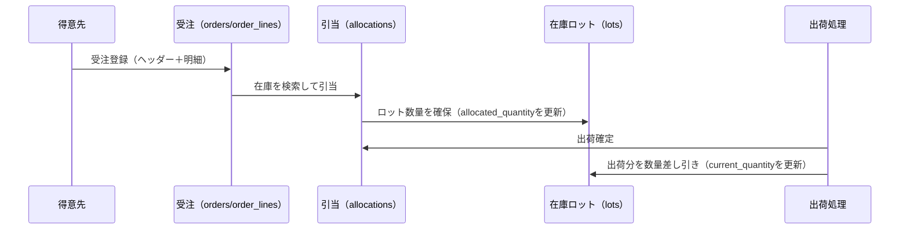
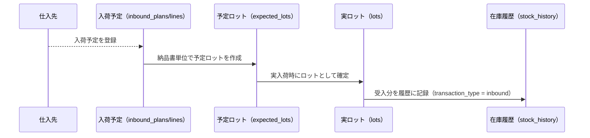

# 業務担当者向け DB かんたんガイド（v2.3）

## このドキュメントの目的
- 一般事務の方でも、ロット管理システムのデータ構造を大づかみに理解できるようにした簡易版の説明です。
- 画面で扱う情報がどのテーブルに保存され、どのように流れるかを図と言葉でまとめています。

## まず覚えておくと便利なキーワード
- **ロット**: 受け入れた在庫の単位。賞味期限や数量を持つ。
- **受注**: お客様からの注文。ヘッダー（orders）と明細（order_lines）がある。
- **引当**: どのロットをどの注文に割り当てるかの記録（allocations）。
- **内示（Forecast）**: 将来の需要予測。まだ確定注文ではない。
- **入荷予定**: 仕入先からいつ、どれだけ届くかの予定（inbound_plans, expected_lots）。

## テーブルの全体像（ざっくり版 ER 図）
以下は業務でよく使うテーブル同士のつながりをシンプルに描いたものです。

### テーブルの役割（グループ別）
- **マスタ系**
  - `customers` / `delivery_places` : 得意先と納品先
  - `suppliers` : 仕入先
  - `warehouses` : 倉庫
  - `products` : 製品・部品
- **受注と出荷**
  - `orders`（受注ヘッダー）と `order_lines`（受注明細）
  - `allocations` : どのロットをどの明細に充てたか
- **在庫**
  - `lots` : 現在庫。数量・賞味期限を持つ
  - `stock_history` : 入出庫の履歴
  - `adjustments` : 棚卸や差異調整の履歴
- **需要予測（内示）**
  - `forecast_headers` / `forecast_lines` : お客様からの予定情報
  - `allocation_suggestions` : 予測ベースの引当案
- **入荷予定**
  - `inbound_plans` / `inbound_plan_lines` : 入荷予定
  - `expected_lots` : 予定ロット（実ロット作成の元情報）
- **設定・ログ**
  - `system_configs`, `business_rules`, `batch_jobs`, `operation_logs`, `master_change_logs`

## よく使う情報の流れ（シーケンス図）

### 1. 受注〜出荷まで

- **ポイント**: 引当は在庫を「予約」するだけ。出荷確定で実数量が減ります。

### 2. 入荷予定〜在庫繰越まで

- **ポイント**: 予定ロットは「予約枠」。現物を受け付けたタイミングで実ロットが作られます。

## 画面とテーブルのひも付け（例）
| 画面 | 主に使うテーブル | 備考 |
|------|------------------|------|
| 受注一覧/詳細 | `orders`, `order_lines` | 引当状況は `allocations` を参照 |
| 在庫一覧 | `lots` | 賞味期限・現在数量を表示 |
| 入荷予定 | `inbound_plans`, `inbound_plan_lines`, `expected_lots` | 受入時に `lots` を生成 |
| 引当提案 | `forecast_headers`, `forecast_lines`, `allocation_suggestions` | 内示ベースの自動案 |
| 棚卸/調整 | `adjustments`, `stock_history` | 差異は調整履歴に残る |

## もっと詳しく知りたい場合
- 詳細な ER 図や列定義は [docs/schema/er-diagram-v2.3.md](../schema/er-diagram-v2.3.md) を参照してください。
- DDL（テーブル定義全文）は [docs/schema/base/lot_management_schema_v2.3.sql](../schema/base/lot_management_schema_v2.3.sql) で確認できます。
