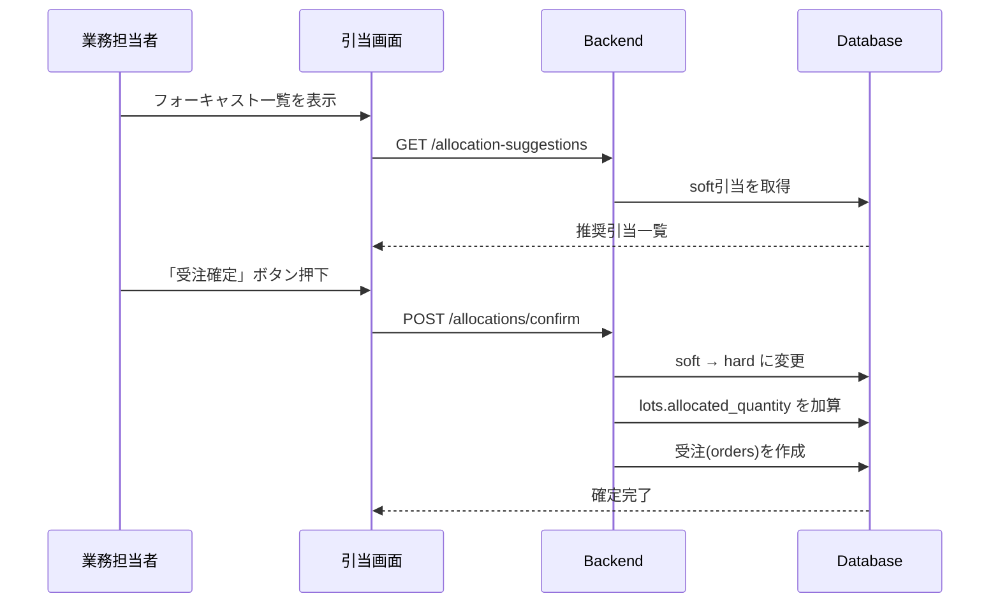
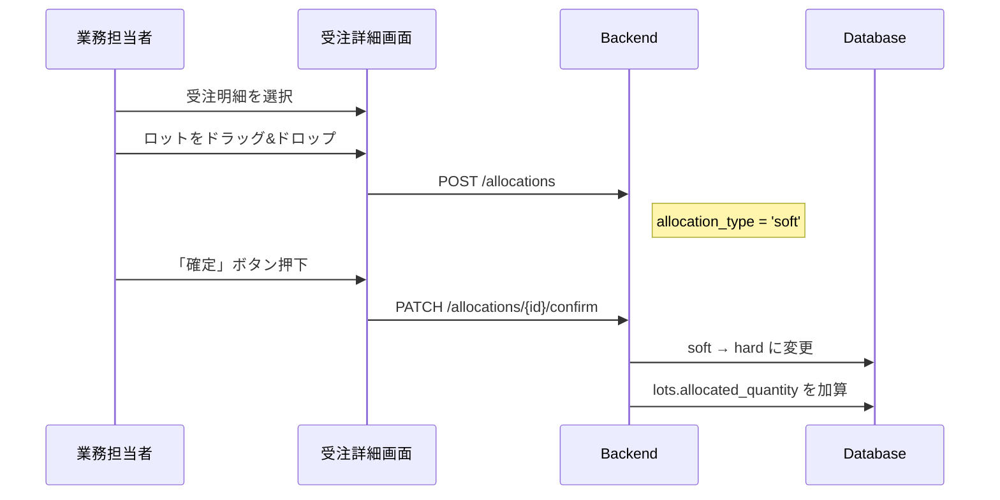
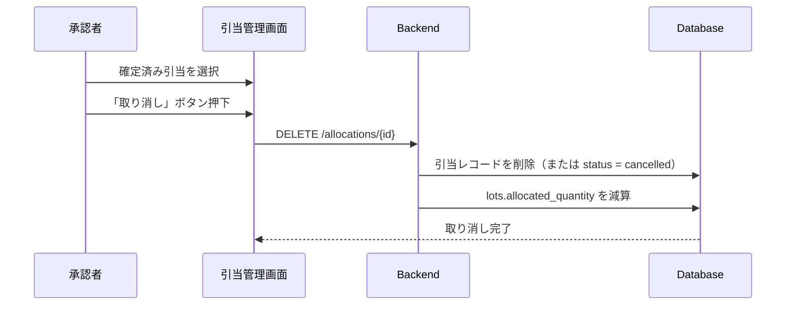
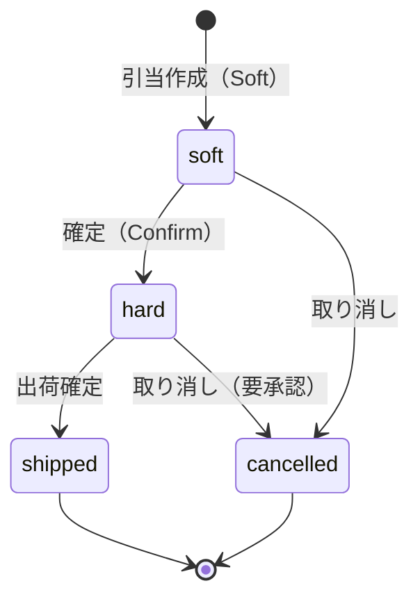
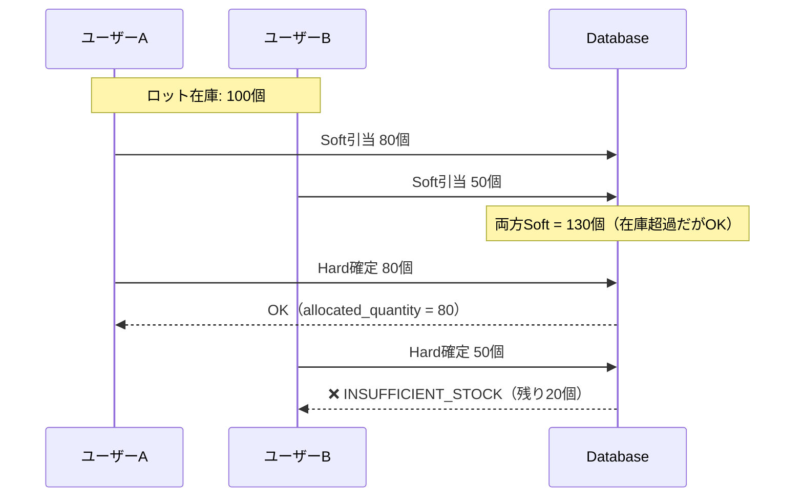

# Hard Allocation（確定引当）詳細設計

> **最終更新:** 2025-12-04  
> **ステータス:** 📝 設計レビュー待ち  
> **目標バージョン:** v3.0

---

## 📖 概要

### 背景

現在のシステムでは **Soft Allocation（推奨引当）** のみ実装されている。
Soft Allocation はフォーキャスト（内示）に基づく「引当の提案」であり、いつでも変更・取り消しが可能。

**Hard Allocation（確定引当）** は、受注確定時にロットを「確定で予約」し、他のオーダーからは引当できないようにロックする仕組み。

### Soft vs Hard の違い

| 項目 | Soft Allocation | Hard Allocation |
|------|----------------|-----------------|
| **用途** | フォーキャスト（内示）向けの引当提案 | 受注確定後の在庫予約 |
| **ロットロック** | なし（他オーダーも引当可） | あり（他オーダーは引当不可） |
| **変更可否** | 自由に変更可能 | 確定後は承認フローが必要 |
| **在庫計算** | 利用可能数量に影響しない | `allocated_quantity` に加算 |
| **ステータス** | `allocation_type = 'soft'` | `allocation_type = 'hard'` |

---

## 🎯 ユースケース

### UC-1: フォーキャストから受注への確定



### UC-2: 受注画面からの直接引当



### UC-3: Hard 引当の取り消し



---

## 📊 データモデル

### 現行スキーマ（変更なし）

```sql
-- allocations テーブル
CREATE TABLE allocations (
    id BIGSERIAL PRIMARY KEY,
    order_line_id BIGINT REFERENCES order_lines(id),
    lot_id BIGINT REFERENCES lots(id),
    allocated_quantity NUMERIC(10,2) NOT NULL,
    allocation_type VARCHAR(10) NOT NULL,  -- 'soft' or 'hard'
    status VARCHAR(20) NOT NULL DEFAULT 'allocated',
    created_at TIMESTAMP DEFAULT NOW(),
    updated_at TIMESTAMP DEFAULT NOW()
);

-- lots テーブル（既存）
-- current_quantity: 現在の総在庫数
-- allocated_quantity: hard 引当済み数量（Soft は含まない）
-- 利用可能数量 = current_quantity - allocated_quantity
```

### ステータス遷移



### 在庫数量の計算ロジック

```
総在庫数        = lots.current_quantity
Hard引当済み    = lots.allocated_quantity
Soft引当済み    = SUM(allocations.allocated_quantity WHERE allocation_type = 'soft')

利用可能数量    = 総在庫数 - Hard引当済み
Soft含む利用可能 = 利用可能数量 - Soft引当済み
```

> [!IMPORTANT]
> **Soft引当は `lots.allocated_quantity` に含まれない**  
> これにより、Soft引当同士は在庫を「共有」できる。Hard確定時に初めてロックされる。

---

## 🔌 API設計

### 1. 引当確定（Soft → Hard）

```
PATCH /allocations/{allocation_id}/confirm
```

**リクエスト:**
```json
{
  "confirmed_by": "user_id"  // オプション
}
```

**レスポンス:**
```json
{
  "id": 123,
  "order_line_id": 456,
  "lot_id": 789,
  "allocated_quantity": 100.00,
  "allocation_type": "hard",
  "status": "allocated",
  "confirmed_at": "2025-12-04T12:00:00Z",
  "confirmed_by": "user123"
}
```

**エラーケース:**

| ケース | HTTPステータス | エラーコード |
|--------|---------------|-------------|
| 在庫不足（他で確定済み） | 409 Conflict | `INSUFFICIENT_STOCK` |
| 既にhard | 400 Bad Request | `ALREADY_CONFIRMED` |
| 引当が存在しない | 404 Not Found | `ALLOCATION_NOT_FOUND` |

---

### 2. 一括確定

```
POST /allocations/confirm-batch
```

**リクエスト:**
```json
{
  "allocation_ids": [123, 124, 125],
  "confirmed_by": "user_id"
}
```

**レスポンス:**
```json
{
  "confirmed": [123, 124],
  "failed": [
    {
      "id": 125,
      "error": "INSUFFICIENT_STOCK",
      "message": "ロット LOT-001 の在庫が不足しています"
    }
  ]
}
```

---

### 3. Hard引当の取り消し

```
DELETE /allocations/{allocation_id}
```

または（論理削除の場合）:

```
PATCH /allocations/{allocation_id}/cancel
```

**前提条件:**
- `allocation_type = 'hard'` かつ `status = 'allocated'` のみ取り消し可能
- `status = 'shipped'` は取り消し不可

---

## 🖥️ UI設計

### 引当画面の変更点

#### 1. 引当カードの状態表示

```
┌─────────────────────────────────────┐
│ 受注明細 #123                        │
│ 製品: ABC-001 / 数量: 100            │
├─────────────────────────────────────┤
│ 引当ロット:                          │
│ ┌───────────────────────────────┐   │
│ │ 🔒 LOT-001  50個  [確定済み]  │   │
│ └───────────────────────────────┘   │
│ ┌───────────────────────────────┐   │
│ │ 📝 LOT-002  50個  [推奨]      │   │
│ │            [確定] [削除]      │   │
│ └───────────────────────────────┘   │
├─────────────────────────────────────┤
│ [全て確定]                          │
└─────────────────────────────────────┘
```

#### 2. カラーコード

| 状態 | 背景色 | アイコン |
|------|--------|---------|
| Soft（推奨） | 青系 (`blue-100`) | 📝 |
| Hard（確定） | 緑系 (`green-100`) | 🔒 |
| 在庫不足 | 赤系 (`red-100`) | ⚠️ |
| 出荷済み | グレー (`gray-100`) | ✅ |

#### 3. 確定ボタンの挙動

```tsx
// 確定ボタン押下時
const handleConfirm = async (allocationId: number) => {
  try {
    await confirmAllocation(allocationId);
    toast.success("引当を確定しました");
    refetch();
  } catch (error) {
    if (error.code === "INSUFFICIENT_STOCK") {
      toast.error(`在庫不足: ${error.message}`);
    } else {
      toast.error("確定に失敗しました");
    }
  }
};
```

---

## ⚠️ エッジケースと例外処理

### 1. 競合（在庫の取り合い）

**シナリオ:** 2つのオーダーが同じロットをSoft引当 → 片方が先にHard確定



**対処:**
- Hard確定時に在庫チェックを行い、不足ならエラーを返す
- UIでリアルタイムに「確定可能数量」を表示

---

### 2. 部分確定

**シナリオ:** Soft引当 100個のうち、60個だけHard確定したい

**API:**
```json
PATCH /allocations/{id}/confirm
{
  "quantity": 60  // 部分確定
}
```

**結果:**
- 元の引当: quantity=100, type=soft → quantity=40, type=soft （残り）
- 新しい引当: quantity=60, type=hard （確定分）

---

### 3. ロット期限切れ後の引当

**ルール:**
- 期限切れロット（`lots.status = 'expired'`）はHard確定不可
- 既にHard確定済みのロットが期限切れになった場合は警告表示

---

## 📋 実装タスク

### Phase 1: バックエンド

- [ ] `PATCH /allocations/{id}/confirm` エンドポイント実装
- [ ] `POST /allocations/confirm-batch` エンドポイント実装
- [ ] 在庫不足チェックロジック
- [ ] `lots.allocated_quantity` の更新ロジック
- [ ] テストケース作成

### Phase 2: フロントエンド

- [ ] 引当カードに「確定」「推奨」バッジ追加
- [ ] 確定ボタン実装
- [ ] 一括確定機能
- [ ] エラーハンドリング（在庫不足時）

### Phase 3: 統合テスト

- [ ] 競合シナリオのテスト
- [ ] 部分確定のテスト
- [ ] キャンセルフローのテスト

---

## 🔗 関連ドキュメント

- [引当機能概要](./allocation.adoc)
- [データモデルガイド](./data_model_guide.md)
- [業務フロー図](./business_flow_diagrams.md)
