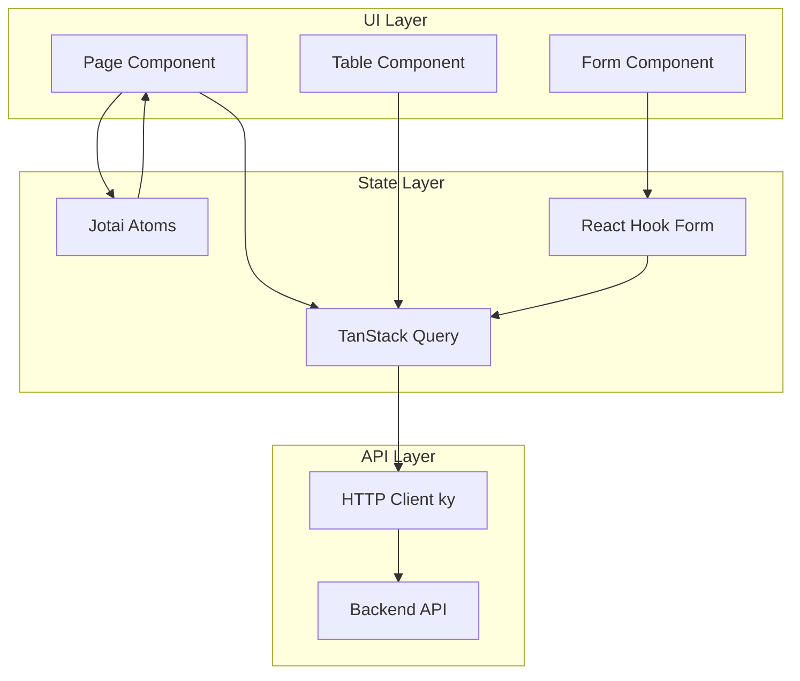

# フロントエンドアーキテクチャ (Frontend Architecture)

## 1. 技術スタック

| 技術 | バージョン | 用途 |
|:---|:---|:---|
| **React** | 18.x | UIライブラリ |
| **TypeScript** | 5.x | 型安全性 |
| **Vite** | 5.x | ビルドツール |
| **TanStack Query** | 5.x | サーバー状態管理 |
| **Jotai** | 2.x | クライアント状態管理 |
| **React Hook Form** | 7.x | フォーム管理 |
| **Zod** | 3.x | バリデーション |
| **shadcn/ui** | - | UIコンポーネント |
| **Tailwind CSS** | 3.x | スタイリング |

## 2. ディレクトリ構造

```
frontend/src/
├── features/          # 機能ドメイン別モジュール（Feature-Sliced Design）
│   ├── products/      # 製品マスタ機能
│   ├── customers/     # 得意先マスタ機能
│   ├── orders/        # 受注管理機能
│   ├── inventory/     # 在庫管理機能
│   └── ...
├── components/        # 共通UIコンポーネント
├── hooks/             # 共通カスタムフック
├── shared/            # 共通ユーティリティ・API
│   ├── api/           # HTTPクライアント
│   └── hooks/         # 共通フック（useMasterApi等）
├── layouts/           # レイアウトコンポーネント
├── services/          # 外部サービス連携
├── types/             # 型定義（OpenAPI生成含む）
├── utils/             # ユーティリティ関数
├── MainRoutes.tsx     # ルーティング定義
└── App.tsx            # アプリケーションルート
```

## 3. Feature構成

各featureは以下のパターンに従う（詳細は `frontend/STYLE_GUIDE.md` 参照）:

```
features/{feature-name}/
├── api.ts              # 型定義 + 特殊APIロジック
├── hooks/
│   ├── useXXX.ts       # 機能固有フック
│   └── index.ts
├── components/
│   ├── {Name}Form.tsx
│   ├── {Name}Table.tsx
│   └── index.ts
└── pages/
    ├── {Name}ListPage.tsx
    ├── {Name}DetailPage.tsx
    └── index.ts
```

## 4. データフロー



## 5. 主要画面

| 画面 | パス | 説明 |
|:---|:---|:---|
| **製品一覧** | `/products` | 製品マスタ管理 |
| **得意先一覧** | `/customers` | 得意先マスタ管理 |
| **仕入先一覧** | `/suppliers` | 仕入先マスタ管理 |
| **受注一覧** | `/orders` | 受注管理 |
| **在庫照会** | `/inventory/lots` | ロット在庫一覧 |
| **入庫管理** | `/inbound` | 入荷予定管理 |
| **ユーザー管理** | `/users` | システムユーザー管理 |

## 6. 状態管理ガイド

### サーバー状態（TanStack Query）
- API経由で取得するデータ
- キャッシュ、再検証、楽観的更新

### クライアント状態（Jotai）
- UIのフィルター状態
- モーダルの開閉状態
- 永続化が必要なユーザー設定

### フォーム状態（React Hook Form + Zod）
- フォーム入力値
- バリデーション

## 7. 参考資料

- [STYLE_GUIDE.md](../../frontend/STYLE_GUIDE.md) - コーディング規約詳細
- [shadcn/ui](https://ui.shadcn.com/) - UIコンポーネントライブラリ
