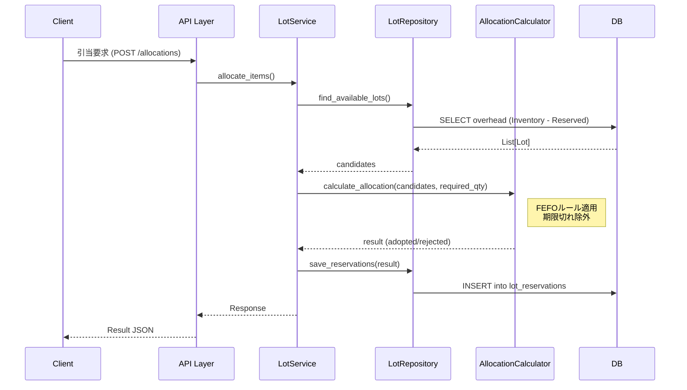

# システム概要 (System Architecture Overview)

## 1. システム構成 (System Composition)

本システムは、在庫・ロット管理を行うWebアプリケーションである。
Clean Architectureを意識したレイヤードアーキテクチャを採用している。

```mermaid
graph TD
    User[User / Browser] -->|HTTP/JSON| LB[Load Balancer / Ingress]
    LB -->|Request| API[Backend API (FastAPI)]
    
    subgraph "Backend Application"
        API -->|Call| AppLayer[Application Service]
        AppLayer -->|Use| Domain[Domain Model / Logic]
        AppLayer -->|Use| Infra[Infrastructure / Repository]
        Infra -->|SQL| DB[(PostgreSQL)]
    end

    subgraph "External Systems"
        SAP[SAP / ERP]
    end

    AppLayer -->|Sync/Integration| SAP
```

## 2. コンポーネント責務 (Component Responsibilities)

| コンポーネント | 役割 | 技術スタック |
| :--- | :--- | :--- |
| **Frontend** | ユーザーインターフェース。在庫照会、入出荷指示、マスタ管理。 | React, TypeScript |
| **Backend API** | REST APIエンドポイントの提供。リクエスト検証、レスポンス整形。 | Python, FastAPI |
| **Application** | ユースケースの実装。トランザクション管理、サービスの調整。 | Python |
| **Domain** | ビジネスロジックの中核。引当計算、ステータス遷移ルール。DBに依存しない。 | Python (Pure) |
| **Infrastructure** | データの永続化、外部システム連携の実装。 | SQLAlchemy, Alembic |
| **Database** | データの保存。整合性制約（FK, Unique）の強制。 | PostgreSQL |

## 3. ディレクトリ構造と役割 (Directory Structure)

`backend/app` 配下の構造：

- **presentation/**: APIのエンドポイント定義 (`routers`)、Pydanticスキーマ (`schemas`)。
- **application/**: ビジネスロジックの調整役 (`services`)。
- **domain/**: 純粋なドメインロジック。例：`allocation/calculator.py` (引当計算)、`lot/policies.py` (FEFOルール)。
- **infrastructure/**: 技術的詳細。DBモデル (`persistence/models`)、リポジトリ (`persistence/repositories`)。

## 4. 主要データフロー (Key Data Flows)

### 4.1. ロット引当フロー

