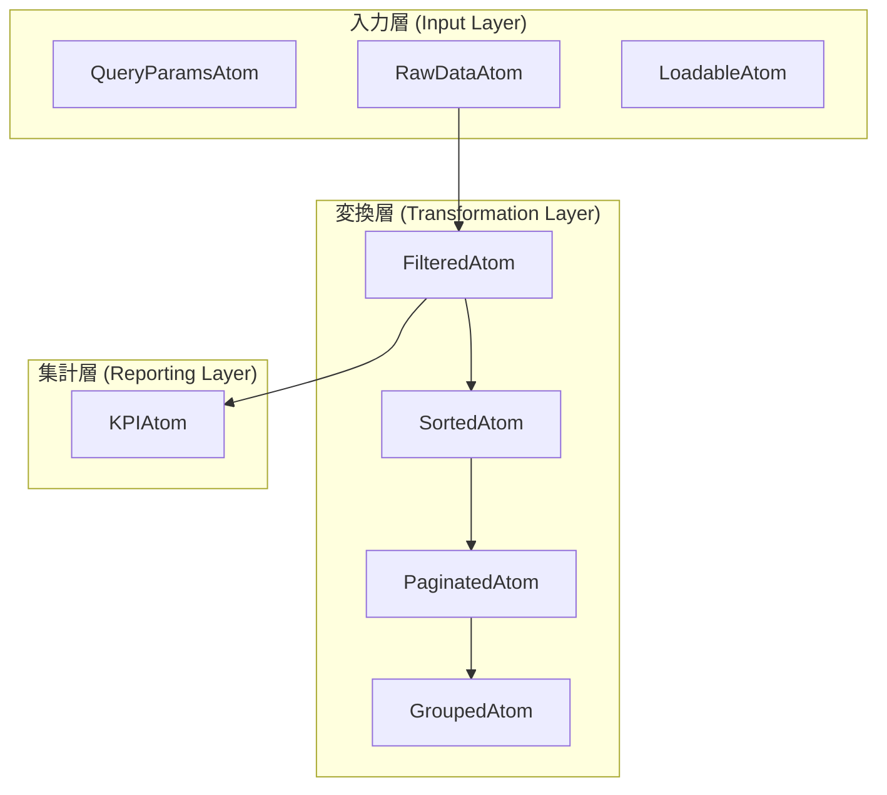

# Jotai Derived Atoms 設計標準

本ドキュメントは、フロントエンドにおけるデータ変換ロジックを Jotai derived atoms に集約し、再利用性とテスト性を最大化するための設計パターンを定義します。

## 1. 基本コンセプト：Atomパイプライン

各機能のデータ処理は、以下の階層構造（パイプライン）に従って実装します。これにより、各ステップの責務が明確になり、一部の状態変更時に最小限の再計算で済むようになります。



---

## 2. 実装レイヤーの詳細

### 2.1 入力層 (Input Layer)
サーバーからの生データを保持・取得するレイヤー。

- **Raw Data**: `TanStack Query` の結果などを Jotai に変換。
- **Loadable**: 非同期データを扱う際は `loadable()` を使用し、UI側でローディング・エラー状態を判定可能にする。

### 2.2 変換層 (Transformation Layer)
純粋関数を使用してデータを加工するレイヤー。

1. **FilteredAtom**: 検索文字列やフィルタ条件による絞り込み。
2. **SortedAtom**: テーブルのソート設定（昇順/降順）の適用。
3. **PaginatedAtom**: ブラウザ上でのページネーション処理。
4. **GroupedAtom**: （必要に応じて）製品別やカテゴリ別のグルーピング。

### 2.3 集計層 (Reporting Layer)
画面上に表示する統計値（KPI）を計算するレイヤー。

- **KPIAtom**: **フィルタ後かつページネーション前**のデータから算出することを原則とする。

---

## 3. 実装のベストプラクティス

### 3.1 変換ロジックの純粋関数化
テストを容易にするため、各ロジックは独立した純粋関数として抽出し、`atoms.test.ts` で検証します。

```typescript
// 推奨: ロジックをエクスポートしてテスト可能にする
export const filterLotsBySearchTerm = (lots: Lot[], term: string) => { ... };

// atom内では上記関数を呼び出すだけにする
export const inventoryLotsFilteredAtom = atom((get) => {
  const lots = get(inventoryLotsRawDataAtom);
  const term = get(inventoryLotSearchQueryAtom);
  return filterLotsBySearchTerm(lots, term);
});
```

### 3.2 Read-only derived atoms の徹底
派生Atom内での副作用（外部変数の変更、API呼び出し等）は厳禁です。

### 3.3 型安全性の確保
TypeScriptの型推論を活用し、パイプラインの各段階で型が正しく継承されるようにします。

---

## 4. リファレンス実装 (Inventory)

具体的なディレクトリ構成案：
```
features/inventory/
├── state/
│   ├── atoms.ts          # derived atoms 定義
│   ├── atoms.test.ts     # 変換ロジックのユニットテスト
│   └── index.ts          # base atoms (filters, tableSettings)
```

### パイプラインの実装例（`atoms.ts`）
```typescript
// 1. Raw Data (Async)
export const inventoryLotsRawAtom = atom(async (get) => {
  const params = get(inventoryLotsQueryParamsAtom);
  return await queryClient.fetchQuery({ ... });
});

// 2. Loadable Wrapper
export const inventoryLotsRawLoadableAtom = loadable(inventoryLotsRawAtom);

// 3. Filtered (Derived)
export const inventoryLotsFilteredAtom = atom((get) => {
  const lotsResult = get(inventoryLotsRawLoadableAtom);
  const lots = lotsResult.state === 'hasData' ? lotsResult.data : [];
  return filterLots(lots, get(filtersAtom));
});
```

---

## 5. 移行と適用基準

- **新規機能**: 原則としてこのパターンを採用する。
- **既存機能のリファクタリング**: コンポーネント内の `useMemo` による複雑な計算が50行を超える場合、または複数のコンポーネントで同じ計算が必要な場合に適用を検討する。
- **性能**: 数千件程度のフロントエンド処理であれば、このリアクティブなパイプラインは `useMemo` よりも効率的なキャッシングを提供できる。
