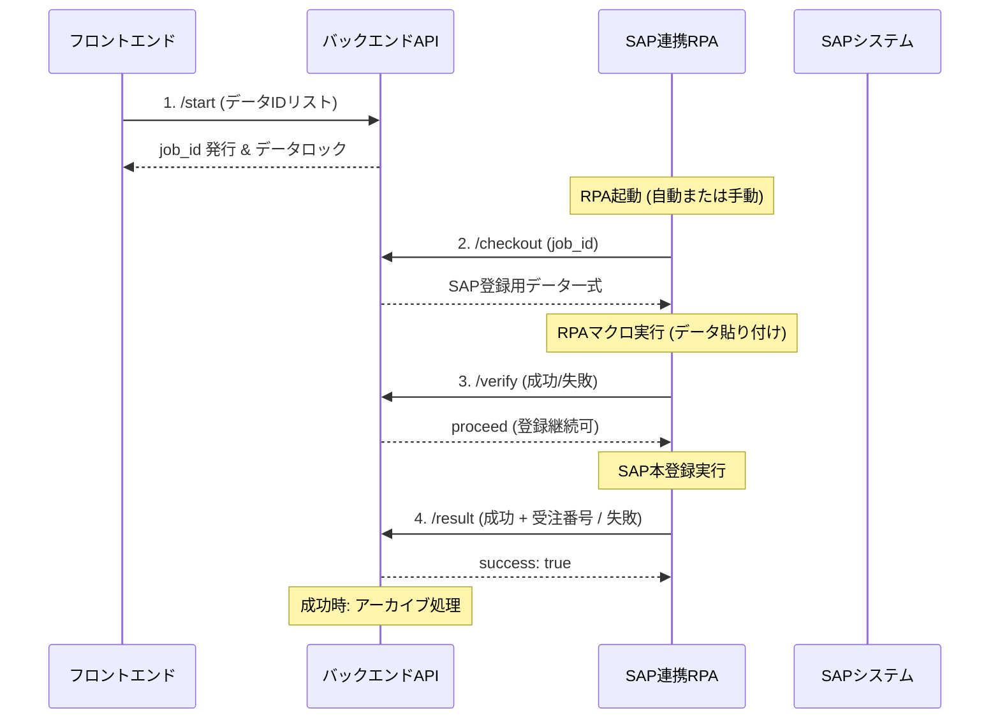

# SAP受注登録RPA 連携仕様書

## 1. 概要
本ドキュメントは、材料ロット管理システムにおけるSAP受注登録RPAとバックエンドAPIの連携仕様について記述したものです。

## 2. API ベースUrl
`http://<SERVER_ADDR>/api/rpa/sap/orders`

## 3. 認証
- **方式**: HTTP Bearer認証 (Access Token)
- RPAアカウント用に発行した有効なトークンを `Authorization: Bearer <token>` ヘッダーに付与してください。

## 4. 連携シーケンス



## 5. エンドポイント詳細

### 5.1 ジョブ開始 (`POST /start`)
- **用途**: フロントエンドから呼び出され、対象データを「処理中」にロックします。
- **Request**:
  ```json
  { "ids": [101, 102, 103] }
  ```
- **Response**:
  ```json
  {
    "job_id": "550e8400-e29b-41d4-a716-446655440000",
    "target_count": 3,
    "launch_url": "rpa-launcher://..." (設定時のみ)
  }
  ```

### 5.2 データ取得 (`POST /checkout`)
- **用途**: RPAから呼び出され、ジョブに紐づくデータを取得します。
- **Request**:
  ```json
  { "job_id": "550e8400-e29b-41d4-a716-446655440000" }
  ```
- **Response**:
  ```json
  {
    "job_id": "...",
    "items": [
      {
        "id": 101,
        "data": {
          "customer_code": "C001",
          "material_code": "M001",
          "delivery_date": "2026-02-10",
          "delivery_quantity": "500",
          "lot_no": "LOT123",
          "inbound_no": "INB456",
          ...
        }
      }
    ]
  }
  ```

### 5.3 バリデーション報告 (`POST /verify`)
- **用途**: RPAマクロ側でのデータ貼り付け・チェックの成否を報告します。
- **Request**:
  ```json
  {
    "job_id": "...",
    "success": true,
    "error_message": null
  }
  ```
- **Response**:
  ```json
  { "action": "proceed" } // proceed or abort
  ```

### 5.4 最終結果報告 (`POST /result`)
- **用途**: SAPへの本登録完了（または致命的エラー）を報告します。
- **Request (成功時)**:
  ```json
  {
    "job_id": "...",
    "success": true,
    "sap_order_no": "1000012345",
    "error_message": null
  }
  ```
- **Request (失敗時)**:
  ```json
  {
    "job_id": "...",
    "success": false,
    "error_message": "SAP Connection failed"
  }
  ```
- **Response**:
  ```json
  { "success": true, "message": "Job status updated." }
  ```

## 6. ステータス遷移
- **開始前**: ステータスは何らかの状態（例: `pending`）
- **RPA開始時**: `processing` に変更（UI側で編集ロック）
- **登録成功報告後**:
  1. `sap_order_no` をデータに書き込み
  2. ステータスを `IMPORTED` に変更
  3. `SmartReadLongDataCompleted` （アーカイブ）へ移動
- **失敗報告後**: ステータスが `ERROR` に戻り、エラー理由が表示される。
