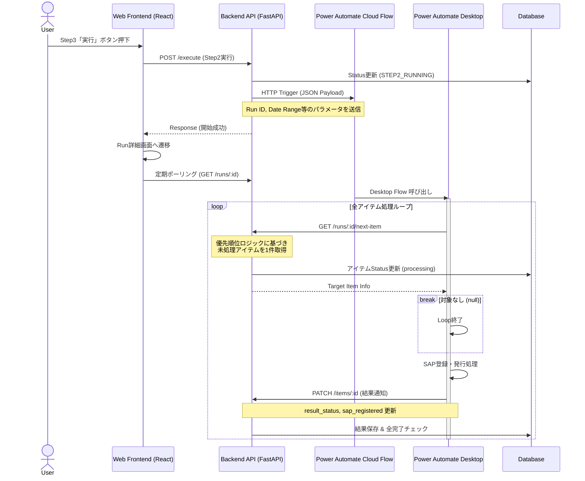

# 素材納品書発行機能 Step3 実行・連携仕様書

## 1. 概要
本ドキュメントは、素材納品書発行業務における **Step3（本番発行処理）** の実行フロー、システム連携アーキテクチャ、および詳細な実装仕様をまとめたものである。
特に、WebアプリケーションとRPA（Power Automate Desktop）間の非同期連携と、アイテム処理の優先順位付けロジックについて詳述する。

## 2. ユーザー要件と背景
### 2.1 課題と要望
*   **実行と監視の分離**: 実行ボタン押下後、すぐに詳細画面で進捗を確認したい。クラウドフローのトリガー完了を待たずに画面遷移を行うこと。
*   **リアルタイム監視**: デスクトップフローは長時間実行されるため、詳細画面でアイテムごとの処理結果（成功・失敗）をリアルタイムに確認できるようにすること。
*   **処理順序の最適化**: メーカー（層別コード）ごとに処理を行う際、効率化のため「小ロット（対象件数が少ない）メーカー」から順に処理を行いたい。
*   **PAD連携の簡素化**: Power Automate Desktop (PAD) 側で複雑な並び替えロジックを持たせず、Web APIから「次に処理すべき1件」を取得するだけで済むようにしたい。

## 3. システムアーキテクチャ

本機能は、**Webアプリ（トリガー・管理）**、**Cloud Flow（中継）**、**Desktop Flow（実処理）** の3層構造で動作する。

### 3.1 シーケンス図

## 4. 実装仕様詳細

### 4.1 優先順位付き次アイテム取得ロジック (Next Item Logic)
PADが効率的に処理を行うため、バックエンドAPIにて処理順序を制御する。

*   **API**: `GET /rpa/material-delivery-note/runs/{run_id}/next-item`
*   **実装メソッド**: `MaterialDeliveryNoteService.get_next_processing_item`
*   **抽出条件**:
    1.  指定された `run_id` に属する。
    2.  `issue_flag` が `True`（発行対象）である。
    3.  `result_status` が未完了の状態（`NULL` または `pending`）。
*   **優先順位アルゴリズム**:
    1.  **メーカー（層別コード）ごとの残件数** を集計する。
    2.  残件数が **少ない** メーカーのアイテムを優先する（小ロット優先）。
    3.  同一メーカー内では `row_no`（行番号）の昇順とする。
*   **排他制御**:
    *   取得されたアイテムの `result_status` は即座に `processing` に更新され、他の処理プロセスによる重複取得を防止する。

### 4.2 フロントエンド仕様

#### Step3 実行一覧画面 (`Step3ExecuteListPage`)
*   **表示条件**: ステータスが `ready_for_step2`, `step2_running`, `done` のRun。
*   **表示カラム**: ID, ステータス, **対象期間**（今回追加: `data_start_date`〜`data_end_date`）, 取込日時, 進捗。
*   **アクションボタン**:
    *   **詳細**: 常に表示。実行前でも実行中でも詳細確認が可能。
    *   **実行**: ステータスが `ready_for_step2` の場合のみ表示。

#### Run 詳細画面 (`RunDetailPage`)
*   **実行機能**: ヘッダー部に「実行」ボタンを配置（`ready_for_step2` 時のみ）。これにより、中身を確認した上での実行が可能。
*   **リアルタイム監視**: 3秒間隔（設定値）でポーリングを行い、PADによるアイテム処理状況（成功・失敗・SAP登録済）を即座に反映する。
*   **結果表示**:
    *   `result_status`: バッジ表示（成功: 緑, 失敗: オレンジ, エラー: 赤）。
    *   `sap_registered`: チェックアイコンまたは✗アイコンで表示。

### 4.3 バックエンドステータス遷移
*   **DRAFT / DOWNLOADED**: 初期状態。アイテム編集・確認期間。
*   **READY_FOR_STEP2**: 全アイテムの確認完了（Step2完了）。実行待ち。
*   **STEP2_RUNNING**: Cloud Flowトリガー直後に遷移。Desktop Flow稼働中。
    *   *注: 以前はトリガー成功時にDONEにしていたが、非同期処理を正しく表現するためRUNNINGを維持するように変更済み。*
*   **DONE**: 全てのアイテムの処理が完了した時点で自動遷移（`update_item` 時にチェック）。

## 5. API インターフェース変更点

### `POST /runs/{run_id}/next-item` (Novel)
*   **Response**: `RpaRunItemResponse` (処理対象アイテム単体)
    *   対象がない場合は `null` (200 OK)

### `PATCH /runs/{run_id}/items/{item_id}` (Extended)
*   **Request Body**:
    *   `result_status`: `success` | `failure` | `error`
    *   `sap_registered`: `boolean`
    *   既存フィールド (`issue_flag` 等) も更新可能

## 6. 今後の拡張性
*   現在はメーカーごとの「残件数」でソートしているが、将来的に「特定のメーカーを最優先」等のルール変更が必要になった場合、`get_next_processing_item` 内のソートキーを変更するだけでPAD側の修正なしに対応可能。
