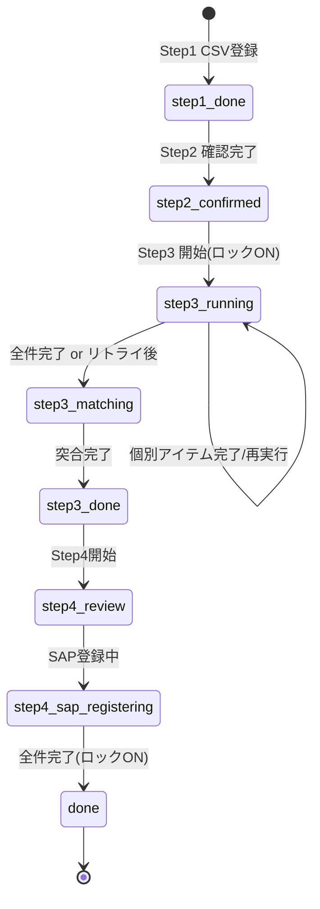

# 素材納品書発行 ワークフロー仕様書

## 概要
素材納品書発行業務のStep1〜Step4の完全なワークフロー仕様。

---

## Step1: 進度実績ダウンロード
**目的**: PAD経由でCSVをダウンロードしてシステムに登録

### フロー
1. PADを呼び出す
2. IEモードでCSVをダウンロード
3. FastAPIのエンドポイントを叩いてCSVを登録
4. 開始日・終了日を記録（Step3の突合で再利用）

---

## Step2: 内容確認
**目的**: 発行対象の選定

### フロー
1. Step1で登録された内容を確認
2. 素材納品書を発行したいものだけに「発行対象」チェックを付与
3. 確認完了 → Step3へ進む

### ロック制御
- **ロックされたアイテム（`lock_flag=true`）は編集不可**
- Step3実行開始時に発行対象アイテムのロックをONにする

---

## Step3: PAD実行・監視・突合
**目的**: 素材納品書の発行とステータス突合

### フロー
1. **実行ボタン押下** → 発行対象アイテムに`lock_flag=true`を設定
2. **クラウドフロー呼び出し** → 必要情報込みでPADが呼ばれる
3. **PADがリスト取得** (`GET /runs/{run_id}/next-item`) → 1件ずつ処理
4. **結果返却**: 1件終わるごとにFastAPIのエンドポイントにステータスが返される
5. **エラー再実行**: 全件完了後、エラーがあったものを再実行
6. **突合処理**: 
   - 全て○ or 1回リトライ後
   - Step1の日付でCSVを再ダウンロード
   - FastAPIでCSVを再インポート（**ステータス列の突合チェック**）
   - ステータスが正しく変わっていれば「突合○」
7. **別CSV処理** (保留): アイテムNo等を含むCSV → テーブル登録

### テーブル列
| No | ステータス | 出荷先 | 層別 | メーカー名 | 材質コード | 納期 | 出荷便 | 結果 | 突合 |

---

## Step4: レビュー・SAP登録
**目的**: 突合OKデータのSAP登録

### フロー
1. **突合○のデータのみに絞って表示**
2. **ロットNo入力** (必須)
3. **SAP✔を入れる**: SAP登録対象を選択
4. **SAP登録実行**: SAP✔のものをSAPへ登録
5. **受注No更新**: SAPからの戻り値（受注No）でデータを更新
6. **ロック✔**: SAP登録完了後にロックをON

### テーブル列
| ロットNo | アイテムNo | No | ステータス | 出荷先 | 層別 | メーカー名 | 材質コード | 納期 | 出荷便 | 突合 | SAP | 受注No |

---

## 状態遷移図

---

## DBスキーマ

### rpa_run_items
| 列名 | 型 | 説明 | 状態 |
|------|-----|------|------|
| `lock_flag` | boolean | 編集ロック | 追加必要 |
| `item_no` | string | アイテムNo (CSVから取得) | 追加必要 |
| `lot_no` | string | ロットNo (Step4入力) | 追加必要 |

### rpa_runs
- `data_start_date`, `data_end_date`: Step1の日付（突合用） ✅ 既存

---

## 次のアクション
- [x] ワークフロー仕様書作成
- [ ] DBスキーマ変更（lock_flag, item_no, lot_no列追加）
- [ ] Step4ページをリンク化（routes.ts + メニュー）
- [ ] Step4テーブル列更新（突合○のみ、ロットNo・アイテムNo・SAP・受注No）
- [ ] Step3実行開始時にロックON機能
- [ ] Step2でロックアイテムを編集不可に
