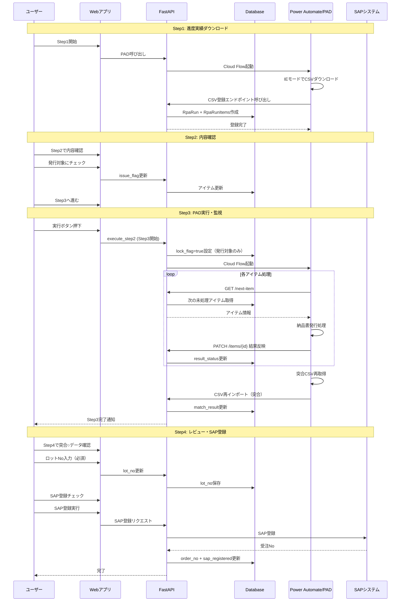
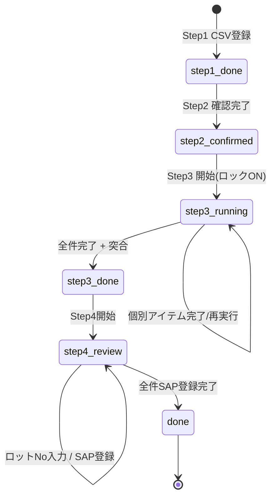

# 素材納品書発行 ワークフロー仕様書

## 概要
素材納品書発行業務のStep1〜Step4の完全なワークフロー仕様。

---

## 業務フロー概要（シーケンス図）



---

## Step1: 進度実績ダウンロード
**目的**: PAD経由でCSVをダウンロードしてシステムに登録

### フロー
1. PADを呼び出す
2. IEモードでCSVをダウンロード
3. FastAPIのエンドポイントを叩いてCSVを登録
4. 開始日・終了日を記録（Step3の突合で再利用）

---

## Step2: 内容確認
**目的**: 発行対象の選定

### フロー
1. Step1で登録された内容を確認
2. 素材納品書を発行したいものだけに「発行対象」チェックを付与
3. 確認完了 → Step3へ進む

### ロック制御
- **ロックされたアイテム（`lock_flag=true`）は編集不可**
- Step3実行開始時に発行対象アイテムのロックをONにする

---

## Step3: PAD実行・監視・突合
**目的**: 素材納品書の発行とステータス突合

### フロー
1. **実行ボタン押下** → 発行対象アイテムに`lock_flag=true`を設定
2. **クラウドフロー呼び出し** → 必要情報込みでPADが呼ばれる
3. **PADがリスト取得** (`GET /runs/{run_id}/next-item`) → 1件ずつ処理
4. **結果返却**: 1件終わるごとにFastAPIのエンドポイントにステータスが返される
5. **エラー再実行**: 全件完了後、エラーがあったものを再実行
6. **突合処理**: 
   - 全て○ or 1回リトライ後
   - Step1の日付でCSVを再ダウンロード
   - FastAPIでCSVを再インポート（**ステータス列の突合チェック**）
   - ステータスが正しく変わっていれば「突合○」
7. **別CSV処理** (保留): アイテムNo等を含むCSV → テーブル登録

### テーブル列
| No | ステータス | 出荷先 | 層別 | メーカー名 | 材質コード | 納期 | 出荷便 | 結果 | 突合 |

---

## Step4: レビュー・SAP登録
**目的**: 突合OKデータのSAP登録

### フロー
1. **突合○のデータのみに絞って表示**
2. **ロットNo入力** (必須)
3. **SAP✔を入れる**: SAP登録対象を選択
4. **SAP登録実行**: SAP✔のものをSAPへ登録
5. **受注No更新**: SAPからの戻り値（受注No）でデータを更新
6. **ロック✔**: SAP登録完了後にロックをON

### ロットNo自動引当機能

**エンドポイント**: `GET /runs/{run_id}/items/{item_id}/lot-suggestions`

**ロジック**:
1. `RpaRun.customer_id` + `RpaRunItem.external_product_code` → `CustomerItem` 検索
2. `CustomerItem` から `product_id` + `supplier_id` 取得
3. `Lot` 検索（FEFO順、在庫あり、supplier_idでフィルタ）
4. 候補1つ → `auto_selected` 返却

**レスポンス例**:
```json
{
  "lots": [
    {
      "lot_id": 1,
      "lot_number": "LOT-001",
      "available_qty": 100.0,
      "expiry_date": "2025-06-30",
      "supplier_name": "仕入先A"
    }
  ],
  "auto_selected": "LOT-001",
  "source": "customer_item"  // or "product_only" or "none"
}
```

**疎結合設計**: マスタ未登録でもエラーにならず空リストを返す

### テーブル列
| ロットNo | アイテムNo | No | ステータス | 出荷先 | 層別 | メーカー名 | 材質コード | 納期 | 出荷便 | 突合 | SAP | 受注No |

---

## 状態遷移図



---

## システム設定

Power Automate Cloud Flow URLはDBの`system_configs`テーブルで管理。

| キー | 説明 |
|------|------|
| `cloud_flow_url_material_delivery` | 素材納品書発行フローURL |
| `cloud_flow_url_progress_download` | 進度実績DLフローURL |

**優先順位**: DB設定 → 環境変数フォールバック

---

## DBスキーマ

### rpa_run_items
| 列名 | 型 | 説明 | 表示名 | 備考 |
|------|-----|------|------|------|
| `jiku_code` | string | 次区コード | 出荷先 | 旧: destination |
| `external_product_code` | string | 先方品番 | 材質コード | 旧: material_code |
| `lock_flag` | boolean | 編集ロック | - | ✅ 実装済み |
| `item_no` | string | アイテムNo (CSVから取得) | - | ✅ 実装済み |
| `lot_no` | string | ロットNo (Step4入力) | - | ✅ 実装済み |

### rpa_runs
| 列名 | 型 | 説明 | 備考 |
|------|-----|------|------|
| `customer_id` | bigint | 得意先ID | ロット引当用 |
| `data_start_date`, `data_end_date` | date | Step1の日付 | 突合用 |

### system_configs
- Cloud Flow URL等のシステム設定 ✅ 実装済み

---

## 実装状況

| 項目 | 状態 |
|------|------|
| ワークフロー仕様書 | ✅ 完了 |
| DBスキーマ変更（lock_flag, item_no, lot_no列追加） | ✅ 完了 |
| フィールド名統一（jiku_code, external_product_code） | ✅ 完了 |
| customer_id追加（rpa_runs） | ✅ 完了 |
| ロット候補取得エンドポイント | ✅ 完了 |
| Step4ページをリンク化（routes.ts + メニュー） | ✅ 完了 |
| Step4テーブル列更新（突合○のみ、ロットNo・アイテムNo・SAP・受注No） | ✅ 完了 |
| Step3実行開始時にロックON機能 | ✅ 完了 |
| Step2でロックアイテムを編集不可に | ✅ 完了 |
| Step4でロットNo入力UI | ✅ 完了 |
| ナビゲーション導線改善 | ✅ 完了 |
| システム設定テーブル（Cloud Flow URL） | ✅ 完了 |
| ハイブリッドUI（候補数に応じた自動入力/ドロップダウン/手動） | 📌 保留 |
| 仮引当（SOFT）lot_reservations登録 | 📌 保留 |
| SAP登録エンドポイント | 📌 保留（仕様確定後） |
