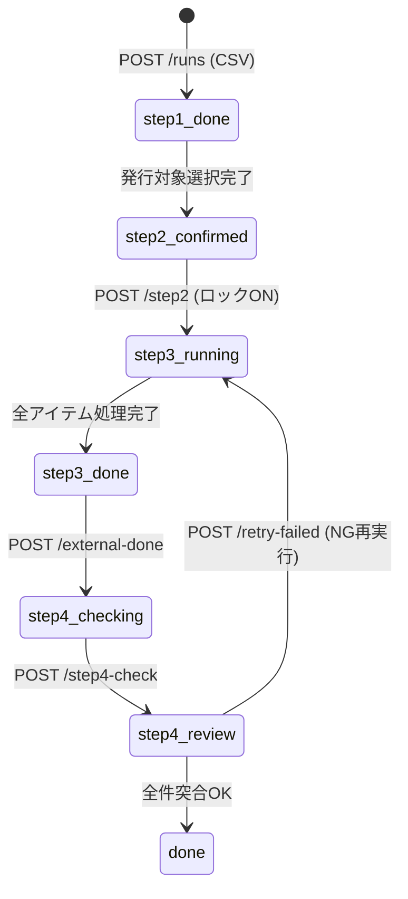
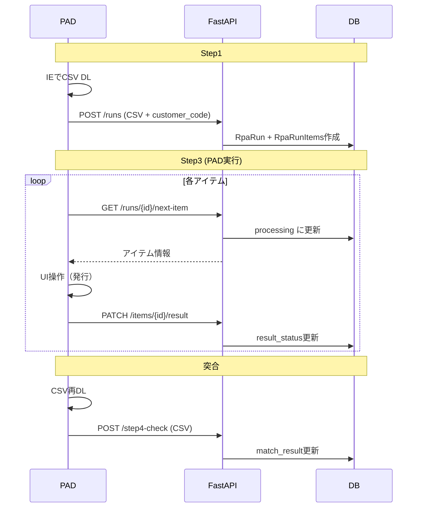
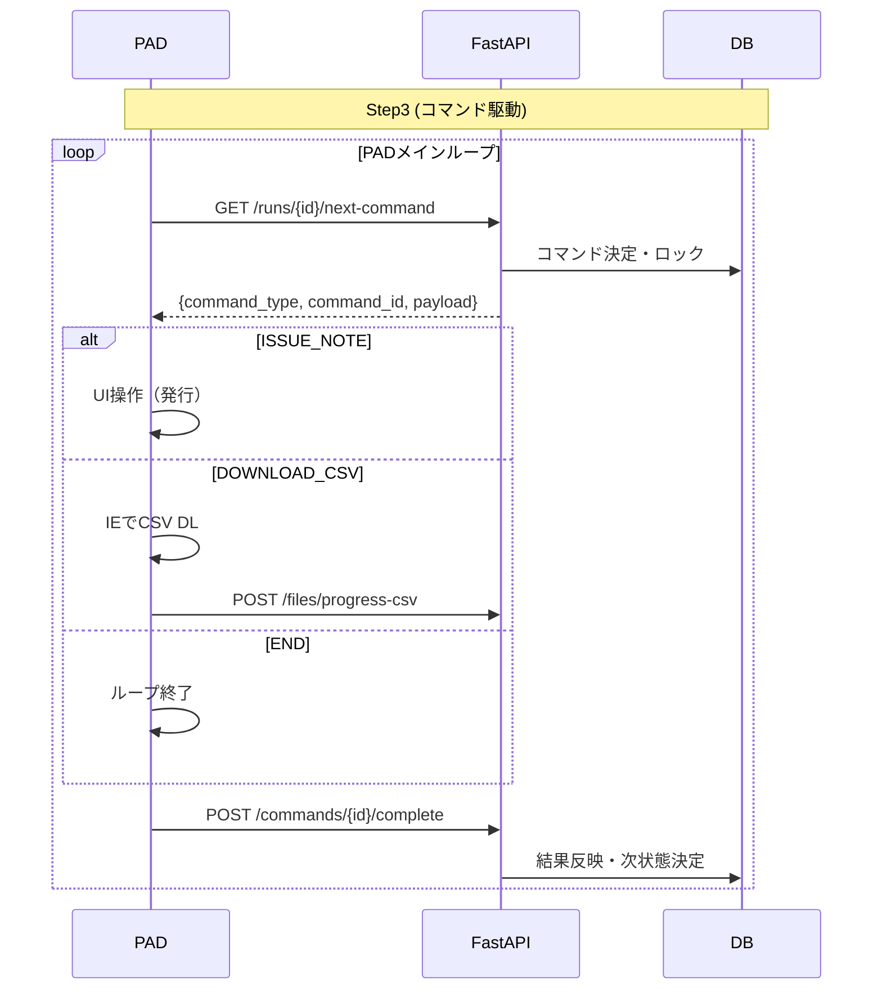

# PAD最小化アーキテクチャ設計書

## 0. 目的と非目的

### 目的
- **PADを「画面操作ドライバ」に固定**し、業務ロジック/判断/状態管理/再実行/突合をFastAPIへ集約する
- `run_id`だけ渡せばStep3が回る（PADに業務データを持たせない）
- 途中失敗でも再実行で整合が壊れない（idempotent、状態遷移が単方向）

### 非目的
- SAP登録（Step4のSAP処理）は今回の範囲外
- ただしStep4からSAP連携するインタフェース前提は記載

---

## 1. 現状（As-Is）の事実

### 1.1 エンドポイント一覧

**Base URL**: `/api/rpa/material-delivery-note`

| メソッド | パス | 用途 | 呼び出し元 |
|---------|------|------|-----------|
| `POST` | `/runs` | CSV登録（Run作成） | PAD / Web |
| `GET` | `/runs` | Run一覧取得 | Web |
| `GET` | `/runs/{run_id}` | Run詳細取得 | Web |
| `PATCH` | `/runs/{run_id}/items/{item_id}` | Item更新（Web用） | Web |
| `GET` | `/runs/{run_id}/next-item` | **次の処理対象取得** | **PAD** |
| `GET` | `/runs/{run_id}/items/{item_id}/lot-suggestions` | ロット候補取得 | Web |
| `POST` | `/runs/{run_id}/items/batch-update` | 一括更新 | Web |
| `POST` | `/runs/{run_id}/complete-all` | Step2完了 | Web |
| `POST` | `/runs/{run_id}/step2` | Step3実行開始 | Web |
| `POST` | `/runs/{run_id}/external-done` | 外部手順完了 | Web |
| `PATCH` | `/runs/{run_id}/items/{item_id}/result` | **結果更新** | **PAD** |
| `POST` | `/runs/{run_id}/step4-check` | 突合チェック | PAD / Web |
| `POST` | `/runs/{run_id}/retry-failed` | NG再実行 | Web |

### 1.2 DBモデル

#### テーブル: `rpa_runs`

```python
class RpaRun(Base):
    __tablename__ = "rpa_runs"
    
    id: Mapped[int]                          # PK
    rpa_type: Mapped[str]                    # "material_delivery_note"
    status: Mapped[str]                      # 状態（RpaRunStatus）
    data_start_date: Mapped[date | None]     # Step1日付（突合用）
    data_end_date: Mapped[date | None]       # Step1日付（突合用）
    customer_id: Mapped[int | None]          # 得意先ID（ロット引当用）
    step2_executed_at: Mapped[datetime | None]
    external_done_at: Mapped[datetime | None]
    step4_executed_at: Mapped[datetime | None]
```

#### テーブル: `rpa_run_items`

```python
class RpaRunItem(Base):
    __tablename__ = "rpa_run_items"
    
    id: Mapped[int]                          # PK
    run_id: Mapped[int]                      # FK → rpa_runs.id
    row_no: Mapped[int]                      # CSV行番号
    
    # CSVカラム
    status: Mapped[str | None]               # CSVステータス
    jiku_code: Mapped[str | None]            # 次区コード（出荷先）
    layer_code: Mapped[str | None]           # 層別
    external_product_code: Mapped[str | None] # 先方品番（材質コード）
    
    # フラグ
    issue_flag: Mapped[bool]                 # 発行対象
    lock_flag: Mapped[bool]                  # 編集ロック（Step3開始時にON）
    complete_flag: Mapped[bool]              # 発行完了
    match_result: Mapped[bool | None]        # 突合結果（NULL/True/False）
    sap_registered: Mapped[bool | None]      # SAP登録済み
    
    # 処理状態
    result_status: Mapped[str | None]        # pending/processing/success/failure/failed_timeout
    processing_started_at: Mapped[datetime | None]  # タイムアウト判定用
    
    # 追加データ
    item_no: Mapped[str | None]              # アイテムNo
    lot_no: Mapped[str | None]               # ロットNo（Step4入力）
    order_no: Mapped[str | None]             # 受発注No
```

### 1.3 状態遷移

#### RpaRun.status

```python
class RpaRunStatus:
    STEP1_DONE = "step1_done"                    # CSVインポート直後
    STEP2_CONFIRMED = "step2_confirmed"          # Step2確認完了
    STEP3_RUNNING = "step3_running"              # PAD実行中（旧名: STEP2_RUNNING）
    STEP3_DONE = "step3_done"                    # 外部手順待ち
    STEP4_CHECKING = "step4_checking"            # 突合チェック中
    STEP4_REVIEW = "step4_review"                # レビュー可能
    DONE = "done"                                # 完了
```



#### RpaRunItem.result_status

| 値 | 意味 |
|----|------|
| `NULL` | 未処理 |
| `pending` | 処理待ち（リトライ対象含む） |
| `processing` | 処理中（get_next_item取得時に設定） |
| `success` | 成功 |
| `failure` | 失敗 |
| `failed_timeout` | タイムアウト（2分経過） |

### 1.4 既存の責務分担

| 処理 | 現在の実行場所 |
|------|---------------|
| 対象選別 (`issue_flag`) | **Web UI** |
| アイテム取得 | **FastAPI** (`get_next_processing_item`) |
| 処理順序決定（layer_code優先） | **FastAPI** |
| タイムアウト検出（2分） | **FastAPI** |
| 結果登録 | **PAD → FastAPI** (`PATCH /result`) |
| Run状態自動遷移 | **FastAPI** (`_update_run_status_if_needed`) |
| 突合判定 | **FastAPI** (`execute_step4_check`) |
| NG再実行 | **FastAPI** (`retry_step3_failed`) |

---

## 2. 目標（To-Be）：PAD最小化の基本方針

### PADに残すのは以下のみ

1. **IEモードでCSVをダウンロード**（画面操作）
2. **画面操作で納品書発行**（UIクリック等）
3. **FastAPIへのHTTP呼び出し**
   - 命令受領（GET /next-command）
   - 結果返却（POST /commands/{id}/complete）
   - CSVアップロード（POST /files/progress-csv）

### PADから排除する

- 対象選別・リトライ判断・突合判定
- 状態遷移・例外分類・ログ整形
- 業務データの保持（run_idのみ渡す）
- ループ終了条件の判断

---

## 3. PAD⇄FastAPIの最小契約（API Contract）

### 3.1 新規エンドポイント設計

#### GET `/runs/{run_id}/next-command`

**目的**: PADが次に実行すべきコマンドを取得

**レスポンス**:

```json
{
  "command_type": "ISSUE_NOTE",
  "command_id": "cmd_12345",
  "item_id": 42,
  "payload": {
    "jiku_code": "B509",
    "layer_code": "0902",
    "external_product_code": "8891078",
    "delivery_date": "2025-12-22",
    "delivery_quantity": 200
  }
}
```

| command_type | 意味 | PADの動作 |
|--------------|------|----------|
| `ISSUE_NOTE` | 納品書発行 | UI操作で発行 |
| `DOWNLOAD_CSV` | CSV再ダウンロード | IEでCSV取得→アップロード |
| `END` | 処理終了 | ループ終了 |

**HTTPステータス**:
- `200`: コマンドあり
- `204`: コマンドなし（処理完了）
- `409`: 状態不整合（再取得不可）

---

#### POST `/runs/{run_id}/commands/{command_id}/complete`

**目的**: コマンド実行結果を返却

**リクエスト**:

```json
{
  "status": "success",
  "error_code": null,
  "error_message": null,
  "retryable": false
}
```

| status | 意味 |
|--------|------|
| `success` | 成功 |
| `failure` | 失敗（恒久エラー） |
| `error_retryable` | 一時エラー（リトライ可能） |
| `error_data` | データ不備 |

**冪等性**: 同じ `command_id` に対する二重送信は無視（既に完了済みなら200返却）

---

#### POST `/runs/{run_id}/files/progress-csv`

**目的**: Step1登録・Step3突合用CSVアップロード

```
Content-Type: multipart/form-data

file: (CSV binary)
purpose: "step1_import" | "step3_matching"
```

---

### 3.2 既存エンドポイントとの互換

| 既存 | 新規 | 移行方針 |
|------|------|---------|
| `GET /next-item` | `GET /next-command` | 互換レイヤ維持→段階廃止 |
| `PATCH /items/{id}/result` | `POST /commands/{id}/complete` | 互換レイヤ維持 |
| `POST /runs` | `POST /files/progress-csv` | 統合検討 |

---

## 4. 状態管理と排他（ロック設計）

### 4.1 Step3開始時のロック

```python
# execute_step2() 内の実装
self.db.query(RpaRunItem).filter(
    RpaRunItem.run_id == run_id,
    RpaRunItem.issue_flag.is_(True),
).update({"lock_flag": True, "updated_at": now})
```

### 4.2 next-command取得時の排他

**現在の実装** (`get_next_processing_item`):

```python
# 取得と同時にprocessing状態へ更新
target_item.result_status = "processing"
target_item.processing_started_at = utcnow()
self.db.commit()
```

**課題**: `SELECT...FOR UPDATE SKIP LOCKED`を使っていない

**改善案**:

```python
# 原子的に取得
item = (
    self.db.query(RpaRunItem)
    .filter(...)
    .with_for_update(skip_locked=True)
    .first()
)
```

### 4.3 タイムアウト回復

```python
# 2分経過したprocessingをfailed_timeoutに変更
timeout_threshold = utcnow() - timedelta(minutes=2)
self.db.query(RpaRunItem).filter(
    RpaRunItem.result_status == "processing",
    RpaRunItem.processing_started_at < timeout_threshold,
).update({"result_status": "failed_timeout"})
```

---

## 5. リトライ戦略（FastAPI主導）

### 5.1 エラー分類

| 分類 | result_status | 再試行 |
|------|---------------|--------|
| 成功 | `success` | - |
| 一時エラー | `failure` (retryable=true) | 自動再試行 |
| 恒久エラー | `failure` (retryable=false) | 手動確認 |
| タイムアウト | `failed_timeout` | 自動再試行 |
| データ不備 | `error_data` | 手動修正 |

### 5.2 リトライ対象抽出

```sql
SELECT * FROM rpa_run_items
WHERE run_id = :run_id
  AND issue_flag = true
  AND result_status IN ('pending', 'failed_timeout')
ORDER BY layer_code_count ASC, row_no ASC
LIMIT 1
FOR UPDATE SKIP LOCKED
```

### 5.3 リトライ回数制御（To-Be）

```python
class RpaRunItem:
    retry_count: Mapped[int] = mapped_column(Integer, server_default="0")
    max_retries: Mapped[int] = mapped_column(Integer, server_default="3")
```

---

## 6. 突合（CSV再DL→再インポート→ステータス突合）の責務分離

### 6.1 責務分担

| 処理 | 担当 |
|------|------|
| CSV取得（IEモード） | **PAD** |
| CSVアップロード | **PAD** |
| CSVパース | **FastAPI** |
| 突合判定 | **FastAPI** |
| match_result更新 | **FastAPI** |
| 監査ログ | **FastAPI** |

### 6.2 日付範囲の引き継ぎ

```python
# Step1で保存
run.data_start_date = start_date
run.data_end_date = end_date

# Step3突合で使用
actual_start_date = run.data_start_date
actual_end_date = run.data_end_date
```

---

## 7. シーケンス図

### 7.1 As-Is（現状）



### 7.2 To-Be（next-command方式）



---

## 8. 実装タスク分解

### 8.1 FastAPI側

| タスク | 詳細 | 優先度 |
|--------|------|--------|
| `GET /next-command` 実装 | コマンドタイプ判定ロジック | P1 |
| `POST /commands/{id}/complete` 実装 | 冪等性、エラー分類 | P1 |
| `POST /files/progress-csv` 実装 | 目的別処理分岐 | P2 |
| `FOR UPDATE SKIP LOCKED` 導入 | 排他制御強化 | P2 |
| `retry_count` カラム追加 | Alembic マイグレーション | P2 |
| 互換レイヤ | 既存エンドポイントからのマッピング | P3 |

### 8.2 PAD側

| タスク | 詳細 |
|--------|------|
| コマンドディスパッチャ実装 | `command_type` による分岐のみ |
| UI操作ハンドラ | `ISSUE_NOTE` 時のUI操作 |
| CSV操作ハンドラ | `DOWNLOAD_CSV` 時のIE操作 |
| 結果返却 | `POST /complete` 呼び出し |

### 8.3 移行計画

| フェーズ | 内容 |
|---------|------|
| Phase 1 | 新エンドポイント実装（既存と並行） |
| Phase 2 | PADを新エンドポイントに切り替え |
| Phase 3 | 既存エンドポイントを非推奨化 |
| Phase 4 | 既存エンドポイント削除 |

---

## 9. 受け入れ条件

- [ ] PADの分岐は`command_type`分岐のみ（ビジネス判断なし）
- [ ] `run_id`だけ渡せばStep3が回る
- [ ] 途中失敗でも再実行で整合が壊れない（idempotent）
- [ ] 突合はFastAPIだけで完結し、結果がDBで追跡できる
- [ ] 同じコマンド完了報告を二重送信しても壊れない

---

## Appendix: 仕様書と実装の差異

| 項目 | 仕様書 | 実装 | 対応 |
|------|--------|------|------|
| ステータス名 | `step2_running` | `STEP3_RUNNING` (実態はStep3) | 仕様書を修正 |
| タイムアウト | 記載なし | 2分 (`processing_started_at` 基準) | 仕様書に追記 |
| 層別優先ソート | 記載なし | `layer_code` 残件数昇順 | 仕様書に追記 |
| `customer_code` パラメータ | 記載なし | `POST /runs` で受付 | 仕様書に追記済み |
