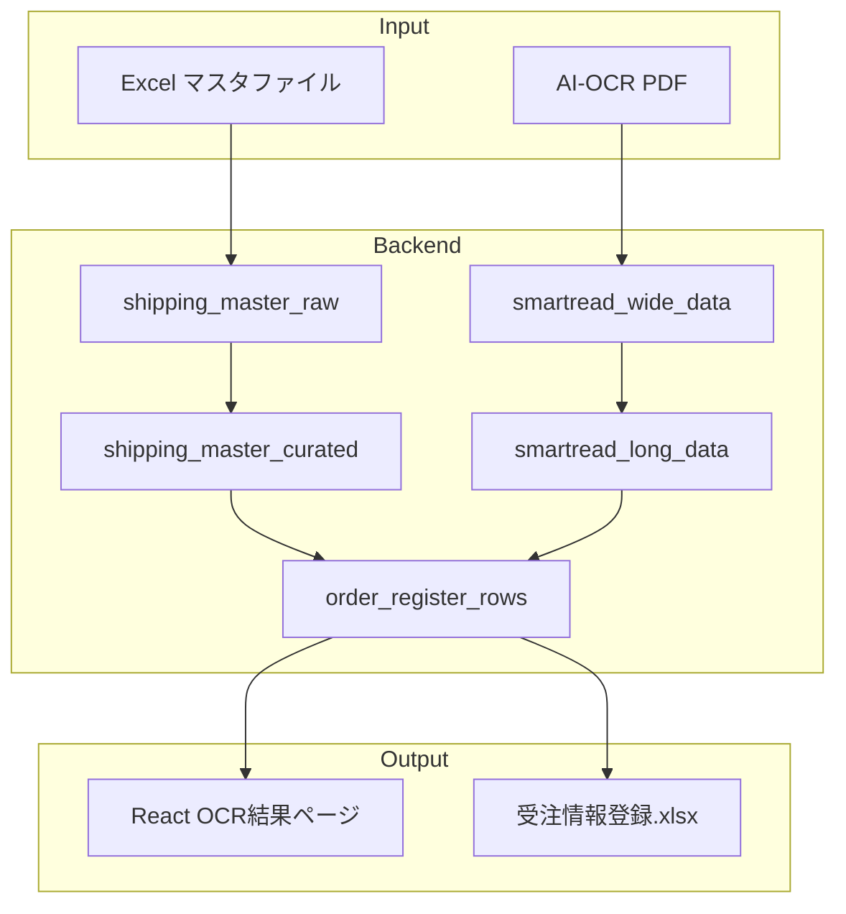

# OCR受注登録（中間ステップ）実装計画

現行VBAと同じ列・同じ見た目の「受注情報登録_yyyymmddhhMMss.xlsx」を生成し、Reactでも同内容を一覧表示できるようにする。

## User Review Required

> [!IMPORTANT]
> **ダミーデータについて**：Excelのマスタデータは本番でしか取得できないため、開発・テスト用のダミーデータを作成します。縦持ちデータは既存のAI-OCRデータ（`smartread_long_data`）を使用します。

> [!WARNING]
> **命名規則**：ドキュメントでは「マスタ」と記載されていますが、分かりやすさのため「出荷用マスタデータ」（`shipping_master`）として実装します。

> [!NOTE]
> **既存マスタとの独立性**：出荷用マスタデータは既存の得意先マスタ・仕入先マスタ・倉庫マスタなどとは**連動しません**。出荷用マスタ内の得意先コードなどが既存マスタに存在しなくても問題なく動作します（ForeignKey制約なし）。将来の連携は別フェーズで検討します。

---

## 現状の理解

### 既存テーブル構造
- `smartread_wide_data`: 横持ちデータ（OCR結果の生データ）
- `smartread_long_data`: 縦持ちデータ（横持ちから変換後）
  - `content`: JSONB形式で各フィールドを保持
  - 例: `{"入庫No": "...", "納期": "...", "納入量": "...", ...}`

### 追加が必要なテーブル
1. **出荷用マスタ生データ** (`shipping_master_raw`): Excel「マスタ」シートの列をそのまま取り込み
2. **出荷用マスタ整形済み** (`shipping_master_curated`): アプリ参照用、キーで一意に特定可能
3. **受注登録結果** (`order_register_rows`): OCR + マスタ参照結果を統合

---

## Proposed Changes

### Backend: DBモデル

#### [NEW] [shipping_master_models.py](file:///Users/kazuya/dev/projects/lot-management-system/backend/app/infrastructure/persistence/models/shipping_master_models.py)

```python
"""出荷用マスタデータモデル."""

class ShippingMasterRaw(Base):
    """出荷用マスタ生データ（監査・完全再現用）.
    
    Excel「マスタ」シートの列A〜T（20列）をそのまま保持。
    """
    __tablename__ = "shipping_master_raw"
    
    id: Mapped[int] = mapped_column(BigInteger, primary_key=True)
    
    # キー候補列
    customer_code: Mapped[str | None]      # 得意先コード
    material_code: Mapped[str | None]      # 材質コード
    jiku_code: Mapped[str | None]          # 次区（出荷先区分）
    warehouse_code: Mapped[str | None]     # 倉庫コード（追加キー候補）
    
    # 製品情報
    delivery_note_product_name: Mapped[str | None]  # 素材納品書記載製品名
    customer_part_no: Mapped[str | None]            # 先方品番
    maker_part_no: Mapped[str | None]               # メーカー品番
    
    # 発注・メーカー情報
    order_flag: Mapped[str | None]         # 発注
    maker_code: Mapped[str | None]         # メーカー
    maker_name: Mapped[str | None]         # メーカー名
    supplier_code: Mapped[str | None]      # 仕入先コード
    staff_name: Mapped[str | None]         # 担当者名
    
    # 納入先情報
    delivery_place_abbr: Mapped[str | None]   # 納入先略称
    delivery_place_code: Mapped[str | None]   # 納入先コード
    delivery_place_name: Mapped[str | None]   # 納入先
    
    # 倉庫情報
    shipping_warehouse: Mapped[str | None]    # 出荷倉庫
    
    # 出荷票・ルール
    shipping_slip_text: Mapped[str | None]    # 出荷票テキスト
    transport_lt_days: Mapped[int | None]     # 輸送LT(営業日)
    order_existence: Mapped[str | None]       # 発注の有無
    remarks: Mapped[str | None]               # 備考
    
    # メタ情報
    row_index: Mapped[int]                    # Excel行番号
    import_batch_id: Mapped[str | None]       # インポートバッチID
    created_at: Mapped[datetime]


class ShippingMasterCurated(Base):
    """出荷用マスタ整形済み（アプリ参照用）.
    
    キー: 得意先コード × 材質コード × 次区(jiku_code)
    重複時は倉庫キーも使用、それでも重複ならアラート。
    """
    __tablename__ = "shipping_master_curated"
    __table_args__ = (
        UniqueConstraint(
            "customer_code", "material_code", "jiku_code",
            name="uq_shipping_master_curated_key"
        ),
    )
    
    id: Mapped[int] = mapped_column(BigInteger, primary_key=True)
    raw_id: Mapped[int | None]  # shipping_master_raw への参照
    
    # キー列（NOT NULL）
    customer_code: Mapped[str]      # 得意先コード
    material_code: Mapped[str]      # 材質コード
    jiku_code: Mapped[str]          # 次区（出荷先区分）
    
    # 拡張キー
    warehouse_code: Mapped[str | None]
    
    # 正規化された値
    customer_name: Mapped[str | None]         # 得意先名
    delivery_note_product_name: Mapped[str | None]
    customer_part_no: Mapped[str | None]
    maker_part_no: Mapped[str | None]
    maker_code: Mapped[str | None]
    maker_name: Mapped[str | None]
    supplier_code: Mapped[str | None]
    supplier_name: Mapped[str | None]         # 仕入先名称（結合用）
    delivery_place_code: Mapped[str | None]
    delivery_place_name: Mapped[str | None]
    shipping_warehouse_code: Mapped[str | None]
    shipping_warehouse_name: Mapped[str | None]
    shipping_slip_text: Mapped[str | None]
    transport_lt_days: Mapped[int | None]
    has_order: Mapped[bool]                   # 発注の有無（正規化）
    remarks: Mapped[str | None]
    
    # 重複フラグ
    has_duplicate_warning: Mapped[bool] = mapped_column(default=False)
    
    created_at: Mapped[datetime]
    updated_at: Mapped[datetime]


class OrderRegisterRow(Base):
    """受注登録結果（OCR + マスタ参照）.
    
    Excel出力・React表示の単一ソース。
    """
    __tablename__ = "order_register_rows"
    
    id: Mapped[int] = mapped_column(BigInteger, primary_key=True)
    
    # 参照元
    long_data_id: Mapped[int | None]      # smartread_long_data への参照
    curated_master_id: Mapped[int | None] # shipping_master_curated への参照
    task_date: Mapped[date]
    
    # ロット割当（手入力）
    lot_no_1: Mapped[str | None]
    quantity_1: Mapped[int | None]
    lot_no_2: Mapped[str | None]
    quantity_2: Mapped[int | None]
    
    # OCR由来
    inbound_no: Mapped[str | None]        # 入庫No
    shipping_date: Mapped[date | None]    # 出荷日（生成値）
    delivery_date: Mapped[date | None]    # 納期
    delivery_quantity: Mapped[int | None] # 納入量
    item_no: Mapped[str | None]           # アイテムNo
    quantity_unit: Mapped[str | None]     # 数量単位
    
    # マスタ/OCR混在
    material_code: Mapped[str | None]
    jiku_code: Mapped[str | None]
    customer_part_no: Mapped[str | None]
    maker_part_no: Mapped[str | None]
    
    # マスタ由来
    source: Mapped[str] = mapped_column(default="OCR")  # 取得元
    shipping_slip_text: Mapped[str | None]
    customer_code: Mapped[str | None]
    customer_name: Mapped[str | None]
    supplier_code: Mapped[str | None]
    supplier_name: Mapped[str | None]
    shipping_warehouse_code: Mapped[str | None]
    shipping_warehouse_name: Mapped[str | None]
    delivery_place_code: Mapped[str | None]
    delivery_place_name: Mapped[str | None]
    remarks: Mapped[str | None]
    
    # ステータス
    status: Mapped[str] = mapped_column(default="PENDING")  # PENDING/EXPORTED/ERROR
    error_message: Mapped[str | None]
    
    created_at: Mapped[datetime]
    updated_at: Mapped[datetime]
```

---

#### [NEW] [20260120_add_shipping_master_tables.py](file:///Users/kazuya/dev/projects/lot-management-system/backend/alembic/versions/20260120_add_shipping_master_tables.py)

3テーブル（`shipping_master_raw`, `shipping_master_curated`, `order_register_rows`）を追加するマイグレーション

---

### Backend: サービス層

#### [NEW] [shipping_master_service.py](file:///Users/kazuya/dev/projects/lot-management-system/backend/app/application/services/shipping_master/shipping_master_service.py)

- `import_excel_raw()`: Excelファイルから生データ取り込み
- `curate_master_data()`: 生データ → 整形済みデータ変換（キー重複検知含む）
- `get_curated_by_key()`: キー（得意先×材質×次区）で検索
- `create/update/delete`: CRUD操作

#### [NEW] [order_register_service.py](file:///Users/kazuya/dev/projects/lot-management-system/backend/app/application/services/order_register/order_register_service.py)

- `generate_from_ocr()`: OCR縦持ちデータ + マスタ参照で結果行を生成
- `export_to_excel()`: 受注情報登録Excel出力
- `update_lot_assignments()`: ロット割当更新

---

### Backend: API

#### [NEW] [shipping_master_router.py](file:///Users/kazuya/dev/projects/lot-management-system/backend/app/presentation/api/routes/shipping_master_router.py)

```
GET    /api/shipping-masters              # 一覧取得
GET    /api/shipping-masters/{id}         # 詳細取得
POST   /api/shipping-masters              # 新規作成
PUT    /api/shipping-masters/{id}         # 更新
DELETE /api/shipping-masters/{id}         # 削除
POST   /api/shipping-masters/import       # Excelインポート
GET    /api/shipping-masters/export       # Excelエクスポート
```

#### [NEW] [order_register_router.py](file:///Users/kazuya/dev/projects/lot-management-system/backend/app/presentation/api/routes/order_register_router.py)

```
GET    /api/order-register                # 一覧取得
POST   /api/order-register/generate       # OCR→結果生成
POST   /api/order-register/export         # Excel出力
PUT    /api/order-register/{id}/lots      # ロット割当更新
```

---

### Backend: ダミーデータ

#### [NEW] [seed_shipping_master_dummy.py](file:///Users/kazuya/dev/projects/lot-management-system/seed_shipping_master_dummy.py)

本番Excelが取得できないため、テスト用のダミーデータを生成するスクリプト。

```python
# 20件程度のダミーマスタデータを生成
# - 得意先コード: C001〜C005
# - 材質コード: M001〜M010
# - 次区: J01〜J04
# - 各組み合わせでユニークなレコードを作成
```

---

### Frontend: マスタページ

#### [MODIFY] [GlobalNavigation.tsx](file:///Users/kazuya/dev/projects/lot-management-system/frontend/src/components/layouts/GlobalNavigation.tsx)

マスタメニュー配下に「出荷用マスタデータ」サブメニューを追加

#### [NEW] [ShippingMasterListPage.tsx](file:///Users/kazuya/dev/projects/lot-management-system/frontend/src/features/shipping-master/pages/ShippingMasterListPage.tsx)

出荷用マスタデータ一覧ページ

#### [NEW] [ShippingMasterEditPage.tsx](file:///Users/kazuya/dev/projects/lot-management-system/frontend/src/features/shipping-master/pages/ShippingMasterEditPage.tsx)

編集ページ

---

### Frontend: OCR結果ページ

#### [MODIFY] [GlobalNavigation.tsx](file:///Users/kazuya/dev/projects/lot-management-system/frontend/src/components/layouts/GlobalNavigation.tsx)

受注管理の右に「OCR結果」メニューを追加

#### [NEW] [OcrResultPage.tsx](file:///Users/kazuya/dev/projects/lot-management-system/frontend/src/features/ocr-result/pages/OcrResultPage.tsx)

OCR結果一覧ページ（縦持ちデータ + マスタ参照結果表示 + Excel出力）

---

## データフロー図



---

## Verification Plan

### Automated Tests

1. **ダミーデータ投入テスト**
   ```bash
   cd backend && python ../seed_shipping_master_dummy.py
   ```

2. **バックエンドユニットテスト**
   ```bash
   # テストDB起動
   docker compose -f docker-compose.test.yml up -d
   sleep 5
   
   # テスト実行
   cd backend && python -m pytest tests/services/test_shipping_master_service.py -v
   cd backend && python -m pytest tests/services/test_order_register_service.py -v
   ```

3. **APIテスト**
   ```bash
   cd backend && python -m pytest tests/api/test_shipping_master.py -v
   cd backend && python -m pytest tests/api/test_order_register.py -v
   ```

4. **Lint/Typecheck**
   ```bash
   # バックエンド
   cd backend && ruff check . && ruff format --check .
   cd backend && mypy app --ignore-missing-imports
   
   # フロントエンド
   cd frontend && npm run lint && npm run typecheck
   ```

### Manual Verification

1. **マスタデータ画面確認**
   - ブラウザで http://localhost:5678 にアクセス
   - 「マスタ」→「出荷用マスタデータ」を選択
   - 一覧が表示されることを確認
   - 新規作成・編集・削除が動作することを確認

2. **OCR結果ページ確認**
   - 「OCR結果」メニューを選択
   - OCRデータとマスタ参照結果が統合表示されることを確認
   - Excel出力ボタンをクリックし、ファイルがダウンロードされることを確認

---

## 実装順序

| 順番 | コンポーネント | 工数目安 |
|------|--------------|---------|
| 1 | DBモデル + マイグレーション | 1h |
| 2 | ダミーデータスクリプト | 0.5h |
| 3 | 出荷用マスタサービス + API | 2h |
| 4 | フロントエンド マスタページ | 2h |
| 5 | 受注登録結果サービス + API | 2h |
| 6 | OCR結果ページ | 2h |
| 7 | テスト + 検証 | 1.5h |
| **合計** | | **約11時間** |

---

## 質問事項

1. **縦持ちデータの具体的なフィールド**：既存の`smartread_long_data.content`（JSONB）にどのようなフィールドが入っているか？特に以下を確認したい：
   - `入庫No`, `納期`, `納入量`, `アイテムNo`, `材質コード`, `先方品番`, `メーカー品番`, `数量単位`

2. **出荷日の計算ロジック**：祝日カレンダーは既存とのことですが、`輸送LT(営業日)`を使った出荷日計算の具体的なロジックを教えてください。

3. **出荷票テキストのロット置換**：後回しとのことですが、実装時に参考となるサンプルテキストがあれば教えてください。
