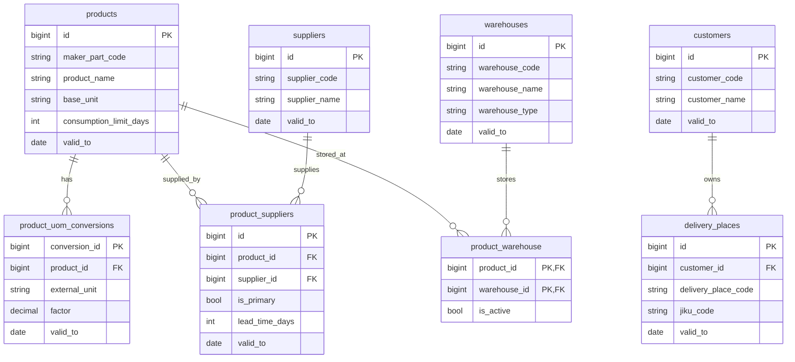
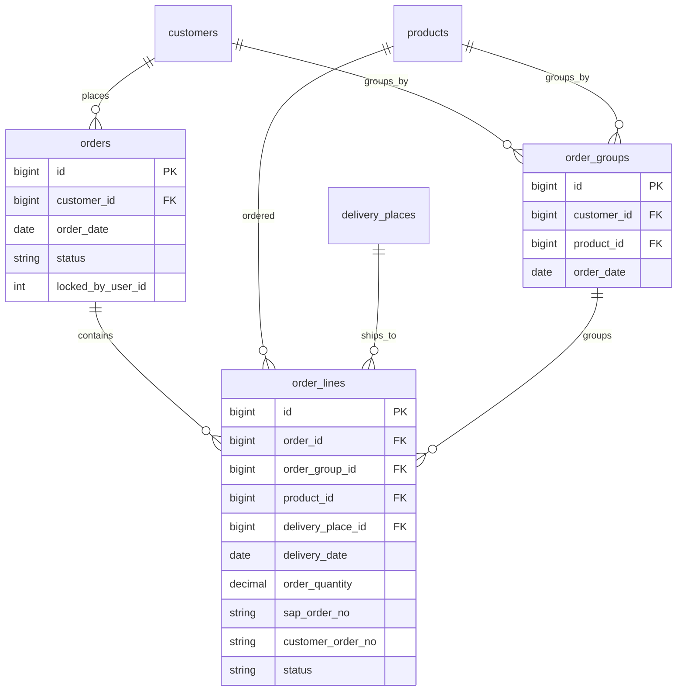
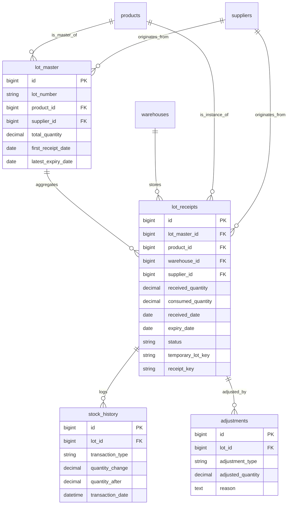
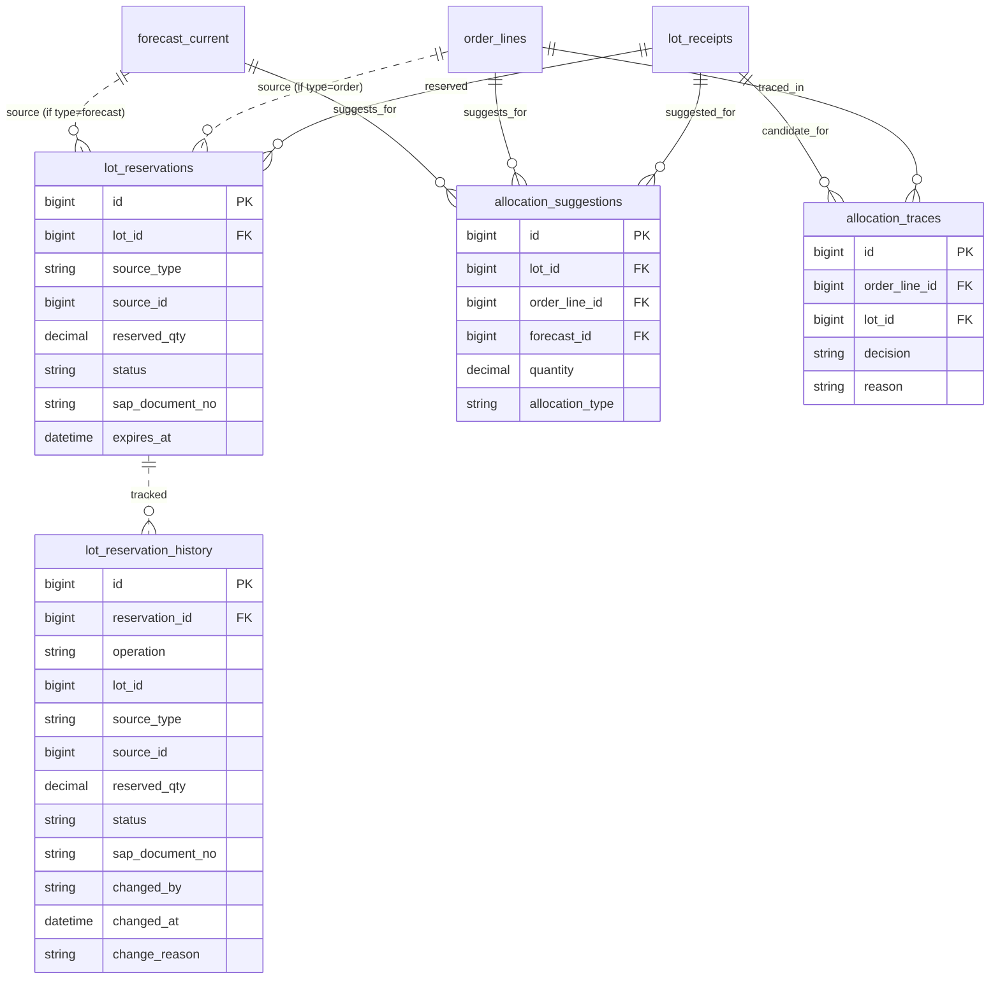
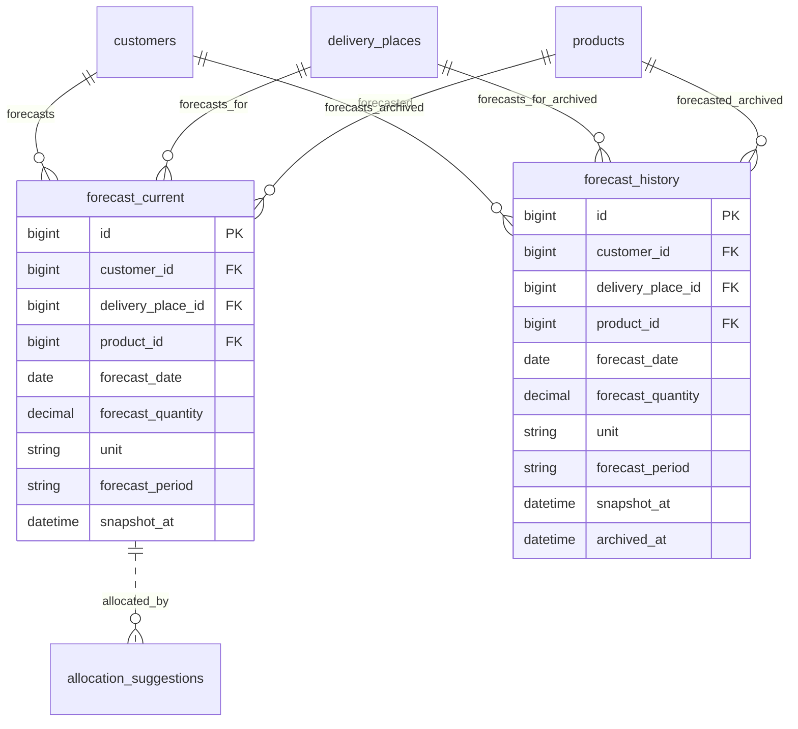
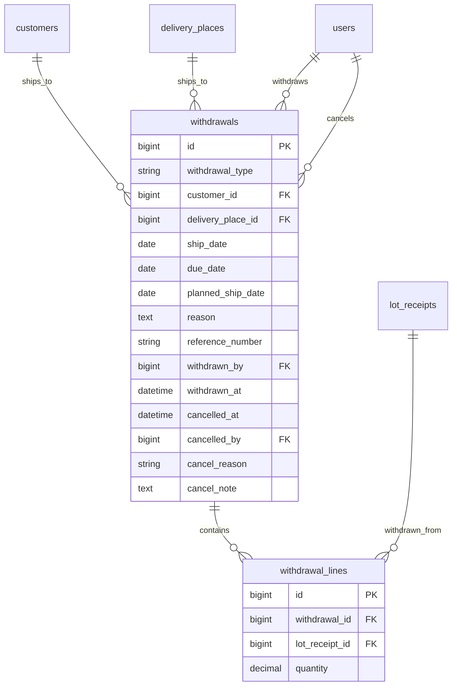
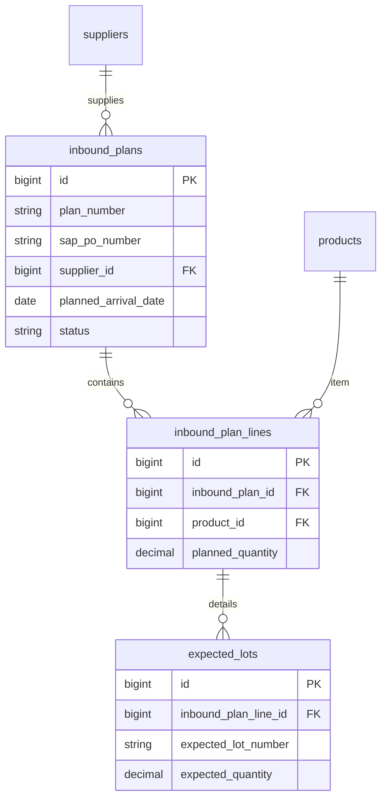
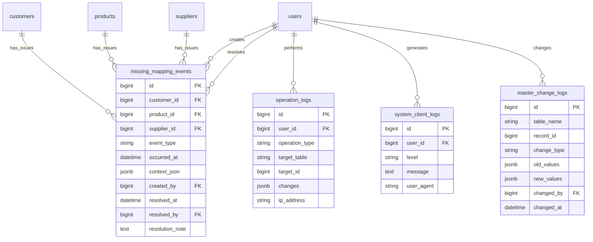

# ER図 (Entity Relationship Diagram)

全エンティティ間のリレーションを示す総合ER図。

## 1. 総合ER図 (Comprehensive ER Diagram)

全50テーブルの関係性を可視化した総合図。

```mermaid
erDiagram
    %% ====================
    %% Core Masters
    %% ====================
    products ||--o{ product_uom_conversions : "has"
    customers ||--o{ delivery_places : "owns"
    products ||--o{ product_suppliers : "supplied_by"
    suppliers ||--o{ product_suppliers : "supplies"
    products ||--o{ product_warehouse : "stored_at"
    warehouses ||--o{ product_warehouse : "stores"

    %% ====================
    %% Product Mappings & Settings
    %% ====================
    customers ||--o{ customer_items : "defines"
    products ||--o{ customer_items : "referenced_by"
    suppliers ||--o{ customer_items : "default_supplier"
    customer_items ||--o{ customer_item_jiku_mappings : "has_jiku"
    customer_items ||--o{ customer_item_delivery_settings : "has_settings"
    delivery_places ||--o{ customer_item_jiku_mappings : "maps_to"
    delivery_places ||--o{ customer_item_delivery_settings : "maps_to"
    customers ||--o{ product_mappings : "buys"
    products ||--o{ product_mappings : "mapped"
    suppliers ||--o{ product_mappings : "supplies"

    %% ====================
    %% Order Management
    %% ====================
    customers ||--o{ orders : "places"
    orders ||--o{ order_lines : "contains"
    products ||--o{ order_lines : "ordered"
    delivery_places ||--o{ order_lines : "ships_to"
    order_groups ||--o{ order_lines : "groups"
    customers ||--o{ order_groups : "groups_by"
    products ||--o{ order_groups : "groups_by"

    %% ====================
    %% Inbound & Purchasing
    %% ====================
    suppliers ||--o{ inbound_plans : "supplies"
    inbound_plans ||--o{ inbound_plan_lines : "contains"
    products ||--o{ inbound_plan_lines : "item"
    inbound_plan_lines ||--o{ expected_lots : "details"

    %% ====================
    %% Inventory Management
    %% ====================
    products ||--o{ lot_master : "is_master_of"
    suppliers ||--o{ lot_master : "originates_from"
    lot_master ||--o{ lot_receipts : "aggregates"
    warehouses ||--o{ lot_receipts : "stores"
    products ||--o{ lot_receipts : "is_instance_of"
    suppliers ||--o{ lot_receipts : "originates_from"
    lot_receipts ||--o{ stock_history : "logs"
    lot_receipts ||--o{ adjustments : "adjusted_by"

    %% ====================
    %% Allocation & Reservation
    %% ====================
    lot_receipts ||--o{ lot_reservations : "reserved"
    order_lines ||..o{ lot_reservations : "source (if type=order)"
    forecast_current ||..o{ lot_reservations : "source (if type=forecast)"
    lot_reservations ||..o{ lot_reservation_history : "tracked"
    lot_receipts ||--o{ allocation_suggestions : "suggested_for"
    order_lines ||--o{ allocation_suggestions : "suggests_for"
    forecast_current ||--o{ allocation_suggestions : "suggests_for"
    order_lines ||--o{ allocation_traces : "traced_in"
    lot_receipts ||--o{ allocation_traces : "candidate_for"

    %% ====================
    %% Demand Forecasting
    %% ====================
    customers ||--o{ forecast_current : "forecasts"
    delivery_places ||--o{ forecast_current : "forecasts_for"
    products ||--o{ forecast_current : "forecasted"
    customers ||--o{ forecast_history : "forecasts_archived"
    delivery_places ||--o{ forecast_history : "forecasts_for_archived"
    products ||--o{ forecast_history : "forecasted_archived"

    %% ====================
    %% Withdrawal & Shipment
    %% ====================
    customers ||--o{ withdrawals : "ships_to"
    delivery_places ||--o{ withdrawals : "ships_to"
    users ||--o{ withdrawals : "withdraws"
    users ||--o{ withdrawals : "cancels"
    withdrawals ||--o{ withdrawal_lines : "contains"
    lot_receipts ||--o{ withdrawal_lines : "withdrawn_from"

    %% ====================
    %% System & Auth & RPA
    %% ====================
    users ||--o{ user_roles : "assigned"
    roles ||--o{ user_roles : "defined_in"
    users ||--o{ user_supplier_assignments : "manages"
    suppliers ||--o{ user_supplier_assignments : "managed_by"
    rpa_runs ||--o{ rpa_run_items : "contains"
    users ||--o{ rpa_runs : "starts"

    %% ====================
    %% Cloud Flow Integration
    %% ====================
    users ||--o{ cloud_flow_jobs : "requests"

    %% ====================
    %% Mappings & Master Change Tracking
    %% ====================
    users ||--o{ master_change_logs : "changes"
    warehouses ||--o{ warehouse_delivery_routes : "ships_from"
    delivery_places ||--o{ warehouse_delivery_routes : "ships_to"
    products ||--o{ warehouse_delivery_routes : "routed"

    %% ====================
    %% Error Tracking & Audit Logs
    %% ====================
    customers ||--o{ missing_mapping_events : "has_issues"
    products ||--o{ missing_mapping_events : "has_issues"
    suppliers ||--o{ missing_mapping_events : "has_issues"
    users ||--o{ missing_mapping_events : "creates"
    users ||--o{ missing_mapping_events : "resolves"
    users ||--o{ operation_logs : "performs"
    users ||--o{ system_client_logs : "generates"
```

## 2. ドメイン別ER図 (Domain-specific ER Diagrams)

### 2.1 コアマスタドメイン (Core Masters Domain)

### 2.2 受注管理ドメイン (Order Management Domain)

### 2.3 在庫管理ドメイン (Inventory Management Domain)

### 2.4 引当・予約ドメイン (Allocation & Reservation Domain)

### 2.5 需要予測ドメイン (Demand Forecasting Domain)

### 2.6 出荷・出庫ドメイン (Withdrawal & Shipment Domain)

### 2.7 入荷・仕入ドメイン (Inbound & Purchasing Domain)

### 2.8 監査・ログドメイン (Audit & Logging Domain)

## 3. テーブル一覧 (Table List)

システム全体で50テーブルを管理:

### 3.1 コアマスタ (8テーブル)
- products, customers, suppliers, warehouses, delivery_places
- product_uom_conversions, product_suppliers, product_warehouse

### 3.2 品番・納入設定 (4テーブル)
- customer_items, product_mappings, customer_item_jiku_mappings, customer_item_delivery_settings

### 3.3 受注管理 (3テーブル)
- order_groups, orders, order_lines

### 3.4 入荷・仕入 (3テーブル)
- inbound_plans, inbound_plan_lines, expected_lots

### 3.5 在庫管理 (4テーブル)
- lot_master, lot_receipts, stock_history, adjustments

### 3.6 引当・予約 (4テーブル)
- lot_reservations, allocation_suggestions, allocation_traces, lot_reservation_history

### 3.7 需要予測 (2テーブル)
- forecast_current, forecast_history

### 3.8 出荷・出庫 (2テーブル)
- withdrawals, withdrawal_lines

### 3.9 システム・権限・RPA (7テーブル)
- users, roles, user_roles, user_supplier_assignments, system_configs, rpa_runs, rpa_run_items

### 3.10 バッチ処理・業務ルール (2テーブル)
- batch_jobs, business_rules

### 3.11 Power Automate連携 (2テーブル)
- cloud_flow_configs, cloud_flow_jobs

### 3.12 マッピング・マスタ変更 (3テーブル)
- layer_code_mappings, master_change_logs, warehouse_delivery_routes

### 3.13 エラー追跡・監査ログ (3テーブル)
- missing_mapping_events, operation_logs, system_client_logs

### 3.14 OCR・テストデータ (2テーブル)
- smartread_configs, seed_snapshots

### 3.15 システムテーブル (1テーブル)
- alembic_version (migration管理)
