# データベーススキーマ (Database Schema)

本ドキュメントでは、Lot Management Systemの全データベーステーブル定義と、ドメインごとのER図（実体関連図）を記載する。

## 1. 概要 (Overview)

- **データベース**: PostgreSQL
- **共通カラム**:
    - `id`: BIGSERIAL (Primary Key)
    - `created_at`: 作成日時 (Not Null, Default: Current Timestamp)
    - `updated_at`: 更新日時 (Not Null, Default: Current Timestamp)
- **論理削除**:
    - マスタ系テーブルは `valid_to` カラムを持つ（日次管理）。
    - `valid_to >= current_date` のレコードを有効とみなす。
- **業務キー**:
    - 内部ID (`id`) とは別に、業務上で一意性を識別するためのコード（例: `product_code`, `customer_order_no`）を持つテーブルが多い。

## 2. 基本マスタ (Core Masters)

システムの基盤となるマスタデータ群。

### 2.1 テーブル一覧

| テーブル名 | 和名 | 説明 | 備考 |
| :--- | :--- | :--- | :--- |
| **products** | 製品マスタ | 全製品の基本情報を管理。 | メーカー品番、基本単位、消費期限日数など |
| **customers** | 得意先マスタ | 販売先の基本情報を管理。 | |
| **suppliers** | 仕入先マスタ | 原材料の調達先情報を管理。 | |
| **warehouses** | 倉庫マスタ |在庫を保管する物理的・論理的場所。 | 社内/社外/仕入先倉庫の区分あり |
| **delivery_places** | 納入先マスタ | 得意先ごとの納品場所。 | 次区コード(Jiku Code)も管理 |
| **product_uom_conversions** | 単位換算マスタ | 製品ごとの単位変換係数を管理。 | 例: 1缶 = 20kg |

### 2.2 ER図 (Mermaid)

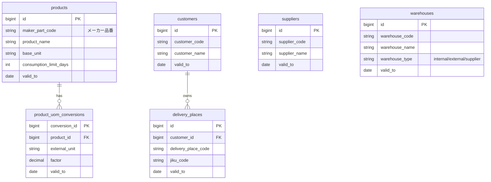

## 3. 品番・納入設定 (Product Mappings & Settings)

得意先・製品・仕入先の3者間の関係定義や、納品時の個別ルール設定。

### 3.1 テーブル一覧

| テーブル名 | 和名 | 説明 | 備考 |
| :--- | :--- | :--- | :--- |
| **customer_items** | 得意先品目 | 得意先と製品の紐付け。 | 先方品番、梱包単位、出荷テンプレート |
| **product_mappings** | 商品マスタ | 得意先・製品・仕入先の3者マッピング。 | 商流の定義 |
| **customer_item_jiku_mappings** | 次区マッピング | 得意先品番と納入先(次区)の紐付け。 | デフォルト納入先の解決に使用 |
| **customer_item_delivery_settings** | 納入設定 | 納入先ごとの細かい出荷・梱包・LT設定。 | SAP連携用テキストなど |

### 3.2 ER図 (Mermaid)

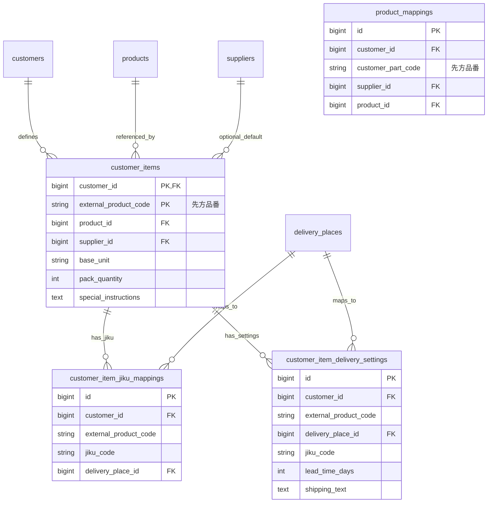

## 4. 受注管理 (Order Management)

顧客からの注文情報の管理。

### 4.1 テーブル一覧

| テーブル名 | 和名 | 説明 | 備考 |
| :--- | :--- | :--- | :--- |
| **order_groups** | 受注グループ | 「得意先×製品×受注日」をまとめる論理単位。 | 仮想的な受注番号の役割 |
| **orders** | 受注ヘッダ | 受注伝票のヘッダ情報。 | 受注日、ステータス |
| **order_lines** | 受注明細 | 受注の明細行。 | 数量、納期、納入先、業務キー(SAP番号等) |

### 4.2 ER図 (Mermaid)

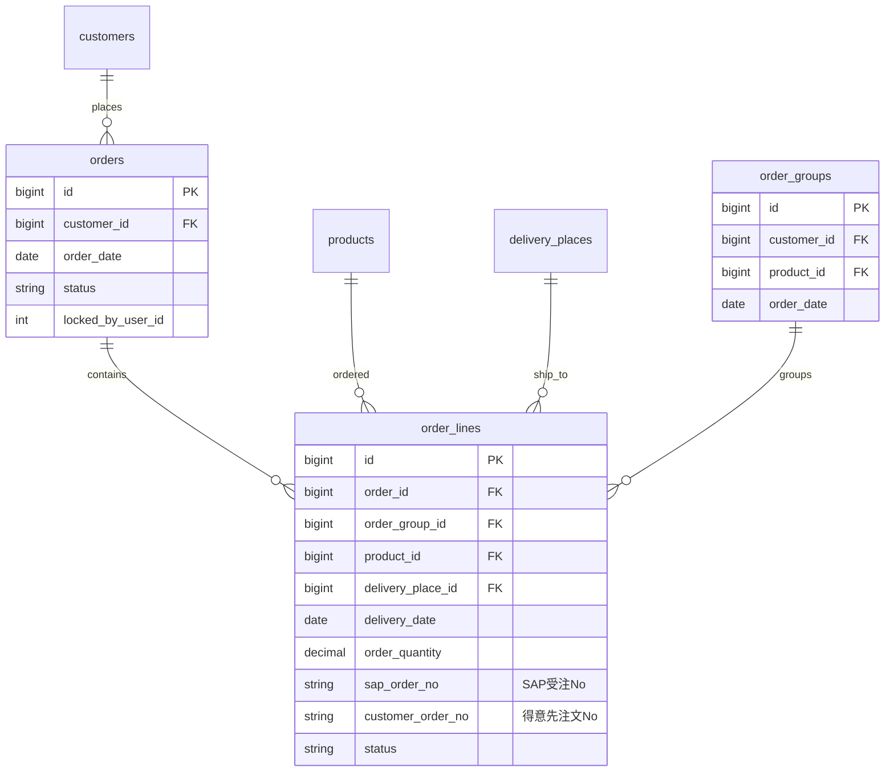

## 5. 入荷・仕入 (Inbound & Purchasing)

原材料の入荷予定および実績管理。

### 5.1 テーブル一覧

| テーブル名 | 和名 | 説明 | 備考 |
| :--- | :--- | :--- | :--- |
| **inbound_plans** | 入荷予定ヘッダ | サプライヤーからの入荷予定。 | SAP購買発注番号(PO)とリンク |
| **inbound_plan_lines** | 入荷予定明細 | 入荷予定の品目・数量。 | |
| **expected_lots** | 入荷予定ロット | 明細に対する具体的なロット情報の紐付け（任意）。 | |

### 5.2 ER図 (Mermaid)

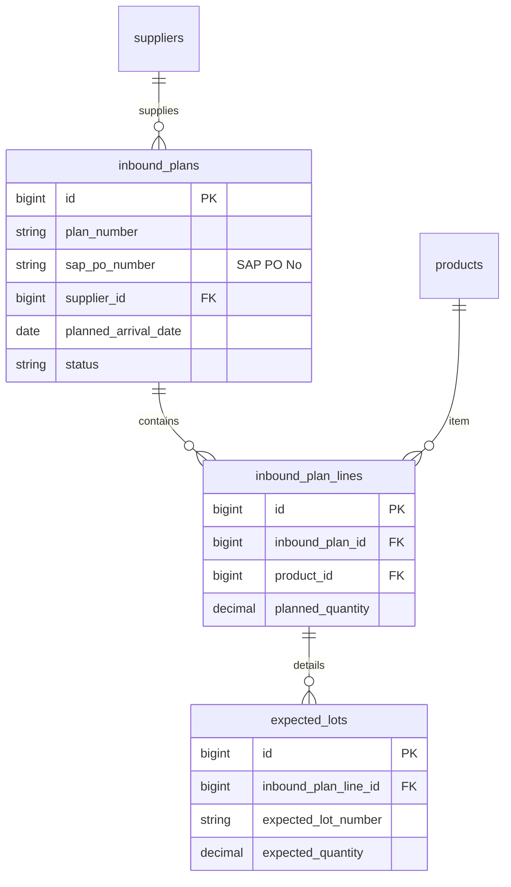

## 6. 在庫管理 (Inventory Management)

物理在庫(ロット)の状態と履歴管理。現行設計では「ロット番号の名寄せ」と「入荷実体」を分離し、
`lot_master` と `lot_receipts` の2テーブルで表現する。

### 6.1 テーブル一覧

| テーブル名 | 和名 | 説明 | 備考 |
| :--- | :--- | :--- | :--- |
| **lot_master** | ロット番号名寄せ | 同一ロット番号の名寄せマスタ。 | `lot_number` + `product_id` で一意 |
| **lot_receipts** | 入荷実体 | 入荷1件を表す物理ロット。 | `lot_master` に紐づく |
| **stock_history** | 在庫履歴 | ロットに対する全ての数量変動ログ。 | 入出庫、調整、移動履歴 |
| **adjustments** | 在庫調整 | 棚卸やロスなどの数量調整記録。 | |

### 6.2 ER図 (Mermaid)

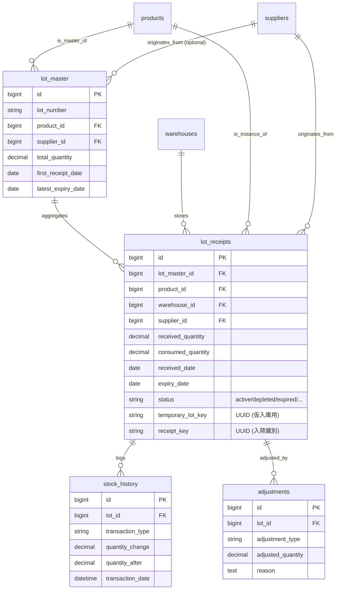

## 7. 引当・予約 (Allocation & Reservation)

需要（受注・フォーキャスト）と供給（在庫）のマッチング。

### 7.1 テーブル一覧

| テーブル名 | 和名 | 説明 | 備考 |
| :--- | :--- | :--- | :--- |
| **lot_reservations** | ロット予約 | ロットに対する数量予約の事実。 | Order/Forecast/Manualの区別あり |
| **allocation_suggestions** | 引当推奨 | システム計算による引当案（一時データ）。 | ユーザー承認待ちの提案 |
| **allocation_traces** | 引当トレース | 引当ロジック(FEFO等)の判断根拠ログ。 | なぜそのロットが選ばれたか/選ばれなかったか |

### 7.2 ER図 (Mermaid)

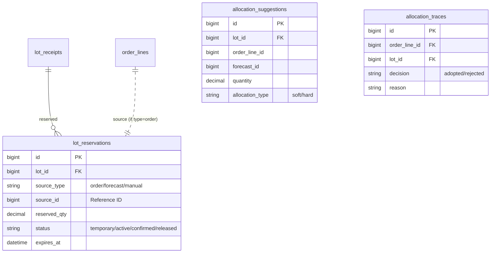

## 8. 需要予測 (Demand Forecasting)

顧客需要予測データの管理。

### 8.1 テーブル一覧

| テーブル名 | 和名 | 説明 | 備考 |
| :--- | :--- | :--- | :--- |
| **forecast_current** | 現行予測 | 最新の需要予測データ。 | 引当対象となる予測 |
| **forecast_history** | 予測履歴 | 過去の予測データのアーカイブ。 | 予測精度分析用 |

### 8.2 ER図 (Mermaid)

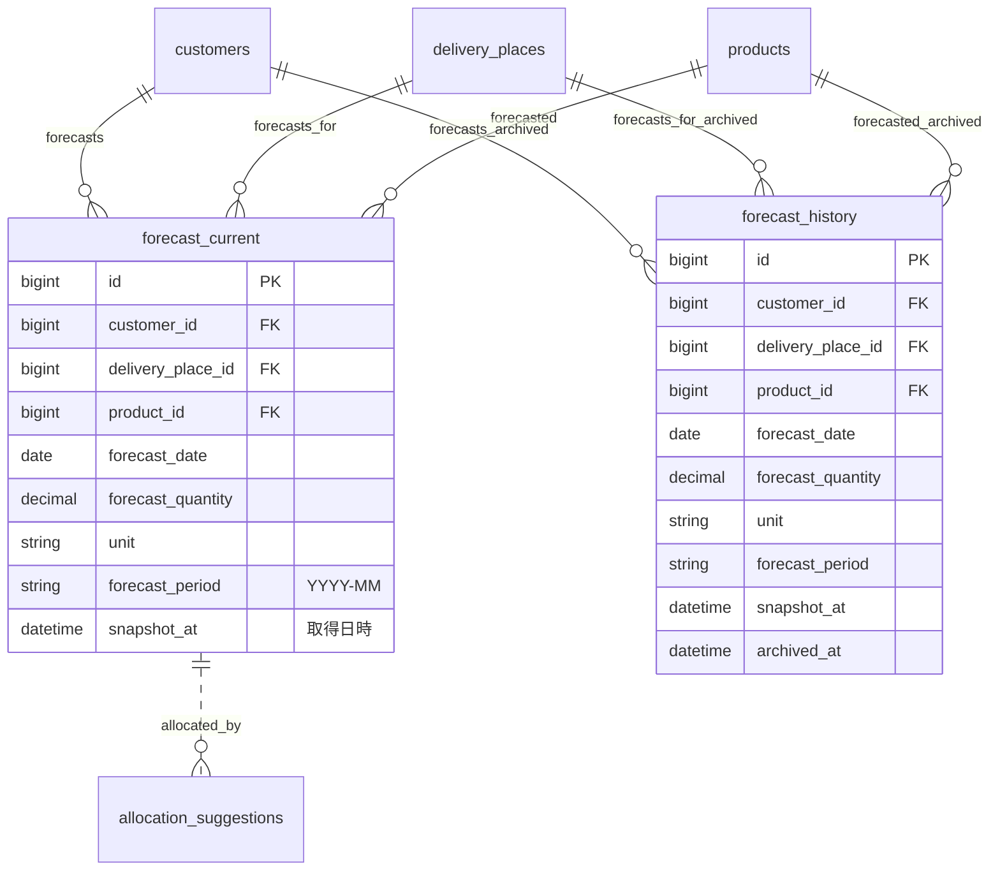

## 9. 出荷・出庫 (Withdrawal & Shipment)

在庫からの出庫実績管理。

### 9.1 テーブル一覧

| テーブル名 | 和名 | 説明 | 備考 |
| :--- | :--- | :--- | :--- |
| **withdrawals** | 出庫ヘッダ | 出庫伝票のヘッダ情報。 | 受注手動、内部使用、廃棄など |
| **withdrawal_lines** | 出庫明細 | 出庫伝票の明細行。 | ロットごとの出庫数量 |

### 9.2 ER図 (Mermaid)

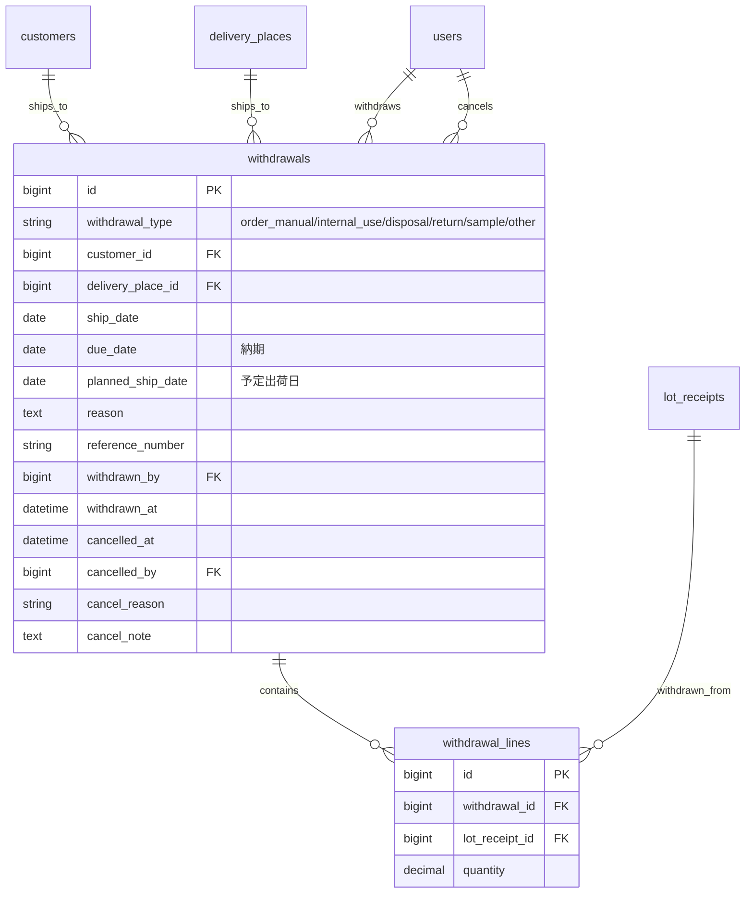

## 10. システム・権限・RPA (System & Auth & RPA)

システム管理、認証、およびRPA連携ログ。

### 10.1 テーブル一覧

| テーブル名 | 和名 | 説明 | 備考 |
| :--- | :--- | :--- | :--- |
| **users** | ユーザー | システム利用者。 | Azure AD連携IDなど |
| **roles** | ロール | 権限ロール情報。 | |
| **user_roles** | ユーザーロール | ユーザーとロールの多対多関係。 | |
| **user_supplier_assignments**| 担当仕入先 | ユーザーごとの担当仕入先設定。 | 画面フィルタリングに使用 |
| **system_configs** | システム設定 | キーバリュー形式の全体設定。 | |
| **rpa_runs** | RPA実行 | 素材納品書RPAなどの実行ジョブヘッダ。 | |
| **rpa_run_items** | RPA実行詳細 | RPA処理対象の明細行（CSV行）。 | ステータス管理 |

### 10.2 ER図 (Mermaid)

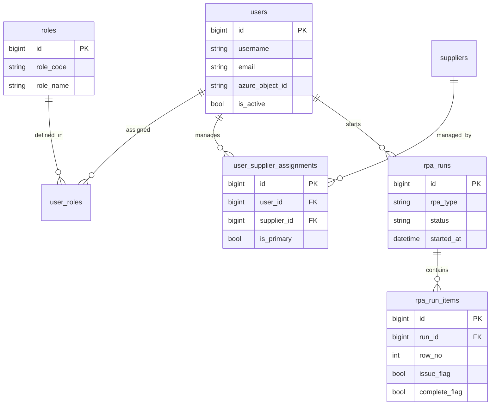

## 11. バッチ処理・業務ルール (Batch & Business Rules)

バッチジョブ管理と業務ルールエンジン。

### 11.1 テーブル一覧

| テーブル名 | 和名 | 説明 | 備考 |
| :--- | :--- | :--- | :--- |
| **batch_jobs** | バッチジョブ | バッチ処理の実行ジョブ管理。 | 引当推奨、在庫同期、レポート生成など |
| **business_rules** | 業務ルール | ビジネスルールの定義。 | 引当、期限警告、かんばん、在庫同期アラート |

### 11.2 ER図 (Mermaid)

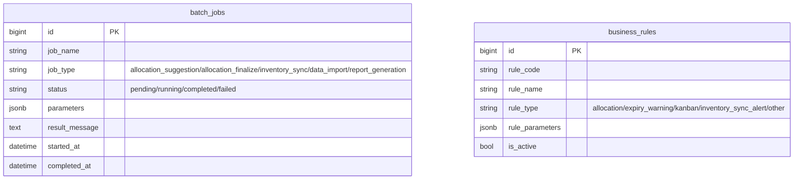

## 12. Power Automate連携 (Cloud Flow Integration)

Microsoft Power Automate連携設定とジョブ管理。

### 12.1 テーブル一覧

| テーブル名 | 和名 | 説明 | 備考 |
| :--- | :--- | :--- | :--- |
| **cloud_flow_configs** | クラウドフロー設定 | Power Automate設定のキーバリューストア。 | エンドポイントURL、認証情報など |
| **cloud_flow_jobs** | クラウドフロージョブ | Power Automate実行ジョブ履歴。 | データエクスポートなどの実行管理 |

### 12.2 ER図 (Mermaid)

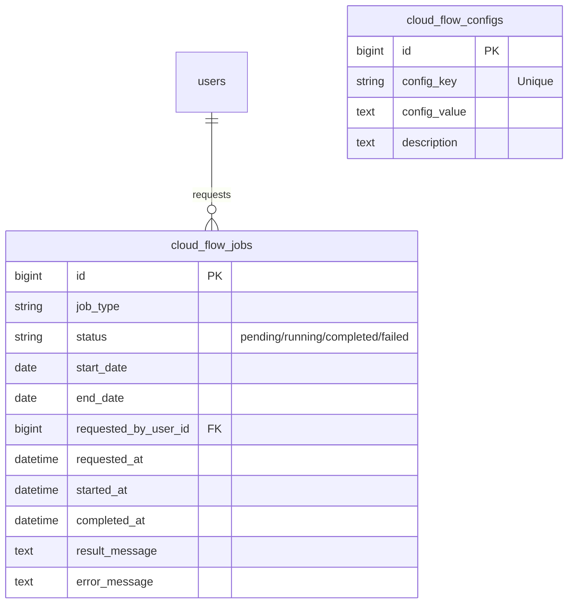

## 13. マッピング・マスタ変更 (Mappings & Master Change Tracking)

レイヤーコードマッピング、製品-仕入先関係、倉庫-製品関係、マスタ変更ログ。

### 13.1 テーブル一覧

| テーブル名 | 和名 | 説明 | 備考 |
| :--- | :--- | :--- | :--- |
| **layer_code_mappings** | レイヤーコードマッピング | レイヤーコードとメーカー名の紐付け。 | |
| **product_suppliers** | 製品-仕入先関係 | 製品ごとの仕入先設定。 | 主仕入先フラグ、リードタイム |
| **product_warehouse** | 製品-倉庫関係 | 製品ごとの保管可能倉庫設定。 | |
| **master_change_logs** | マスタ変更ログ | マスタデータ変更の監査ログ。 | 変更前後の値をJSONで保存 |
| **warehouse_delivery_routes** | 倉庫-納入先経路 | 倉庫から納入先への輸送経路設定。 | 輸送リードタイム |

### 13.2 ER図 (Mermaid)

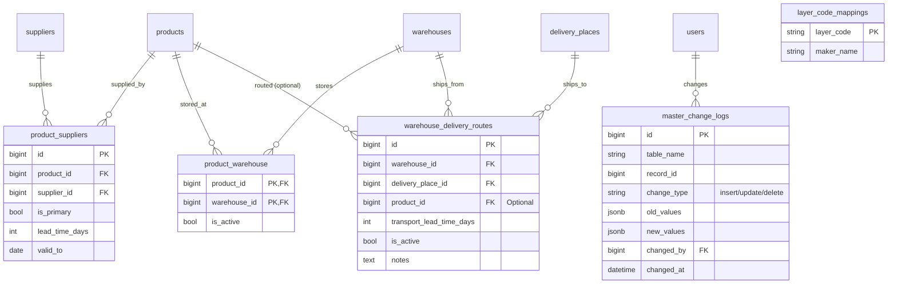

## 14. エラー追跡・監査ログ (Error Tracking & Audit Logs)

マッピングエラー、操作ログ、引当履歴、クライアントログ。

### 14.1 テーブル一覧

| テーブル名 | 和名 | 説明 | 備考 |
| :--- | :--- | :--- | :--- |
| **missing_mapping_events** | マッピング欠損イベント | マッピングエラーのトラッキング。 | 納入先未設定、次区マッピング未設定など |
| **operation_logs** | 操作ログ | ユーザー操作の監査ログ。 | 作成、更新、削除、ログイン、エクスポート |
| **lot_reservation_history** | ロット予約履歴 | ロット予約の変更履歴。 | INSERT/UPDATE/DELETE操作の追跡 |
| **system_client_logs** | クライアントログ | フロントエンドからのエラーログ。 | ブラウザ側のエラー収集 |

### 14.2 ER図 (Mermaid)

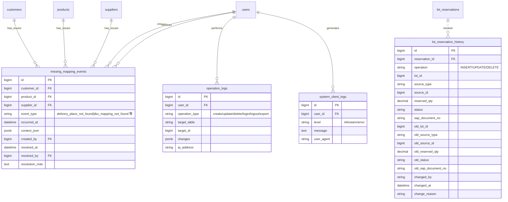

## 15. OCR・テストデータ (OCR & Test Data)

OCR設定とテストデータスナップショット管理。

### 15.1 テーブル一覧

| テーブル名 | 和名 | 説明 | 備考 |
| :--- | :--- | :--- | :--- |
| **smartread_configs** | SmartRead設定 | OCR (SmartRead) 連携設定。 | エンドポイント、APIキー、テンプレート |
| **seed_snapshots** | テストデータスナップショット | テストデータ生成のスナップショット管理。 | パラメータ、プロファイル、サマリ保存 |

### 15.2 ER図 (Mermaid)

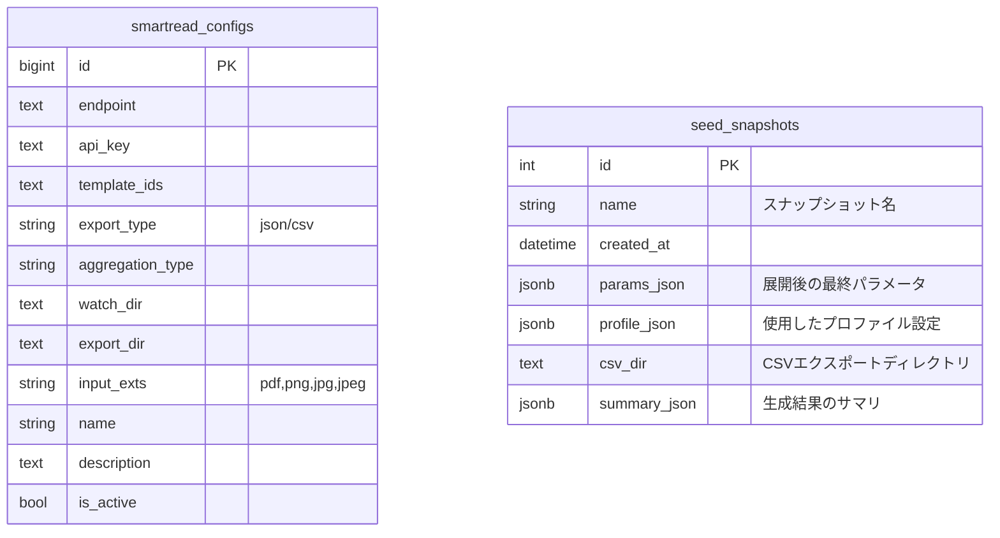
