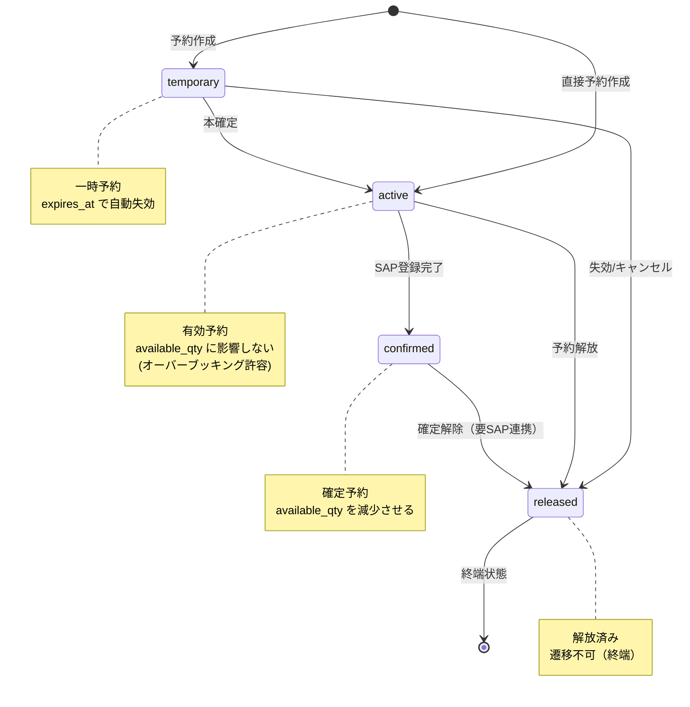
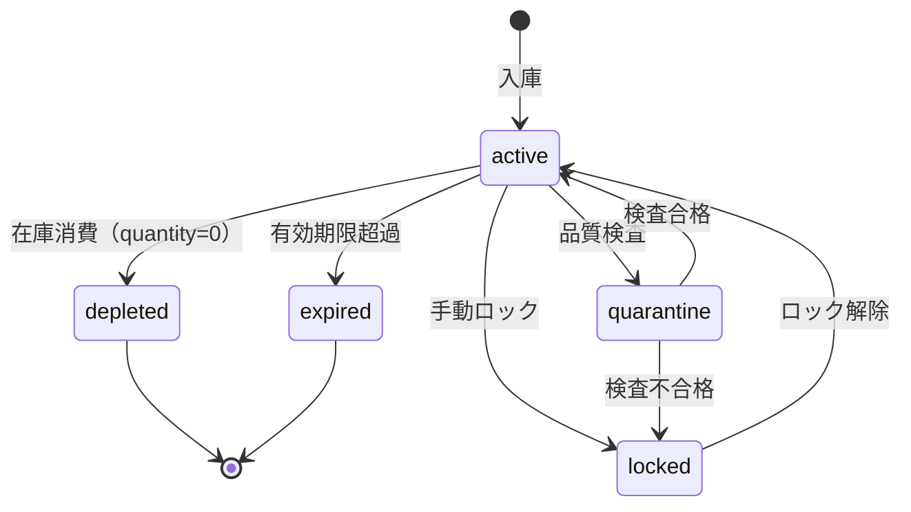
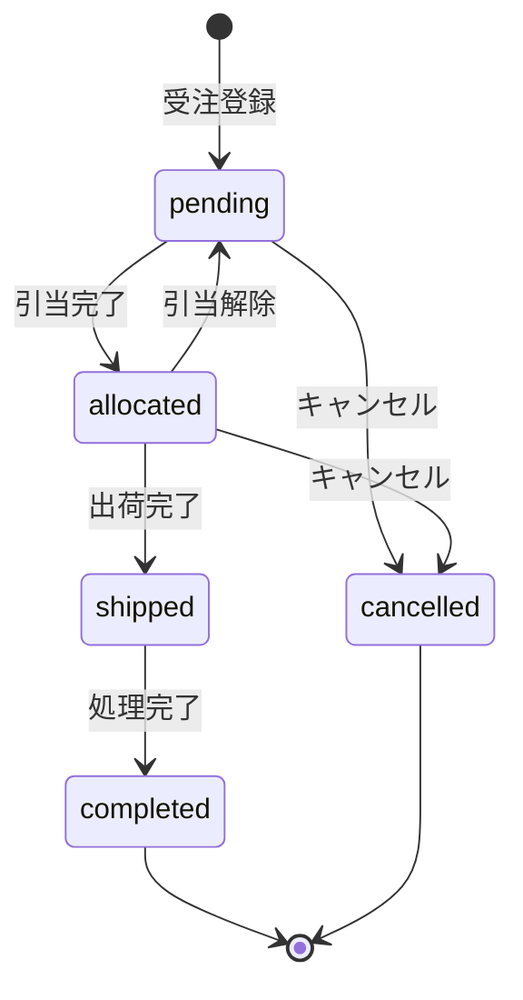
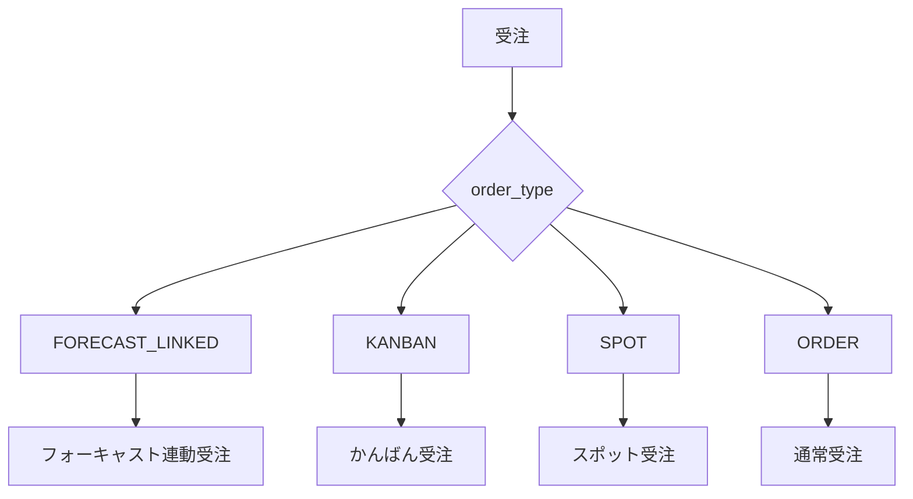

# 状態遷移図 (State Machines)

本ドキュメントでは、システム内の主要なエンティティの状態遷移をMermaid図で可視化する。

## 1. ロット予約 (LotReservation)

予約のライフサイクル。根拠: `backend/app/infrastructure/persistence/models/lot_reservations_model.py`

### 1.1 遷移ルール詳細

| 遷移前 | 遷移後 | トリガー | 備考 |
|:---|:---|:---|:---|
| - | `temporary` | 仮予約作成 | `expires_at` 必須 |
| - | `active` | 通常予約作成 | |
| `temporary` | `active` | 本確定処理 | |
| `temporary` | `released` | 失効/ユーザーキャンセル | |
| `active` | `confirmed` | SAP登録完了 | `sap_document_no` 設定 |
| `active` | `released` | 予約解放 | |
| `confirmed` | `released` | 確定解除 | **要SAP連携** |

---

## 2. ロット在庫 (Lot)

ロットの状態管理。根拠: `backend/app/infrastructure/persistence/models/inventory_models.py`

### 2.1 ステータス詳細

| ステータス | 意味 | 引当可否 |
|:---|:---|:---:|
| `active` | 有効 | ○ |
| `depleted` | 枯渇（在庫0） | × |
| `expired` | 有効期限切れ | × |
| `quarantine` | 品質検査中 | × |
| `locked` | 手動ロック中 | × |

---

## 3. 受注明細 (OrderLine)

受注の処理状態。根拠: `backend/app/infrastructure/persistence/models/orders_models.py`

### 3.1 ステータス詳細

| ステータス | 意味 | 次アクション |
|:---|:---|:---|
| `pending` | 引当待ち | 引当実行 or キャンセル |
| `allocated` | 引当済み | 出荷 or 引当解除 |
| `shipped` | 出荷済み | 完了処理 |
| `completed` | 完了 | なし（終端） |
| `cancelled` | キャンセル | なし（終端） |

---

## 4. 受注種別 (OrderType)

受注の需要種別分類。

---

## 5. 在庫調整区分 (AdjustmentType)

在庫調整の理由区分。

| 区分 | 意味 | 数量変動 |
|:---|:---|:---:|
| `physical_count` | 棚卸差異 | ± |
| `damage` | 破損 | - |
| `loss` | 紛失 | - |
| `found` | 発見 | + |
| `other` | その他 | ± |
