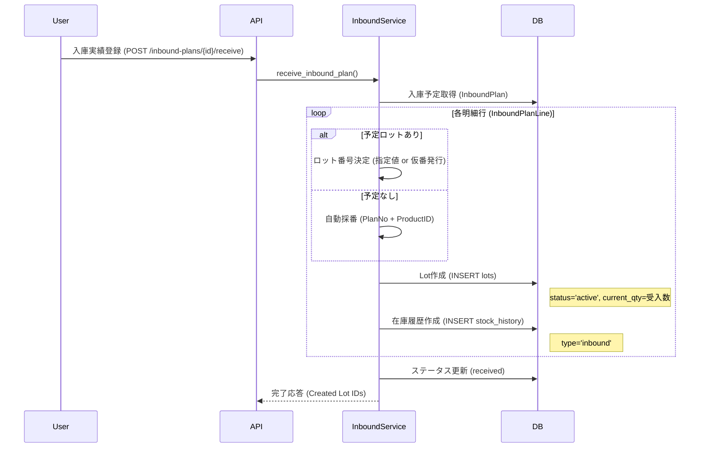
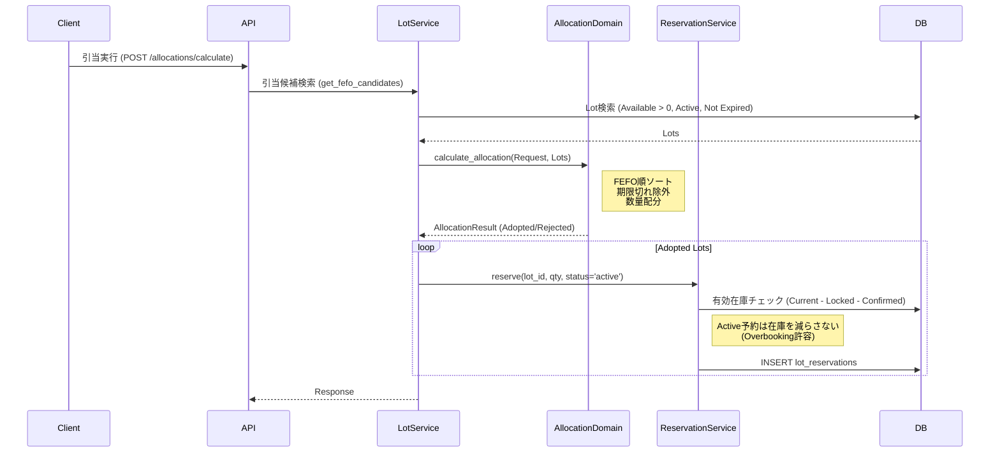
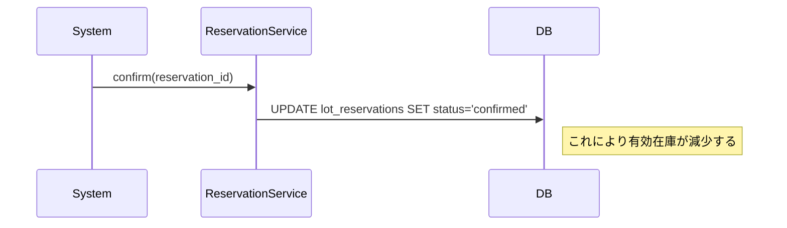

# 主要フロー (Core Flows)

## 1. 入庫〜在庫化フロー (Inbound Process)
入庫予定 (`InboundPlan`) の受け入れから、ロット在庫 (`Lots`) の生成まで。

## 2. 引当・予約フロー (Allocation Process)
受注明細 (`OrderLine`) に対する在庫の引き当て。

## 3. 予約確定フロー (Reservation Confirmation)
仮予約 (`Active`) を確定 (`Confirmed`) させ、有効在庫を減らす。
通常、SAP連携や出庫指示のタイミングで行われる。

