# ロット管理システム - 業務フロー図統合ドキュメント

最終更新: 2025-11-27

## 目次

1. [ロット管理方針](#1-ロット管理方針)
2. [材料ビジネス業務フロー - 指示品パターン①](#2-材料ビジネス業務フロー---指示品パターン)
3. [材料ビジネス業務フロー - かんばんパターン⑤](#3-材料ビジネス業務フロー---かんばんパターン)
4. [AI-OCR業務フロー](#4-ai-ocr業務フロー)
5. [材料ロット管理システム構成図](#5-材料ロット管理システム構成図)
6. [素材納品書発行業務フロー](#6-素材納品書発行業務フロー)
7. [サプライヤーポータル自動化フロー](#7-サプライヤーポータル自動化フロー)
8. [発注計画フロー](#8-発注計画フロー)

---

## 1. ロット管理方針

材料業務の自動化におけるロットNo管理の方針を示します。

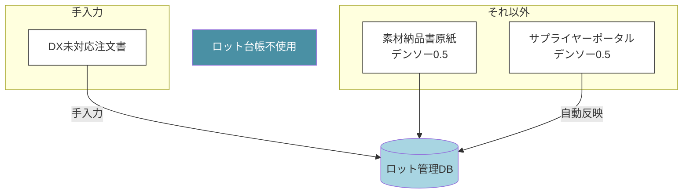

---

## 2. 材料ビジネス業務フロー - 指示品パターン①

納入先種別:デンソー製作所向け、注文形態:指示品の業務フローです。

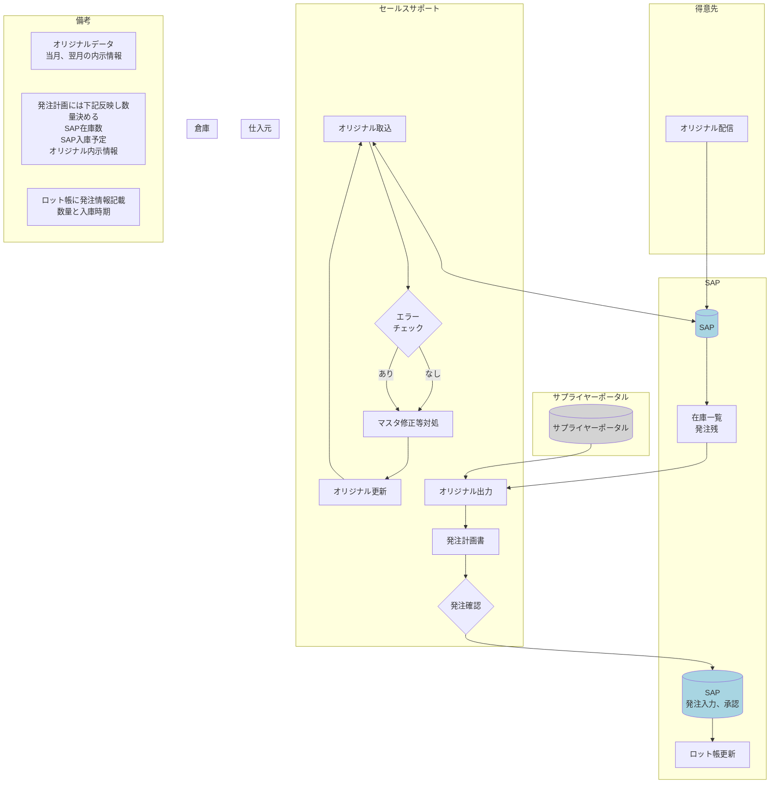

---

## 3. 材料ビジネス業務フロー - かんばんパターン⑤

納入先種別:デンソー製作所向け、注文形態:かんばん在庫品の業務フローです。

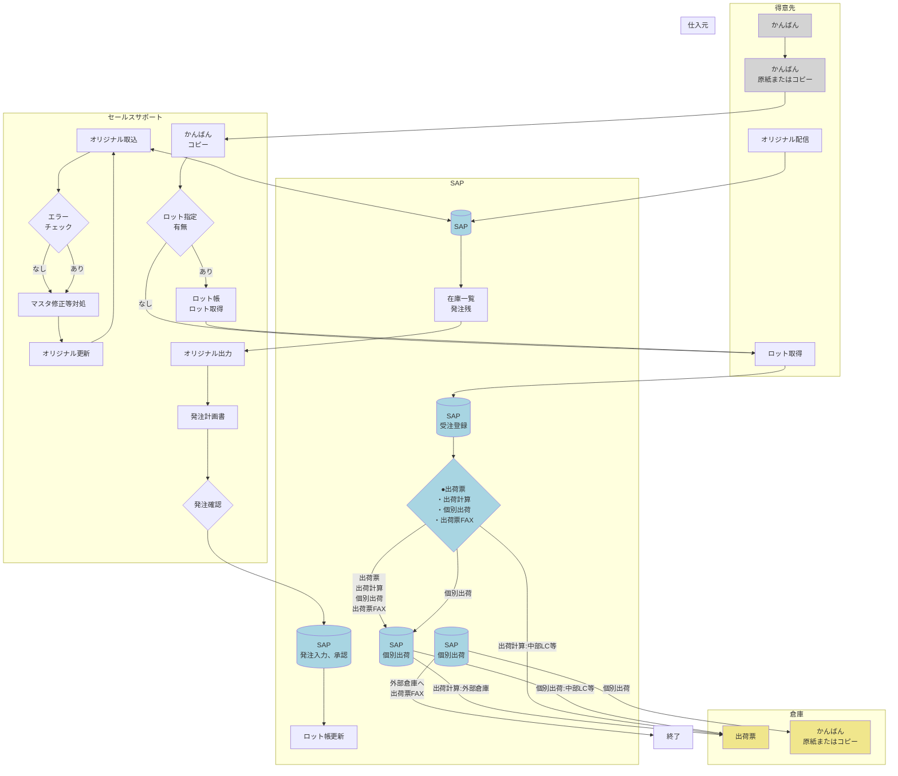

---

## 4. AI-OCR業務フロー

AI-OCRを活用した業務自動化フローを3つのパターンで示します。

### 4.1 ロット引当前のフロー

```mermaid
graph TB
    subgraph fax["FAX受信・印刷"]
        A["FAX受信<br/>中部LC<br/>外部倉庫"]
        B["印刷<br/>FAX依頼分"]
        C["ロット番号引当<br/>案材納品書に記入"]
    end
    
    subgraph multifunction["複合機・ユーザー"]
        D["複合機・ユーザー"]
    end
    
    subgraph ocr["AI-OCR処理"]
        E["Smart Read取込み<br/>AIによる自動仕分け(0.2円/枚)"]
        F["AI-OCR解析<br/>SmartRead → csv作成<br/>ロット番号有"]
        G["AI-OCR(RPA)"]
    end
    
    subgraph csv["CSV解析"]
        H["CSV解析<br/>・単位・次区チェック<br/>・データ整形"]
        I["RPA<br/>(Power Automate)"]
    end
    
    subgraph manual["手動登録"]
        J["SAP手動登録"]
        K["完了"]
        L["ユーザー"]
    end
    
    subgraph sap["SAP登録処理"]
        M["SAP受注登録マクロ実行<br/>・エラーチェック<br/>・SAPに自動登録"]
        N{"成功?"}
        O["エラー通知<br/>(Teams)"]
        P["RPA<br/>(Power Automate)"]
    end
    
    A --> B
    B --> C
    C --> D
    D --> E
    E --> F
    F --> G
    G --> H
    H --> I
    H --> M
    M --> N
    N -->|Yes| J
    N -->|No| O
    J --> K
    K --> L
    O --> P
    
    style A fill:#6b8e23
    style B fill:#6b8e23
    style C fill:#6b8e23
    style D fill:#4a4a4a
    style E fill:#2c5f7c
    style F fill:#d77228
    style G fill:#b8621b
    style H fill:#b8621b
    style I fill:#2c5f7c
    style J fill:#2c7f8e
    style K fill:#8b4a8b
    style L fill:#6b2f8b
    style M fill:#b8621b
    style N fill:#2c5f7c
    style O fill:#2c7f8e
    style P fill:#2c5f7c
```

### 4.2 ロット引当後のフロー

```mermaid
graph TB
    subgraph fax["FAX受信処理"]
        A["FAX受信<br/>中部LC<br/>外部倉庫<br/>対谷→PDF"]
    end
    
    subgraph multifunction["複合機"]
        B["複合機"]
    end
    
    subgraph ocr["AI-OCR処理"]
        C["Smart Read取込み<br/>AIによる自動仕分け(0.2円/枚)"]
        D["AI-OCR解析<br/>SmartRead → csv作成<br/>ロット番号なし"]
        E["AI-OCR(RPA)"]
    end
    
    subgraph csv["CSV解析・通知"]
        F["CSV解析<br/>・単位・次区チェック<br/>・データ整形"]
        G["Excel一覧書き出し<br/>ロット番号欄:空欄"]
        H["SS全員に通知<br/>ロットNo入力依頼"]
        I["RPA<br/>(Power Automate)"]
    end
    
    subgraph manual["手動入力"]
        J["ロット番号入力(手動)<br/>→Excel一覧"]
        K["SAP手動登録"]
        L["完了"]
        M["ユーザー"]
    end
    
    subgraph sap["SAP登録処理"]
        N["SAP受注登録マクロ実行<br/>・エラーチェック<br/>・SAPに自動登録"]
        O{"成功?"}
        P["エラー通知<br/>(Teams)"]
        Q["RPA<br/>(Power Automate)"]
    end
    
    A --> B
    B --> C
    C --> D
    D --> E
    E --> F
    F --> G
    G --> H
    H --> I
    I --> J
    J --> K
    K --> L
    L --> M
    F --> N
    N --> O
    O -->|Yes| K
    O -->|No| P
    P --> Q
    
    style A fill:#6b8e23
    style B fill:#4a4a4a
    style C fill:#2c5f7c
    style D fill:#d77228
    style E fill:#b8621b
    style F fill:#b8621b
    style G fill:#2c5f7c
    style H fill:#2c7f8e
    style I fill:#2c5f7c
    style J fill:#2c5f7c
    style K fill:#2c7f8e
    style L fill:#8b4a8b
    style M fill:#6b2f8b
    style N fill:#b8621b
    style O fill:#2c5f7c
    style P fill:#2c7f8e
    style Q fill:#2c5f7c
```

### 4.3 現行プロセスと改善案の比較

```mermaid
graph TB
    subgraph current["現行プロセス"]
        A1["FAX受信(現行)"]
        B1["仕分け処理(手動)"]
        C1["SmartRead仕分け<br/>AIによる自動仕分け(0.2円/枚)"]
        A1 --> B1
        A1 -.-> C1
    end
    
    subgraph improvement["改善案プロセス"]
        D1["スキャンPDF化<br/>中部LCでスキャン→共有フォルダ<br/>に自動保存"]
        E1["AI-OCR解析<br/>SmartRead → csv作成"]
        F1["CSV解析<br/>Power Automate → 単位・次区チェック"]
        G1["SAP受注登録マクロ<br/>実行"]
        
        D1 --> E1
        E1 --> F1
        F1 --> G1
    end
    
    subgraph combined["統合フロー"]
        A2["FAX受信(現行)"]
        B2["仕分け処理(手動)"]
        C2["SmartRead仕分け<br/>AIによる自動仕分け(0.2円/枚)"]
        D2["AI-OCR解析<br/>SmartRead → csv作成"]
        E2["CSV解析<br/>Power Automate → 単位・次区チェック"]
        F2["SAP受注登録マクロ<br/>実行"]
        
        A2 --> B2
        A2 -.-> C2
        B2 --> D2
        C2 --> D2
        D2 --> E2
        E2 --> F2
    end
    
    style A1 fill:#6b8e23
    style A2 fill:#6b8e23
    style D1 fill:#6b8e23
    style B1 fill:#2c5f7c
    style B2 fill:#2c5f7c
    style C1 fill:#2c5f7c
    style C2 fill:#2c5f7c
    style E1 fill:#2c5f7c
    style D2 fill:#2c5f7c
    style E2 fill:#2c5f7c
    style F1 fill:#2c5f7c
    style G1 fill:#b8621b
    style F2 fill:#b8621b
```

---

## 5. 材料ロット管理システム構成図

材料ロット管理システムの全体構成と各フェーズの連携を示します。

### 5.1 改修(材料ロット管理)

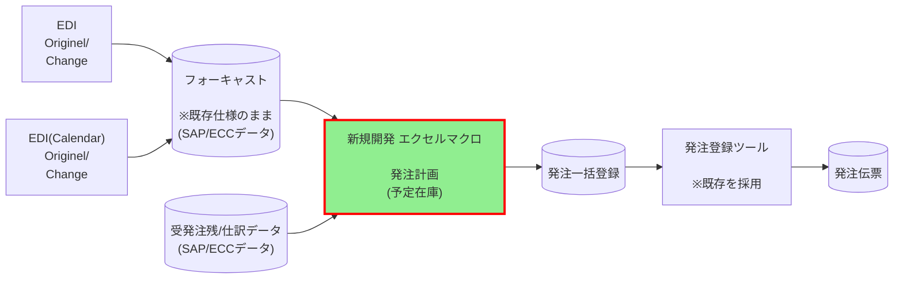

### 5.2 発注・仕入(SAP) → ロット管理システム統合

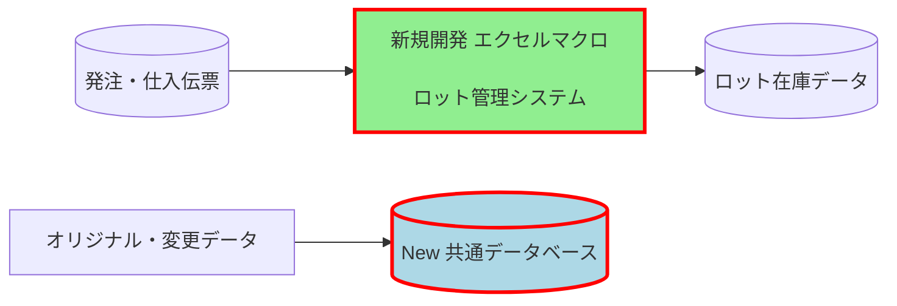

### 5.3 出荷予定(SP) → 納品書(SP) → 受注登録(SAP)

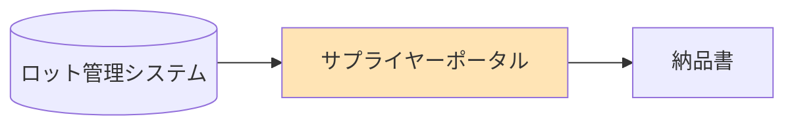

---

## 6. 素材納品書発行業務フロー

素材納品書発行業務の8つのパターンを統合的に示します。

### 6.1 全体構造図

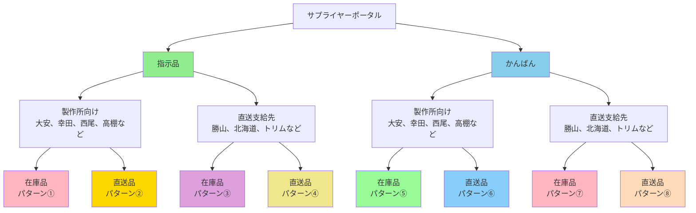

### 6.2 統合業務フロー図

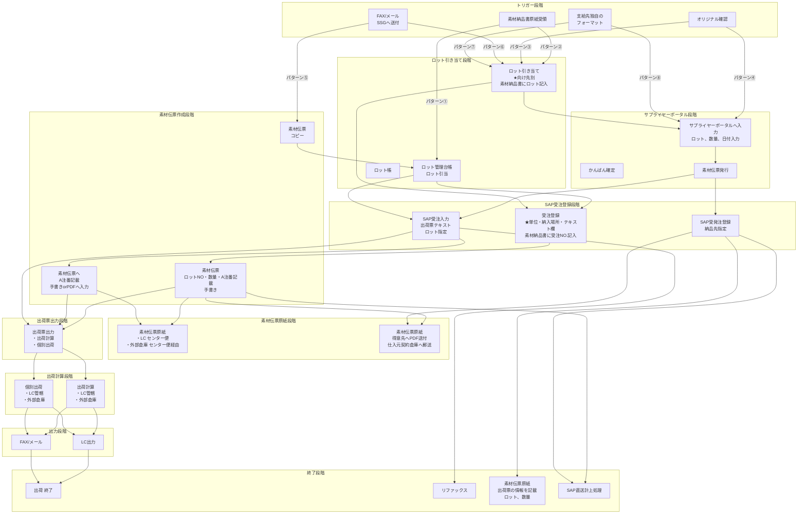

### 6.3 パターン選択フローチャート

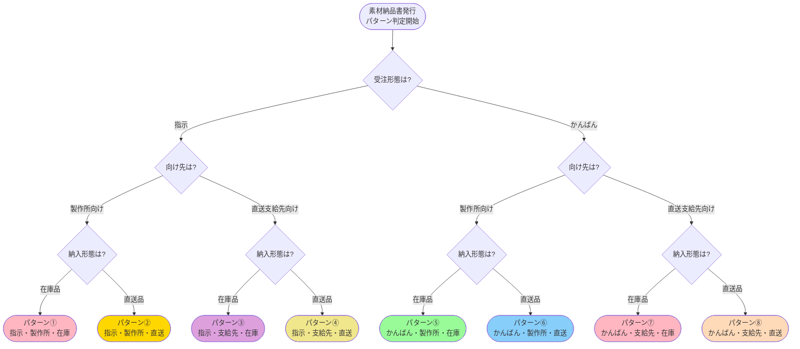

---

## 7. サプライヤーポータル自動化フロー

サプライヤーポータル自動化のロット簡略化による開発環境の変化を示します。

### 7.1 業務フロー(上部・下部経路)

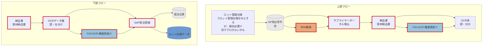

---

## 8. 発注計画フロー

SAPシステムと連携する発注計画の全体フローを示します。

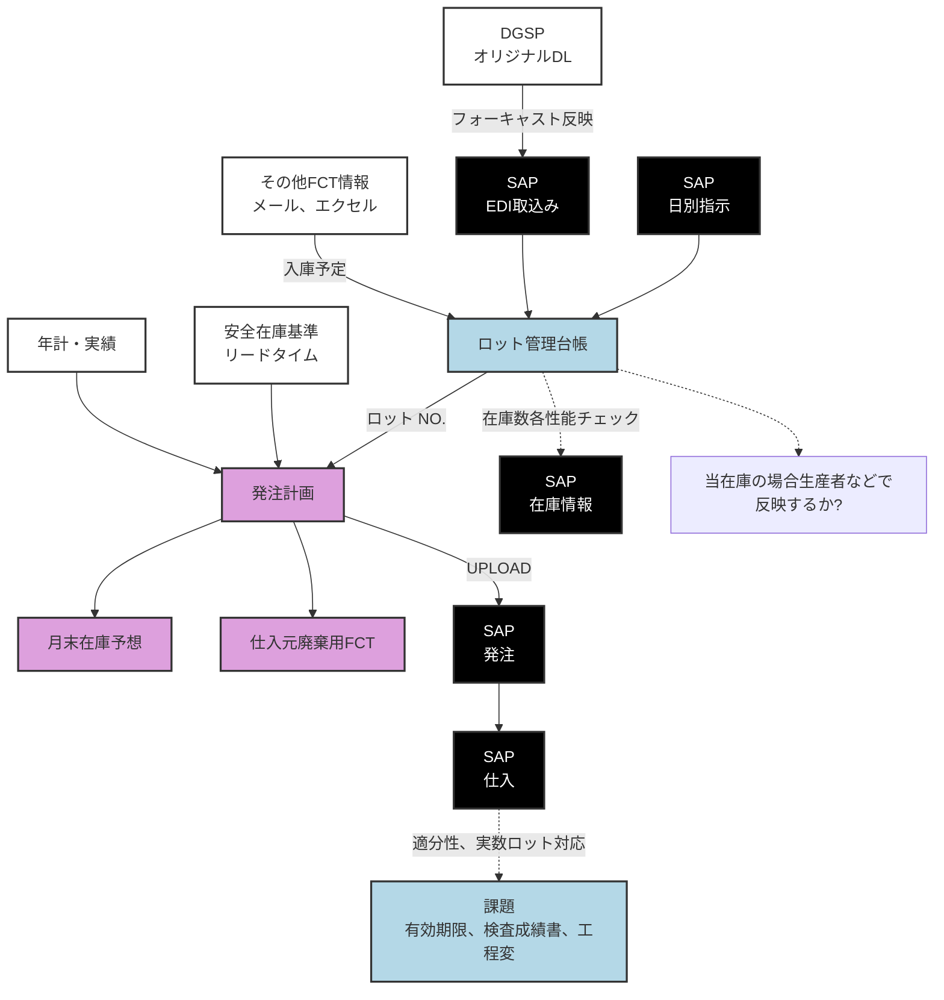

---

## レビューポイント

このドキュメントをレビューされる際は、以下の点をご確認ください:

1. **図の可読性**: マーメイド図が複雑すぎないか、適切に分割されているか
2. **フロー図の論理性**: 各ステップの流れが論理的で理解しやすいか
3. **用語の一貫性**: 同じ概念に対して異なる用語が使われていないか
4. **色分けやスタイル**: 視覚的に区別しやすく、意味のある色分けになっているか
5. **省略可能な要素**: 必須ではない説明やステップが含まれていないか
6. **不足している情報**: 理解に必要な説明が欠けていないか

改善提案がありましたら、具体的な箇所と修正案をご指摘ください。
